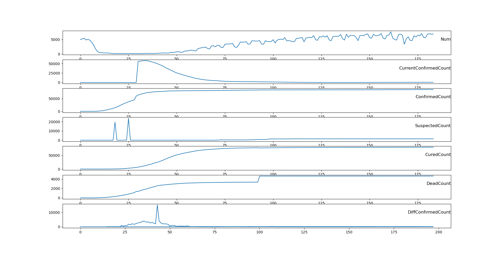
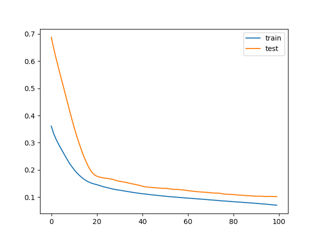
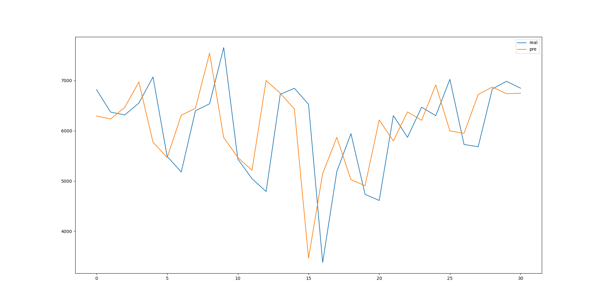
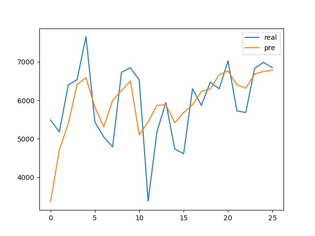

考虑到疫情的严重程度对人们出行的影响，从网上找到了有关COVID-19的确诊人数的数据。时间跨度为1.24到10.31

数据包含每个省份的确诊人数、现存确诊人数、疑似病例、治愈人数、死亡人数。从中提取出全国每天的各项人数。各项人数如下如所示。

对确诊人数进行一阶差分。求出每天的新增确诊人数。

其中2月13号这天，因为修改了确诊的判断标准，所以增长人数特别多。但是对于出行的英雄并不是很大。所以将它的值改为前7天的最大值3700。

第一次预测。结果如下，出现预测比实际“提前”的情况

最前面15天因为数据存在错误删去。剩余183天中，取前面152天作为训练集，剩下31天为测试集。

训练集上平均绝对误差为0.046，测试集上为0.0948。

反归一化后均方误差在989左右，准确率不够。

尝试使用有状态的LSTM。还没有完成全部试验。

训练技术均方误差为0.0336。测试集上为0.0860

反归一化后均方误差在850左右，准确率不够。

均方误差在850左右，有所下降。

尝试加入SAE对输入的数据进行特征提取。还没有完成试验。

下阶段目标：提高预测的准确率。尝试与前台进行交互。