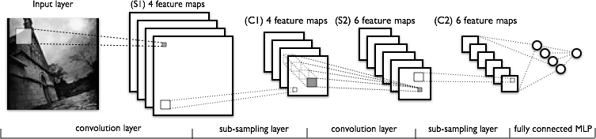

# LSTM整体结构


<center>LSTM 中的重复模块包含四个交互的层</center>

不必担心这里的细节。我们会一步一步地剖析 LSTM 解析图。现在，我们先来熟悉一下图中使用的各种元素的图标。


<center>LSTM 中的图标</center>

在上面的图例中，每一条黑线传输着一整个向量，从一个节点的输出到其他节点的输入。粉色的圈代表按位 pointwise 的操作，诸如向量的和，而黄色的矩阵就是学习到的神经网络层。合在一起的线表示向量的连接，分开的线表示内容被复制，然后分发到不同的位置。

逐点加法


逐点乘法


# LSTM 的核心思想

LSTM 的关键就是细胞状态，水平线在图上方贯穿运行。

细胞状态类似于传送带。直接在整个链上运行，只有一些少量的线性交互。信息在上面流传保持不变会很容易。


<center>Paste_Image.png</center>

LSTM 有通过精心设计的称作为“门”的结构来去除或者增加信息到细胞状态的能力。门是一种让信息选择式通过的方法。他们包含一个 `sigmoid` 神经网络层和一个按位的乘法操作。


<center>Paste_Image.png</center>

Sigmoid 层输出$0$到$1$之间的数值，描述每个部分有多少量可以通过。$0$代表“不许任何量通过”，$1$就指"允许任意量通过”！

LSTM 拥有三个门，来保护和控制细胞状态。

# 逐步理解 LSTM

在我们 LSTM 中的第一步是决定我们会从细胞状态中丢弃什么信息。这个决定通过一个称为**忘记门层**完成。该门会读取 $h_{t-1}$和$x_t$，输出一个在$0$到$1$之间的数值给每个在细胞状态$C_{t-1}$中的数字。$1$表示“完全保留”， $0$表示“完全舍弃”。

让我们回到语言模型的例子中来基于已经看到的预测下一个词。在这个问题中，细胞状态可能包含当前**主语**的性别，因此正确的**代词**可以被选择出来。当我们看到新的**主语**，我们希望忘记旧的**主语**。


<center>决定丢弃信息</center>


此处实心圆点表示矩阵乘法

下一步是确定什么样的新信息被存放在细胞状态中。这里包含两个部分。第一，`sigmoid` 层称 “**输入门层**” 决定什么值我们将要更新。然后，一个 `tanh` 层创建一个新的候选值向量，$\tilde{C}_t$，会被加入到状态中。下一步，我们会讲这两个信息来产生对状态的更新。

在我们语言模型的例子中，我们希望增加新的主语的性别到细胞状态中，来替代旧的需要忘记的主语。


<center>确定更新的信息</center>


现在是更新旧细胞状态的时间了，$C_{t-1}$更新为$C_{t}$前面的步骤已经决定了将会做什么，我们现在就是实际去完成。

我们把旧状态与$f_t$ 相乘，丢弃掉我们确定需要丢弃的信息。接着加上 $i_t * \tilde{C}_t$。这就是新的候选值，根据我们决定更新每个状态的程度进行变化。

在语言模型的例子中，这就是我们实际根据前面确定的目标，丢弃旧代词的性别信息并添加新的信息的地方。


<center>更新细胞状态</center>


此处空心圆点表示逐点相乘

最终，我们需要确定输出什么值。这个输出将会基于我们的细胞状态，但是也是一个过滤后的版本。首先，我们运行一个 `sigmoid` 层来确定细胞状态的哪个部分将输出出去。接着，我们把细胞状态通过 `tanh` 进行处理（得到一个在$-1$到$1$之间的值）并将它和 `sigmoid` 门的输出相乘，最终我们仅仅会输出我们确定输出的那部分。

在语言模型的例子中，因为他就看到了一个 **代词**，可能需要输出与一个 **动词** 相关的信息。例如，可能输出是否代词是单数还是负数，这样如果是动词的话，我们也知道动词需要进行的词形变化。


<center>输出信息</center>


参数计算：

此处未计算偏置矩阵

4个门控。被乘的矩阵是由h和x拼接而成，行：shape(h)+shape(x)，列：1

每个门控W权重矩阵，行：shape(h)，列：shape(h)+shape(x)。

这样子根据矩阵乘法得到的结果是shape(h)长度的向量。h的维度没有改变。


# 结合代码理解LSTM

```python
from math import sqrt
from numpy import concatenate
from matplotlib import pyplot
from pandas import read_csv
from pandas import DataFrame
from pandas import concat
from sklearn.preprocessing import MinMaxScaler
from sklearn.preprocessing import LabelEncoder
from sklearn.metrics import mean_squared_error,mean_absolute_error
from keras.models import Sequential
from keras.layers import Dense,LSTM,Dropout
import pandas as pd

pd.set_option("display.width",None)
pd.set_option("display.max_rows",None)

def series_to_supervised(data, n_in=1, n_out=1, dropnan=True):
    # 获取特征值数量n_vars
    n_vars = 1 if type(data) is list else data.shape[1]
    df = DataFrame(data)
    # print(df)
    cols, names = list(), list()
    # input sequence (t-n, ... t-1)
    # 创建8个v(t-1)作为列名
    for i in range(n_in, 0, -1):
        # 向列表cols中添加一个df.shift(1)的数据
        cols.append(df.shift(i))
        # print(cols)
        names += [('var%d(t-%d)' % (j+1, i)) for j in range(n_vars)]
    # forecast sequence (t, t+1, ... t+n)
    for i in range(0, n_out):
        # 向列表cols中添加一个df.shift(-1)的数据
        cols.append(df.shift(-i))
        # print(cols)
        if i == 0:
        	names += [('var%d(t)' % (j+1)) for j in range(n_vars)]
        else:
        	names += [('var%d(t+%d)' % (j+1, i)) for j in range(n_vars)]
    # print(cols)
    # 将列表中两个张量按照列拼接起来，list(v1,v2)->[v1,v2],其中v1向下移动了一行，此时v1,v2是监督学习型数据
    agg = concat(cols, axis=1)
    # print(agg)
    # 重定义列名
    agg.columns = names
    # print(agg)
    # 删除空值
    if dropnan:
    	agg.dropna(inplace=True)
    return agg

import keras.backend as K
def r2(y_true, y_pred):
    SS_reg = K.sum(K.square(y_pred - y_true))
    mean_y = K.mean(y_true)
    SS_tot = K.sum(K.square(y_true - mean_y))
    f = 1 - SS_reg/SS_tot
    return f

def R2(y_true, y_pred):
    SS_reg = sum((y_pred - y_true)**2)
    mean_y = y_true.mean()
    SS_tot = sum((y_true - mean_y)**2)
    f = 1 - SS_reg/SS_tot
    return f

# load dataset
dataset = read_csv('预测总出行人数/date-num-COVID-diff.csv')
# 删掉那些我们不想预测的列
dataset = dataset.drop(["Date","SuspectedCount",'CurrentConfirmedCount','DeadCount','DiffConfirmedCount','CuredCount'],axis=1)
values = dataset.values

# 数据转换为浮点型
values = values.astype('float32')
# 将所有数据缩放到（0，1）之间
scaler = MinMaxScaler(feature_range=(0, 1))
scaled = scaler.fit_transform(values)
scaled = DataFrame(scaled)
scaled.columns=['Num','ConfirmedCount','DateType']

n_days = 5
n_features = len(scaled.columns)

# 将数据格式化成监督学习型数据
reframed = series_to_supervised(scaled, n_days, 1)
reframed = reframed.iloc[:,:n_days * n_features + 1 ]
# reframed.dropna(inplace=True)

# split into train and test sets
values = reframed.values
print(values)
# 取出一年的数据作为训练数据，剩下的做测试数据
n_train = -31
train = values[:n_train, :]
test = values[n_train:, :]
train_X, train_y = train[:, :-1], train[:, -1]
test_X, test_y = test[:, :-1], test[:, -1]
# 将输入数据转换成3D张量 [samples, timesteps, features]，[n条数据，每条数据1个步长，13个特征值]
train_X = train_X.reshape((train_X.shape[0], n_days, n_features))
test_X = test_X.reshape((test_X.shape[0], n_days, n_features))
# 最终生成的数据形状，X:(152,1,7)  Y:(152,)
print(train_X.shape, train_y.shape, test_X.shape, test_y.shape)

# 设计网络结构
model = Sequential()
model.add(LSTM(256, activation="relu",input_shape=(train_X.shape[1], train_X.shape[2]),return_sequences=True))
# model.add(LSTM(256, activation="relu",return_sequences=True))
model.add(Dropout(0.2))
model.add(LSTM(256, activation="relu"))
model.add(Dropout(0.2))
# model.add(Dense(128))
model.add(Dense(16))
model.add(Dropout(0.2))
model.add(Dense(1))
model.compile(loss='mae', optimizer='adam',metrics=[r2])
# 拟合网络
history = model.fit(train_X, train_y, epochs=200, batch_size=train_X.shape[0], validation_data=(test_X, test_y), verbose=2, shuffle=False)
# model.save("预测总出行人数/testmodle.h5")
# 图像展示训练损失
pyplot.plot(history.history['loss'], label='train')
pyplot.plot(history.history['val_loss'], label='test')
pyplot.legend()
pyplot.show()

yhat = model.predict(test_X)
print(yhat)

#重构预测数据形状，进行逆缩放
# 之所有下面奇怪的数据拼接操作，是因为：数据逆缩放要求输入数据的形状和缩放之前的输入保值一致
# 将3D转换为2D
test_X = test_X.reshape((test_X.shape[0], n_days*n_features))
# 拼接y，x为[y,x],即将test_X中的第一列数据替换成预测出来的yhat值
inv_yhat = concatenate((yhat, test_X[:, -(n_features-1):]), axis=1)
print(inv_yhat)
# 对替换后的inv_yhat预测数据逆缩放
inv_yhat = scaler.inverse_transform(inv_yhat)
# 逆缩放后取出第一列(预测列)y
inv_yhat = inv_yhat[:,0]


# 重构真实数据形状，进行逆缩放
test_y = test_y.reshape((len(test_y), 1))
# 因为test_X的第一列数据在上面被修改过，这里要重新还原一下真实数据。将test_X的第一列换成原始数据test_y值
inv_y = concatenate((test_y, test_X[:, -(n_features-1):]), axis=1)
# 对重构后的数据进行逆缩放
inv_y = scaler.inverse_transform(inv_y)
# 逆缩放后取出第一列(真实列)y
inv_y = inv_y[:,0]
print(inv_y)
print(inv_yhat)
# 计算预测列和真实列的误差RMSE值
rmse = sqrt(mean_squared_error(inv_y, inv_yhat))
print('Test RMSE: %.3f' % rmse)
Test_R2 = R2(inv_y, inv_yhat)
print('Test R2: %.3f' % Test_R2)
pyplot.plot(inv_y, label='real')
pyplot.plot(inv_yhat, label='pre')
pyplot.legend()
pyplot.show()
```


values一共179行，16列，每一列的对应的数据是：

前5天的人数，前5天的确诊人数，前5天的日期类型，前4天的人数，前4天的确诊人数，前4天的日期类型，前3天的人数，前3天的确诊人数，前3天的日期类型，前2天的人数，前2天的确诊人数，前2天的日期类型，前1天的人数，前1天的确诊人数，前1天的日期类型，当天的人数。

取出最后31天作为测试集test，148天作为训练集train。

train中，最后1列为当天的人数，是需要预测的量，前面15列是作为预测人数的输入。将前面15列划分成train_x，作为自变量，最后一列划分成train_y作为因变量。test中同理。

因为现在train_x的shape是(148,15)，lstm的输入需要是3D的张量，所以需要将(148,15)转换成(148,5,3)。

这里面148是样本个数，5是时间步长，3是每一个时间步长的特征个数。

test_x同理。


LSTM层的第一个参数256是units，表示该LSTM返回的向量维度是多少。

input_shape中，第一个参数对应时间步长，即如下图排列的细胞有几个。每个细胞对应一个时间步长。此处为5，所以有5个细胞。


input_shape中，第二个参数对应对应LSTM中的输入向量$x_t$，即每个细胞的输入。

LSTM中的256对应于$h_t$的维度。即输出的维度是256。例如下面的代码

```python
model.add(LSTM(256, activation="relu"))	#返回一个维度是256维的向量。即(None, 256)
```

一般来说，LSTM只返回LSTM中最后一个时间步长（最后一个细胞）的输出。

当有多层LSTM的时候，则需要``return_sequences=True``。该参数默认是False。在True的情况下，LSTM会返回每一个细胞的输出。

```python
model.add(LSTM(256, activation="relu",input_shape=(train_X.shape[1], train_X.shape[2]),return_sequences=True))	#返回5个维度是256维的向量。即(None, 5, 256)
```

此处的`` activation="relu"``即将图中的tanh函数替换成relu函数。


epochs控制训练模型的周期数。一个epoch是对提供的整个`x`和`y`数据的迭代。

validation_data选择验证集。评估每个epoch结束时的损失和任何模型指标

verbose控制日志显示
verbose = 0 为不在标准输出流输出日志信息
verbose = 1 为输出进度条记录
verbose = 2 为每个epoch输出一行记录

batch_size控制多少个样本为1批。此处训练集较小，采用全数据集。

# 谈谈深度学习中的 Batch_Size

Batch_Size（批尺寸）是机器学习中一个重要参数，涉及诸多矛盾，下面逐一展开。 

**首先，为什么需要有 Batch_Size 这个参数？ **

Batch 的选择，**首先决定的是下降的方向**。如果数据集比较小，完全可以采用**全数据集 （ Full Batch Learning ）**的形式，这样做至少有 2 个好处：其一，由全数据集确定的方向能够更好地代表样本总体，<u>从而更准确地朝向极值所在的方向</u>。其二，由于不同权重的梯度值差别巨大，因此选取一个全局的学习率很困难。 Full Batch Learning 可以使用**Rprop** 只基于梯度符号并且针对性单独更新各权值。

对于更大的数据集，以上 2 个好处又变成了 2 个坏处：其一，随着数据集的海量增长和内存限制，一次性载入所有的数据进来变得越来越不可行。其二，以 Rprop 的方式迭代，会由于各个 Batch 之间的采样差异性，各次梯度修正值相互抵消，无法修正。这才有了后来**RMSProp**的妥协方案。

**既然 Full Batch Learning 并不适用大数据集，那么走向另一个极端怎么样？**

所谓另一个极端，就是每次只训练一个样本，即 Batch_Size = 1。这就是**在线学习（Online Learning）**。线性神经元在均方误差代价函数的错误面是一个抛物面，横截面是椭圆。对于多层神经元、非线性网络，在局部依然近似是抛物面。使用在线学习，每次修正方向以各自样本的梯度方向修正，横冲直撞各自为政，**难以达到收敛**。


**可不可以选择一个适中的 Batch_Size 值呢？**

当然可以，这就是**批梯度下降法（Mini-batches Learning）**。因为如果数据集足够充分，那么用一半（甚至少得多）的数据训练算出来的梯度与用全部数据训练出来的梯度是几乎一样的。

**在合理范围内，增大 Batch_Size 有何好处？**

- 内存利用率提高了，大矩阵乘法的并行化效率提高。
- 跑完一次 epoch（全数据集）所需的迭代次数减少，对于相同数据量的处理速度进一步加快。 
- 在一定范围内，一般来说 Batch_Size 越大，其确定的下降方向越准，引起训练震荡越小。 

**盲目增大 Batch_Size 有何坏处？**

- 内存利用率提高了，但是内存容量可能撑不住了。
- 跑完一次 epoch（全数据集）所需的迭代次数减少，要想达到相同的精度，其所花费的时间大大增加了，从而对参数的修正也就显得更加缓慢。
- Batch_Size 增大到一定程度，其确定的下降方向已经基本不再变化。

**调节 Batch_Size 对训练效果影响到底如何？**

这里跑一个 LeNet 在 MNIST 数据集上的效果。MNIST 是一个手写体标准库，我使用的是 **Theano** 框架。这是一个 Python 的深度学习库。安装方便（几行命令而已），调试简单（自带 Profile），GPU / CPU 通吃，官方教程相当完备，支持模块十分丰富（除了 CNNs，更是支持 RBM / DBN / LSTM / RBM-RNN / SdA / MLPs）。在其上层有 Keras 封装，支持 GRU / JZS1, JZS2, JZS3 等较新结构，支持 Adagrad / Adadelta / RMSprop / Adam 等优化算法。




运行结果如上图所示，其中绝对时间做了标幺化处理。运行结果与上文分析相印证： 

- Batch_Size 太小，算法在 200 epoches 内不收敛。
- 随着 Batch_Size 增大，处理相同数据量的速度越快。
- 随着 Batch_Size 增大，达到相同精度所需要的 epoch 数量越来越多。
- 由于上述两种因素的矛盾， Batch_Size 增大到某个时候，达到时间上的最优。
- 由于最终收敛精度会陷入不同的局部极值，因此 Batch_Size 增大到某些时候，达到最终收敛精度上的最优。

参考资料：

[自然语言处理(11)— 实战LSTM(keras版本)](https://www.bilibili.com/video/BV1xh411f7Mx)

[深度学习中的batch的大小对学习效果有何影响](https://www.zhihu.com/question/32673260)

[理解 LSTM 网络](https://www.jianshu.com/p/9dc9f41f0b29)