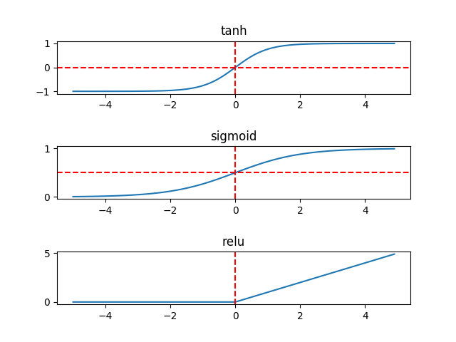
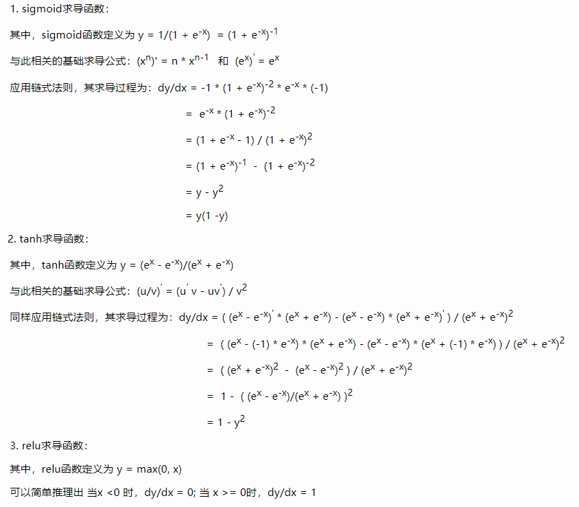

|||
|-|-|
|sigmoid| |
|tanh||
|relu|  |

相较而言，在隐藏层，tanh函数要优于sigmoid函数，可以认为是sigmoid的平移版本，优势在于其取值范围介于-1 ~ 1之间，数据的平均值为0，而不像sigmoid为0.5，有类似数据中心化的效果。

　　但在输出层，sigmoid也许会优于tanh函数，原因在于你希望输出结果的概率落在0 ~ 1 之间，比如二元分类，sigmoid可作为输出层的激活函数。

　　但实际应用中，特别是深层网络在训练时，tanh和sigmoid会在端值趋于饱和，造成训练速度减慢，故深层网络的激活函数默认大多采用relu函数，浅层网络可以采用sigmoid和tanh函数。

 

　　另外有必要了解激活函数的求导公式，在反向传播中才知道是如何进行梯度下降。三个函数的求导结果及推理过程如下：

<!-- 1. sigmoid求导函数：
其中，sigmoid函数定义为$y=\frac{1}{1-e^{-x}} = (1+e^{-x})^{-1}$ -->

参考资料：https://www.cnblogs.com/hutao722/p/9732223.html