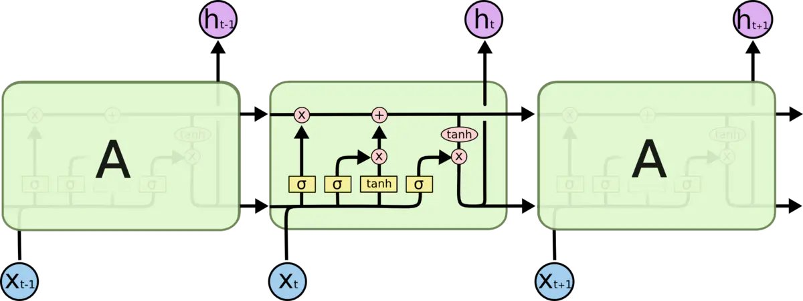

# 客流预测模型

​	随着国内各个城市轨道交通持续的高速发展，轨交乘客数量不断增长，在缓解城市整体交通拥堵的同时，轨道交通本身也面临着较大的客流管理压力。如果能够在事先对客流有一定的预测，将会大大方便客流的管理，有效地缓解客流对整个交通轨道系统的压力。但现实是城市交通轨道缺乏对客流的提前评估和预测，各种预案的实施较为被动，无法及时并且预见性的缓解可能出现的突发客流事件。

​	因此，以大数据平台为基础，通过搭建神经网络模型，对客流进行分析预测，从而辅助实现客流的精细化管理，降低轨道交通的运营成本，提前部署各种预案。

### 长时客流预测

对于客流进行时间粒度长达一天的预测。例如在节假日的前一天，提前预测各个站点在明天会拥有多少客流量。通过预测的结果，就可以安排各个站点的管理人员多少，提前部署各个预案。

长时客流预测主要考虑的是时间维度上客流的相关性。我们选择经典的**LSTM模型**进行预测。该模型于1997年在《Long short-term memory》中提出。如今已成为深度学习的主流之一。

#### LSTM模型

LSTM的整体模型如下：

LSTM 的关键就是细胞状态，水平线在图上方贯穿运行。它通过称作为“门”的结构来去除或者增加信息到细胞状态。其分别是遗忘门、输入门、输出门

##### 遗忘门

该部分决定我们会从细胞状态中丢弃什么信息。门会读取 $h_{t-1}$和$x_t$，输出一个在$0$到$1$之间的数值给每个在细胞状态$C_{t-1}$中的数字。$1$表示“完全保留”， $0$表示“完全舍弃”。

##### 输入门

该部分确定什么样的新信息被存放在细胞状态中。这里包含两个部分。

第一，`sigmoid` 层称 “**输入门层**” 决定什么值我们将要更新。

第二，一个 `tanh` 层创建一个新的候选值向量，$\tilde{C}_t$，会被加入到状态中。

##### 更新细胞状态

将$C_{t-1}$更新为$C_{t}$。

我们把旧状态与$f_t$ 相乘，丢弃掉我们确定需要丢弃的信息。接着加上 $i_t * \tilde{C}_t$。这就是新的候选值，根据我们决定更新每个状态的程度进行变化。

##### 输出门

确定输出什么值。

这个输出将会基于我们的细胞状态，但是也是一个过滤后的版本。首先，我们运行一个 `sigmoid` 层来确定细胞状态的哪个部分将输出出去。接着，我们把细胞状态通过 `tanh` 进行处理（得到一个在$-1$到$1$之间的值）并将它和 `sigmoid` 门的输出相乘，最终我们仅仅会输出我们确定输出的那部分。

输出信息

### 输入参数选择

为了预测站点 $s_i$ 在 $t$ 时刻的客流，分析主办方提供的数据，我们选择站点 $s_i$在$t-5$天到$t-1$天，总共5的以下参数作为输入：

| 参数         | 影响                                 |
| ------------ | ------------------------------------ |
| 疫情新增人数 | 提供疫情对客流量的影响               |
| 平均温度     | 天气对于客流量的影响                 |
| 平均湿度     | 天气对于客流量的影响                 |
| 日期类型     | 节假日、工作日、双休日对客流量的影响 |
| 客流量       | 历史客流量的影响                     |

### 模型搭建

选择2层LSTM，每层5个时间步长。第一层每个时间步长的LSTM单元的输出将会作为第二层的输入，再次进行时间维度上信息的提取。然后添加一层Dropout层，概率选择0.15，防止出现过拟合的情况。最后添加一个全连接层，输出结果。整体结果如图所示：

模型在对2020年1月15到2020年7月16日每天的预测结果与真实值的比较如下所示：

|损失函数|数值|
|-|-|
|RMSE|265.387|
|R2|0.987|
|MAE|172.633|
|MAPE|0.071|

由于各个站点的情况不同，所以我们对每个站点都进行单独的训练，使得结果能够更好的拟合该站点的实际情况。

### 短时客流预测

对客流进行时间步长为15分钟的预测。

短时客流预测与长时客流预测相似，也需要考虑客流在时间维度上的信息。在此基础上，短时客流还需要考虑客流在空间维度上的信息。例如当一个站点有短时内有大量客流，则邻近站点大概率会在接下来的一段时间内有大量客流。

城市轨道交通各个站点之间的关系可以用图 $G = (V,E)$ 表示：$V$ 为城市轨道交通车站集合，$E$ 表示图的边集合。该图是非欧几里得数据，无法使用常规的卷积操作进行信息的提取。同时又考虑到客流在图上的流动，类似于热传导模型。因此选择用图卷积（GCN）进行空间信息上的提取。

#### GCN

由Thomas Kipf在2016年发布的论文《Semi-Supervised Classification with Graph Convolutional Networks》中提出。该篇论文也是这一方向的奠基之作。

##### 类比于热传导方程。

热方程的解具有将初始温度平滑化的特质，这代表热从高温处向低温处传播。一般而言，许多不同的初始状态会趋向同一个稳态（热平衡）。**这种性质与客流相类似，客流会从客流量大的地方，流向客流量少的地方，直到达到一个稳态。**

热传导在三维的等方向均匀介质里的传播可用以下方程表达：
$$
\frac{\partial u}{\partial t}=k(\frac{\partial^2 u}{\partial x^2} + \frac{\partial^2 u}{\partial y^2} + \frac{\partial^2 u}{\partial z^2})
$$
其中：$u=u(t,x,y,z)$表温度，它是时间变数$t$与空间变数$(x,y,z)$的函数。

$\frac{\partial u}{\partial t}$ 是空间中一点的温度对时间的变化率；

$k$是热扩散率，决定于材料的热传导率、密度与热容。

热方程也是抛物线偏微分方程最简单的例子。利用拉普拉斯算子，热方程可推广为下述形式
$$
u_t=k\Delta u
$$
其中的$\Delta$是对空间变数的拉普拉斯算子。

##### 非欧几里得数据

因为描述各个城市轨道交通站点之间的空间关系的是一张图，是离散的结构，所以我们需要从图中提取出离散的拉普拉斯算子，也就是图的拉普拉斯矩阵。

假设$A \in R_{n \times n}$ 是图 $G$的邻接矩阵，$D \in R_{n \times n}$是顶点的度矩阵$D_u=\sum_j W_{ij}$。

对于图G的拉普拉斯矩阵L定义为$L=D-A$。

假设客流量为$\phi = [\phi_1,\phi_2,\cdots,\phi_n]^T$，$\phi_i$是第i个站点的客流量。所以我们可以得出
$$
\frac{d \phi}{d t} = k L\phi
$$

##### 对称归一化

$L=D-A$这样的拉普拉斯矩阵，会导致度较小的节点在聚合后特征较小，度较大的节点在聚合后特征较大，所以需要对矩阵进行归一化操作。

归一化后的拉普拉斯矩阵为$L=D^{-1}L$

考虑到站点之间彼此的影响，除了考虑聚合结点 $i$ 的度 $D_{ii}$，还应该考虑被聚合结点 $j$ 的度 $D_{jj}$ 。采取几何平均数$\sqrt{D_{ii}D_{jj}}$来同时考虑两者的影响

对称归一化的拉普拉斯矩阵为$L=D^{-\frac{1}{2}}AD^{-\frac{1}{2}}$。

之后的 $L$ 指的均为对称归一化的拉普拉斯矩阵

##### 卷积公式推出

在热传导方程中，$\frac{d \phi}{d t}$  与 $L\phi$ 关于k成正比。为了更好地拟合客流的情况，需要考虑更复杂的关系。因此引入神经网络，对其进行卷积操作。

因为传统的卷积的图像是欧几里得数据，结点的邻居数量都是固定的，在欧式空间中的卷积操作实际上是用固定大小可学习的卷积核来抽取像素的特征。但在图这种非欧几里得数据中，结点有多少邻居并不固定，所以传统的卷积核不能直接用于抽取图上结点的特征。所以需要找出一种可处理变长邻居结点的卷积核在图上抽取特征，也就是**频域卷积**。其主要利用**图傅里叶变化**来实现卷积。它利用图的拉普拉斯矩阵导出其频域上的的拉普拉斯算子，再类比频域上的欧式空间中的卷积，导出图卷积的公式。

拉普拉斯矩阵是一个半正定对称矩阵（半正定矩阵本身就是对称矩阵）。

有如下三个性质:

- 实对称矩阵一定n个线性无关的特征向量
- 半正定矩阵的特征值一定非负
- 实对阵矩阵的特征向量总是可以化成两两相互正交的正交矩阵

拉普拉斯矩阵其谱分解为$L=U \Lambda U^{-1}$，其中$U=[u_1,\cdots,u_n]$ ，$\Lambda = diag([\lambda_1,\cdots,\lambda_n])$。其中$U=(\overrightarrow{u_1},\overrightarrow{u_2},\cdots,\overrightarrow{u_n})$，是列向量为单位特征向量的矩阵（$\overrightarrow{u_l}$ 是列向量）。

###### 图上的傅里叶变换

$\overrightarrow{u_l}$ 是 $L$ 的特征向量，类似于傅里叶变化中 $e^{-iwt}$ 是 $\Delta$ 的特征函数，$\omega$ 和特征值密切相关。

传统的傅里叶变化如下：
$$
F(\omega)=\int f(t)e^{-iwt}dt
$$
离散积分是一种内积的形式，仿照傅里叶变化，得到如下公式：
$$
F(\lambda_l)=\hat{f}(\lambda_l)=\sum_{i=1}^Nf(i)u_l^*(i)
$$
$f$ 是图上的 $N$ 维向量，$f(i)$  与图上顶点一一对应，$u_l(i)$表示第 $l$ 个特征向量的第 $i$个分量。那么特征值（频率） $\lambda_l$下的, $f$ 的图上傅里叶变换就是与 $\lambda_l$ 对应的特征向量 $u_l$ 进行内积运算。

利用矩阵乘法将图上的傅里叶变换推广到矩阵形式：
$$
\left(
\begin{matrix}
\hat f(\lambda_1)\\
\hat f(\lambda_2)\\
\vdots\\
\hat f(\lambda_N)
\end{matrix}
\right)
=
\left(
\begin{matrix}
u_1(1) & u_1(2) & \cdots & u_1(N)\\
u_2(1) & u_2(2) & \cdots & u_2(N)\\
\vdots & \vdots & \ddots & \vdots\\
u_N(1) & u_N(2) & \cdots & u_N(N)\\
\end{matrix}
\right)
\left(
\begin{matrix}
f(1)\\
f(2)\\
\vdots\\
f(N)\\
\end{matrix}
\right)
$$
即
$$
\hat{f}=U^Tf
$$

###### 图上的傅里叶逆变换

传统的傅里叶逆变换是对频率 $\omega$ 求积分：
$$
f(t)=\frac{1}{2 \pi}\int F(\omega)e^{i\omega t}d\omega
$$
图上的傅里叶变化是对特征值$\lambda_l$求和：
$$
f(i)=\sum_{l=1}^N\hat{f}(\lambda_l)u_l(i)
$$
利用矩阵乘法将图上的傅里叶变换推广到矩阵形式：
$$
\left(
\begin{matrix}
f(1)\\
f(2)\\
\vdots\\
f(N)\\
\end{matrix}
\right)
=
\left(
\begin{matrix}
u_1(1) & u_2(1) & \cdots & u_N(1)\\
u_1(2) & u_2(2) & \cdots & u_N(2)\\
\vdots & \vdots & \ddots & \vdots\\
u_1(N) & u_2(N) & \cdots & u_N(N)\\
\end{matrix}
\right)
\left(
\begin{matrix}
\hat f(\lambda_1)\\
\hat f(\lambda_2)\\
\vdots\\
\hat f(\lambda_N)
\end{matrix}
\right)
$$
即
$$
f=U\hat{f}
$$

###### 图上的卷积定理

卷积定理：函数卷积的傅里叶变换是函数傅立叶变换的乘积,即对于函数 $f(t)$ 与$h(t)$两者的卷积是其函数傅立叶变换乘积的逆变换：
$$
f*h=F^{-1}[F(f)\odot F(h)]
$$
其中 $F^{-1}$ 表示傅里叶逆变换，$F$ 表示傅里叶变换

推出图上的卷积公式：
$$
(f*h)=U((U^Tf)\odot(U^Th))
$$
这里用积核$g_\theta=diag([\theta_0,\cdots,\theta_{n-1}])$代替$U^Tf$进行卷积，卷积公式就可以写成
$$
g_\theta*x = Ug_\theta U^Tx,g_\theta=diag([\theta_0,\cdots,\theta_{n-1}])
$$

##### 卷积公式改进

由于$g_\theta$的计算复杂度非常高，Kipf等人引入了一种近似ChebNet，将卷积公式近似为
$$
g_\theta=\theta_0x-\theta_1D^{-\frac{1}{2}}AD^{-\frac{1}{2}}x
$$
为了防止过拟合，假设$\theta = \theta_0 = -\theta_1$，图卷积的定义就近似为

$$
g_\theta*x=\theta(I_n-D^{-\frac{1}{2}}AD^{-\frac{1}{2}})x=\theta(\hat{D}^{-\frac{1}{2}}\hat{A}\hat{D}^{-\frac{1}{2}})x
$$

其中$\hat{A}=A+I_n$和$\hat{D}_{ii} = \sum_j\hat{W}_{ij}$重新归一化得到的，即图上加上自环。在加上一个激活函数，就可以得到快速卷积公式：
$$
H^{(l+1)=\sigma(\hat{D}^{-\frac{1}{2}}\hat{A}\hat{D}^{-\frac{1}{2}}H^lW^l)}
$$

#### LSTM-GCN模型

为了更好地实现客流的预测功能，我们选择同时考虑客流在时间维度和空间维度上的信息。

先用GCN模型对客流在空间维度上的信息进行提取，之后再将提取出的信息输入到LSTM进行时间维度上信息的提取。

以站点46例子，时间段选择6:00到23:30，取与其相邻在7个站点距离以内的所有站点。包括站点46一共41个站点，建立一个41*41的邻接矩阵。

取前3个时间段的41个站点的客流量作为41个站点的特征值。这里只选择客流作为特征值是因为只有客流这个特征在图上的流动类似于热传导的过程。如果在这里考虑温度、节假日等非空间维度的特征，将会导致模型拟合度下降。

GCN部分模型如下

整体模型如下：

三组输入层，每组输入参数分别是$t-i$时间的特征值和邻接矩阵。每组输入都会进入GCN模型进行空间信息的提取。提取出的信息会与温度、湿度、节假日等其他信息进行拼接。完成拼接之后，每一组都相当于一个时间步，输入到LSTM中进行空间维度上信息提取。最后连接一个全连接层输出预测的客流。

#### 模型比较

在实验中，我们选择了单独LSTM、单独GCN以及GCN+LSTM组合，三种不同的模型对客流进行了预测。损失函数选择RMSE（均方误差）、MAE（平均绝对误差）、R2（判定系数）、MAPE（平均绝对百分误差）。

|                                  | GCN+LSTM | LSTM    | GCN     |
| -------------------------------- | -------- | ------- | ------- |
| rmse均方根误差                   | 51.0734  | 97.179  | 73.3906 |
| mae平均绝对误差                  | 38.1784  | 67.6438 | 52.0184 |
| r2拟合优度                       | 0.985    | 0.9392  | 0.9682  |
| mape平均绝对百分误差             | 0.0836   | 0.1402  | 0.1044  |

三种模型损失函数比较图像

单独的LSTM模型预测结果与真实值比较

单独的GCN模型预测结果与真实值比较

GCN+LSTM模型预测结果与真实值比较

从比较结果来看，对于客流的预测，时间维度和空间维度都需要进行考虑。结合了两者的GCN+LSTM模型在各项损失函数较另外两者都有较大的提升，对于客流的预测也与真实值更为贴近。