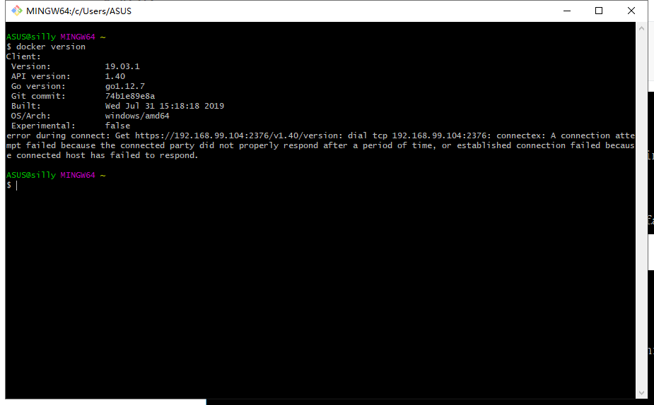
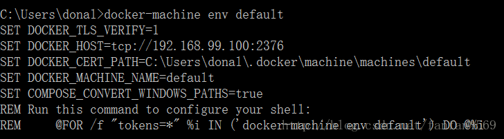
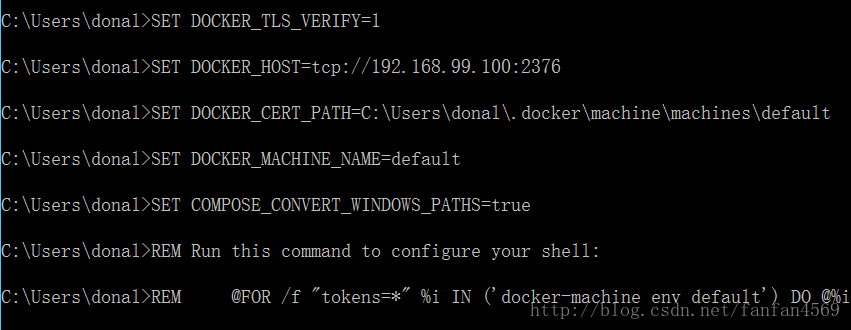
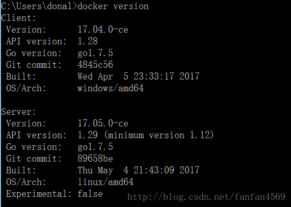
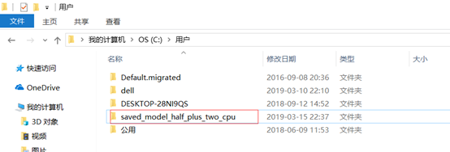

## 输入的语句

遇到的同样的语句在git bash和powershell中运行结果会不一样的情况

创建docker machine default（此语句在git bash中运行）

```
docker-machine -s "E:\ProgramData\Docker Virtual machine" create --engine-registry-mirror=https://vf29u5xi.mirror.aliyuncs.com -d virtualbox default
```

创建Tomcat（在powershell中运行）

```
docker run -d -p 8888:8080 tomcat:9 --name MyTomcat
```

创建一个tensorflow/serving容器

```
docker run -p 8501:8501 -v /c/Users/saved_model_half_plus_two_cpu:/models/half_plus_two -e MODEL_NAME=half_plus_two -t tensorflow/serving
```

## 遇到的错误

### 错误1：在安装了 Hyper-V 的 Windows 上安装 Docker Toolbox

原文：https://qq52o.me/2475.html

这个是最坑的，可能遇到好几个坑

`Docker for Windows` 是依赖 `Hyper-v` 的，但是 `Docker Toolbox` 是用 `VirtualBox` 的，我在上一步的时候已经安装了 `Hyper-v`，还是之前 [Windows10 家庭版的功能中没有 Hyper-V 的解决方法](https://qq52o.me/2468.html) 文中发的方法添加的 `Hyper-v`

在 `Windows` 功能中关闭居然没生效，重启过的，安装 `Docker Toolbox` 倒是没有什么大问题

1）但是如果像我一样安装了 `Hyper-V`，可能将无法正常使用，尝试启动 `Docker QuickStart Terminal`，将会出现以下错误消息：

```bash
Running pre-create checks...
Error with pre-create check: "This computer is running Hyper-V. VirtualBox won't boot a 64bits VM when Hyper-V is activated. Either use Hyper-V as a driver, or disable the Hyper-V hypervisor. (To skip this check, use --virtualbox-no-vtx-check)"
Looks like something went wrong in step ´Checking if machine default exists´... Press any key to continue...
```

这个我的解决方式是直接把 `Hyepr-v` 禁用，管理员模式运行 CMD:

```bash
//To disable:
bcdedit /set hypervisorlaunchtype off

//To enable:
bcdedit /set hypervisorlaunchtype auto 
```

### 错误2：

原文：https://blog.csdn.net/smilelfq/article/details/108075534



error during connect: Get https://192.168.99.104:2376/v1.40/version: dial tcp 192.168.99.104:2376: connectex: A connection attempt failed because the connected party did not properly respond after a period of time, or established connection failed because connected host has failed to respond.

**解决方法：**

cd Docker Toolbox 

运行start.sh 

注：可能需要多试几次


### 错误3：

$ time="2021-03-19T22:03:09+08:00" level=info msg="Unable to use system certificate pool: crypto/x509: system root pool is not available on Windows"
E:\Program Files\Docker Toolbox\docker.exe: Error parsing reference: "[--runtime=nvidia]" is not a valid repository/tag: invalid reference format.
See 'E:\Program Files\Docker Toolbox\docker.exe run --help'.

**解决方法：**

```
docker-machine env --shell cmd default
//或者
docker-machine env default
```



copy 一下



然后就好了




### 错误4

原文：http://www.voidcn.com/article/p-dzkgvuty-bts.html

遇到报错：$ time="2021-03-19T22:03:09+08:00" level=info msg="Unable to use system certificate pool: crypto/x509: system root pool is not available on Windows"
E:\Program Files\Docker Toolbox\docker.exe: Error parsing reference: "[--runtime=nvidia]" is not a valid repository/tag: invalid reference format.
See 'E:\Program Files\Docker Toolbox\docker.exe run --help'.

**解决方法：**更新DockerToolbox版本。（安装了DockerToolbox-19.03.1，解决问题）


### 错误5

原文：https://zhuanlan.zhihu.com/p/133510484

遇到错误

```
No versions of servable my_model found under base path /models/my_model. Did you forget to name your leaf directory as a number (eg. '/1/')?
```

**解决方法：**

原因似乎是没有挂载Windows的文件夹到虚拟机上。

把tensorflow serving中的文件夹saved_model_half_plus_two_cpu复制到C:\Users目录中。复制后如图11所示。注意saved_model_half_plus_two_cpu文件夹中有一个子文件夹00000123，如果没有字文件夹需要手动创建一个，这个子文件夹名字需要是数字，子文件夹中有.pb文件和一个variables文件夹。




输入指令

```
docker run -p 8501:8501 -v /c/Users/saved_model_half_plus_two_cpu:/models/half_plus_two -e MODEL_NAME=half_plus_two -t tensorflow/serving
```

