#公式

参考资料：面向数据驱动的城市轨道交通短时客流预测模型_梁强升.pdf

给定图G=(V,E,A)，其中V表示图的结点集合，E表示图的边集合，$A \in R_{n \times n}$是邻接矩阵。定义$D \in R_{n \times n}$是顶点的度矩阵$D_u=\sum_j W_{ij}$。

对于图G的拉普拉斯矩阵L定义为$L=D-A$，对称归一化的拉普拉斯矩阵为$L=D^{-\frac{1}{2}}AD^{-\frac{1}{2}}$。

拉普拉斯矩阵其谱分解为$L=U \Lambda U^{-1}$，其中$U=[u_1,\cdots,u_n]$ ，$\Lambda = diag([\lambda_1,\cdots,\lambda_1])$。对于一个输入$x \in R^n$在图中的傅里叶变化定义为$\hat{x} = U^Tx$，其傅里叶逆变化定义为$x = U\hat{x}$。这样，$x$与卷积核$g_\theta$进行卷积就可以写成$g_\theta*x = Ug_\theta U^Tx,g_\theta=diag([\theta_0,\cdots,\theta_{n-1}])$。

# 图（Graph）上的热传播模型

参考资料：https://www.zhihu.com/question/54504471

众所周知，没有外接干预的情况下，热量从温度高传播到温度低的地方并且不可逆，根据著名的牛顿冷却定律（Newton Cool's Law），热量传递的速度正比于温度梯度，直观上也就是某个地方 A 温度高，另外一个 B 地方温度低，这两个地方接触，那么温度高的地方的热量会以正比于他们俩温度差的速度从 A 流向 B。

## 从一维空间开始

我们先建立一个一维的温度传播的模型，假设有一个均匀的铁棒，不同位置温度不一样，现在我们刻画这个铁棒上面温度的热传播随着时间变化的关系。预先说明一下，一个连续的铁棒的热传播模型需要列**温度对时间和坐标的偏微分方程**来解决，我们不想把问题搞这么复杂，我们把**空间离散化**，假设铁棒是一个**一维链条**，链条上每一个单元拥有一致的温度，温度在相邻的不同的单元之间传播，如下图：

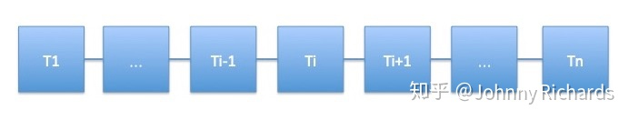

对于第 $i$ 个单元，它只和 $i-1$与$i+1$与两个单元相邻，接受它们传来的热量（或者向它们传递热量，只是正负号的差异而已），假设它当前的温度为$\phi_i$，那么就有：
$$
\frac{d\phi_i}{d_t}=k(\phi_{i+1} - \phi_i)-k(\phi_i - \phi_{i-1})
$$
$k$和单元的比热容、质量有关是个常数。右边第一项是下一个单元向本单元的热量流入导致温度升高，第二项是本单元向上一个单元的热量流出导致温度降低。做一点微小的数学变换可以得到：
$$
\frac{d\phi_i}{d_t} - k[(\phi_{i+1} - \phi_i)-(\phi_i - \phi_{i-1})] = 0
$$

注意观察第二项，它是两个差分的差分，在离散空间中，相邻位置的差分推广到连续空间就是**导数**，那么差分的差分，就是**二阶导数**！

所以，我们可以反推出铁棒这样的连续一维空间的热传导方程就是：
$$
\frac{\partial \phi}{\partial t}-k\frac{\partial^2 \phi}{\partial x^2}=0
$$
同理，在高维的欧氏空间中，一阶导数就推广到**梯度**，二阶导数就是我们今天讨论的主角——**拉普拉斯算子**：
$$
\frac{\partial \phi}{\partial t} - k \Delta \phi = 0
$$
其中$\Delta$这个符号代表的是对各个坐标二阶导数的加和，现在的主流写法也可以写作$\nabla^2$。

综上所述，我们发现这样几个事实：

1、在欧氏空间中，某个点温度升高的速度正比于该点周围的温度分布，用拉普拉斯算子衡量。

2、拉普拉斯算子，是二阶导数对高维空间的推广。

那么，你肯定会问：你扯这么多有什么用呢？我还是看不到拉普拉斯算子和拉普拉斯矩阵还有 GCN 有半毛钱关系啊？

不要急，目前只是第一步，让我们把这个热传导模型推广导拓扑空间，你就会发现它们其实刻画的是同一回事了！

## 图 (Graph) 上热传播模型的推广

现在，我们依然考虑热传导模型，只是这个事情不发生在欧氏空间了，发生在一个 Graph 上面。这个图上的每个结点（Node）是一个单元，且这个单元只和与这个结点相连的单元，也就是有边（Edge）连接的单元发生热交换。例如下图中，结点 1 只和结点 0、2、4 发生热交换，更远的例如结点 5 的热量要通过 4 间接的传播过来而没有直接热交换。

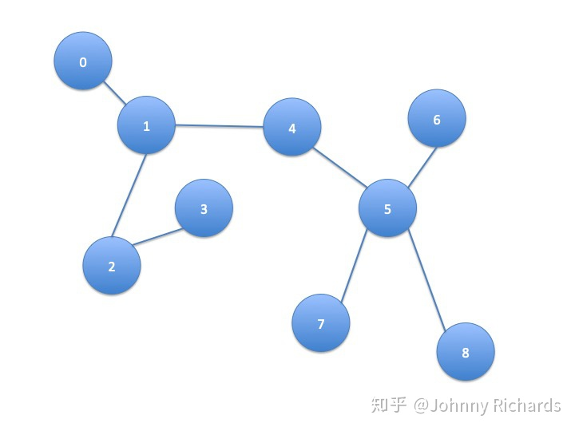

我们假设热量流动的速度依然满足牛顿冷却定律，研究任一结点$i$，它的温度随着时间的变化可以用下式来刻画：
$$
\frac{d \phi_i}{d t} = -k \sum_j A_{ij}(\phi_i-\phi_j)
$$
其中$A$是这个图的邻接矩阵（Adjacency Matrix），定义非常直观： 对于这个矩阵中的每一个元素$A_{ij}$，如果结点$i$和$j$相邻，那么$A_{ij}=1$，否则$A_{ij}=0$。在这里，我们只讨论简单情况：
1. 这张图是无向图，$i$和$j$相邻那么$j$和$i$也相邻，所以$A_{ij} = A_{ji}$，这是个对称阵。
2. 结点自己到自己没有回环边，也就是$A$对角线上元素都是$0$。

所以不难理解上面这个公式恰好表示了只有相邻的边才能和本结点发生热交换且热量输入（输出）正比于温度差。

我们不妨用乘法分配律稍微对上式做一个推导：
$$
\frac{d \phi_i}{d t} = -k[\phi_i \sum_j A_{ij}-\sum_j A_{ij}\phi_j]
=-k[deg(i)\phi_i - \sum_j A_{ij}\phi_j]
$$
先看右边括号里面第一项，$deg(\cdot)$代表对这个顶点求度（degree），一个顶点的度被定义为这个顶点有多少条边连接出去，很显然，根据邻接矩阵的定义，第一项的求和正是在计算顶点$i$的度。

再看右边括号里面的第二项，这可以认为是邻接矩阵的第$i$行对所有顶点的温度组成的向量做了个内积。

为什么要作上述变化呢，我们只看一个点的温度不太好看出来，我们把所有点的温度写成向量形式再描述上述关系就一目了然了。首先可以写成这样：
$$
\begin{bmatrix} \frac{d \phi_1}{d t} \\ \frac{d \phi_2}{d t} \\ \cdots \\ \frac{d \phi_n}{d t}\end{bmatrix} = -k\begin{bmatrix} deg(1) \times \phi_1 \\  deg(2) \times \phi_2 \\ \cdots \\  deg(n) \times \phi_n \end{bmatrix} + kA\begin{bmatrix} \phi_1 \\ \phi_2 \\ \cdots \\ \phi_n \end{bmatrix}
$$
然后我们定义向量$\phi = [\phi_1,\phi_2,\cdots,\phi_n]^T$，那么就有：
$$
\frac{d \phi}{d t} = -kD\phi + kA\phi = -k(D-A)\phi
$$
其中
$$
D = diag(deg(1),deg(2),\cdots,deg(n))
$$
被称为度矩阵，只有对角线上有值，且这个值表示对应的顶点度的大小。整理整理，我们得到：
$$
\frac{d \phi}{d t} + kL\phi = 0
$$
回顾刚才在连续欧氏空间的那个微分方程：
$$
\frac{\partial \phi}{\partial t} - k\Delta\phi = 0
$$
二者具有一样的形式！我们来对比一下二者之间的关系：

- 相同点：刻画空间温度分布随时间的变化，且这个变化满足一个相同形式的微分方程。

- 不同点：**前者刻画拓扑空间有限结点**，用向量$\phi$来刻画当前状态，单位时间状态的变化正比于线性变换$-L$算子作用在状态$\phi$上。**后者刻画欧氏空间的连续分布**，用函数$\phi(x,t)$来刻画当前状态，单位时间状态变化正比于拉普拉斯算子$\Delta$作用在状态$\phi$上。

不难发现，这就是**同一种变换、同一种关系在不同空间上面的体现**，实质上是一回事！

于是我们自然而然，可以把连续空间中的热传导，推广到图（Graph）上面去，我们把图上面和欧氏空间地位相同变换，以矩阵形式体现的$L$叫做拉普拉斯（Laplacian）矩阵。看，这正是[@superbrother](https://www.zhihu.com/people/cabf11cc8524a31b64a9226f266ee834)答案中所述的原始形式的拉普拉斯矩阵$L=D-A$。

需要多嘴一句的是，本文开头所说的离散链条上的热传导，如果你把链条看成一个图，结点从左到右编号 1，2，3... 的话，也可以用图的热传导方程刻画，此时$D$除了头尾两个结点是 1 其他值都是 2，$A$的主对角线上下两条线上值是 1，其他地方是 0。

## 推广到 GCN

现在**问题已经很明朗**了，只要你给定了一个空间，给定了空间中存在一种东西可以在这个空间上流动，两邻点之间流动的强度正比于它们之间的状态差异，那么**何止是热量可以在这个空间流动，任何东西都可以！**

自然而然，假设在图中各个结点流动的东西不是**热量**，而是**特征（Feature）**，而是**消息（Message）**，那么问题自然而然就被推广到了 GCN。**所以 GCN 的实质是什么，是在一张 Graph Network 中特征（Feature）和消息（Message）中的流动和传播！这个传播最原始的形态就是状态的变化正比于相应空间（这里是 Graph 空间）拉普拉斯算子作用在当前的状态。**

抓住了这个实质，剩下的问题就是怎么去更加好的建模和解决这个问题。

建模方面就衍生出了各种不同的算法，你可以在这个问题上面复杂化这个模型，不一定要遵从牛顿冷却定律，你可以引入核函数、引入神经网络等方法把模型建得更非线性更能刻画复杂关系。

解决方面，因为很多问题在频域解决更加好算，你可以通过 Fourier 变换把空域问题转化为频域问题，解完了再变换回来，于是便有了所有 Fourier 变换中的那些故事。

扯了这么多，总结一下，问题的本质就是：

1. 我们有张图，图上每个结点刻画一个实体，物理学场景下这个实体是某个有温度的单元，它的状态是温度，广告和推荐的场景下这个实体是一个 user，一个 item，一个 ad，它的状态是一个 embedding 的向量。
2. 相邻的结点具有比不相邻结点更密切的关系，物理学场景下，这个关系是空间上的临近、接触，广告和推荐场景下这个是一种逻辑上的关系，例如用户购买、点击 item，item 挂载 ad。
3. 结点可以传播热量 / 消息到邻居，使得相邻的结点在温度 / 特征上面更接近。

**本质上，这是一种 Message Passing，是一种 Induction，卷积、傅立叶都是表象和解法。**
**图卷积的核心思想是利用『边的信息』对『节点信息』进行『聚合』从而生成新的『节点表示』**

# 傅里叶变换

## 欧拉公式

参考资料：https://www.matongxue.com/madocs/8

在复平面上画一个单位圆，单位圆上的点可以用三角函数来表示：

### 复数

#### 复平面上的单位圆

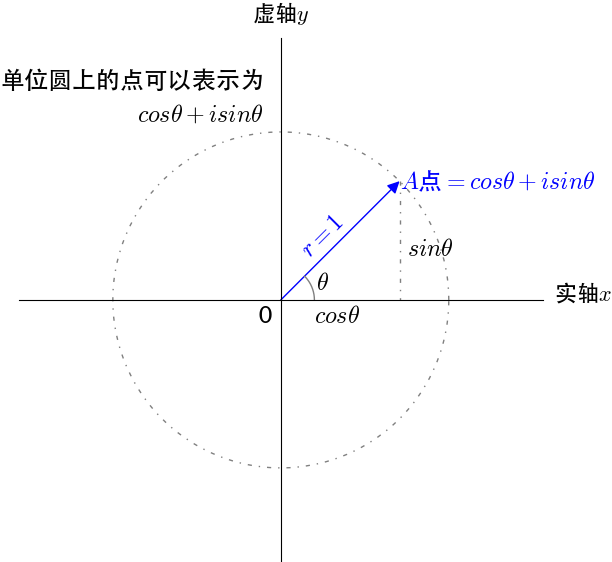

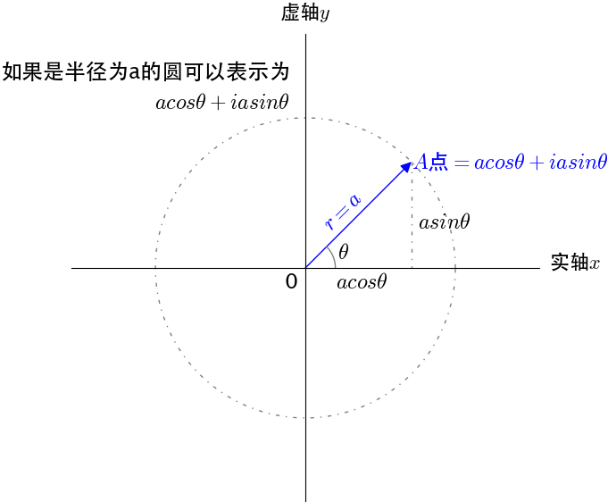

#### 复平面上乘法的几何意义

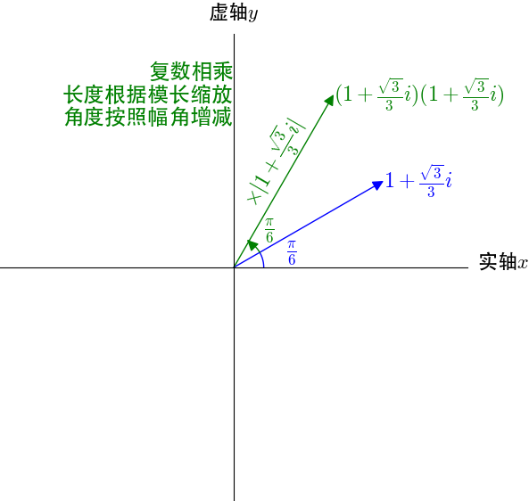

$$
\begin{aligned}
(1+\frac{\sqrt{3}}{3}i)(1+\frac{\sqrt{3}}{3}i) &= \frac{2}{3}+2\frac{\sqrt{3}}{3}i\\
|1+\frac{\sqrt{3}}{3}i| &= \frac{4}{3}\\
|\frac{2}{3}+2\frac{\sqrt{3}}{3}i| &= \frac{16}{9}
\end{aligned}
$$

### 欧拉公式

对于$\theta \in R$,有。$e^{iθ}=cosθ+isinθ$

欧拉公式在形式上很简单，是怎么发现的呢？

#### 欧拉公式与泰勒公式

关于泰勒公式可以参看这篇详尽的科普文章：

[如何通俗地解释泰勒公式？](https://zhihu.com/question/21149770/answer/111173412) 。

欧拉最早是通过泰勒公式观察出欧拉公式的：
$$
\begin{aligned}
&e^x = 1 + x + \frac{1}{2!}x^2 + \frac{1}{3!}x^3+\cdots
\\
&sin(x) = x - \frac{1}{3!}x^3 + \frac{1}{5!}x^5
\\
&cos(x) = 1 - \frac{1}{2!}x^2 + \frac{1}{4!}x^4
\end{aligned}
$$
将$x = i\theta$代入$e$可得：
$$
\begin{aligned}
&e^{i\theta} = 1 + i\theta + \frac{(i\theta)^2}{2!} + \frac{(i\theta)^3}{3!}  + \frac{(i\theta)^4}{4!} + + \frac{(i\theta)^5}{5!} + \frac{(i\theta)^6}{6!} + + \frac{(i\theta)^7}{7!} + \frac{(i\theta)^8}{8!}  + \cdots
\\
&=1+i\theta - \frac{\theta^2}{2!} - \frac{i\theta^3}{3!} + \frac{\theta^4}{4!} + \frac{i\theta^5}{5!} - \frac{\theta^6}{6!} - \frac{i\theta^7}{7!} + \frac{\theta^8}{8!} + \cdots
\\
&=(1-\frac{\theta^2}{2!} + \frac{\theta^4}{4!} - \frac{\theta^6}{6!} + \frac{\theta^8}{8!}) + i(\theta - \frac{\theta^3}{3!} + \frac{\theta^5}{5!} - \frac{\theta^7}{7!} + \cdots)
\\
&=cos\theta + isin\theta
\end{aligned}
$$
那欧拉公式怎么可以有一个直观的理解呢？
#### 对同一个点不同的描述方式

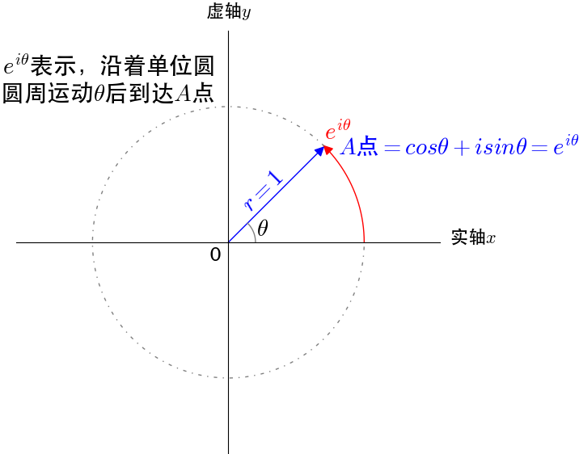

我们可以把$e^{iθ}$看作通过单位圆的圆周运动来描述单位圆上的点，$cosθ+isinθ$通过复平面的坐标来描述单位圆上的点，是同一个点不同的描述方式，所以有$e^{iθ}=cosθ+isinθ$。

#### **为什么$e^{i\theta}$是圆周运动？**

定义$e$为：$e=\lim_{n \to \infty}(1+\frac{1}{n})^n$

这是实数域上的定义，可以推广到复数域$e^i=\lim_{n \to \infty}(1+\frac{i}{n})^n$。根据之前对复数乘法的描述，乘上$(1+\frac{i}{n})$是进行伸缩和旋转运动，$n$取值不同，伸缩和旋转的幅度不同。

我们来看看$e^i=e^{i×1}$如何在圆周上完成1弧度的圆周运动的：

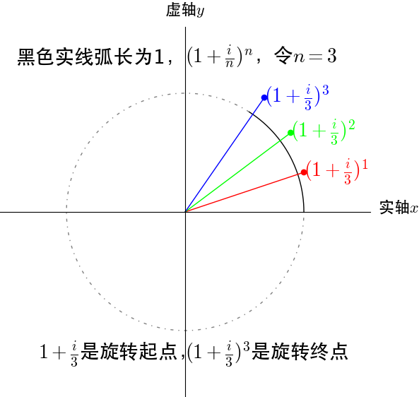

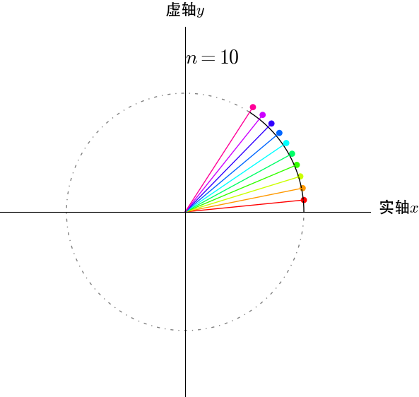

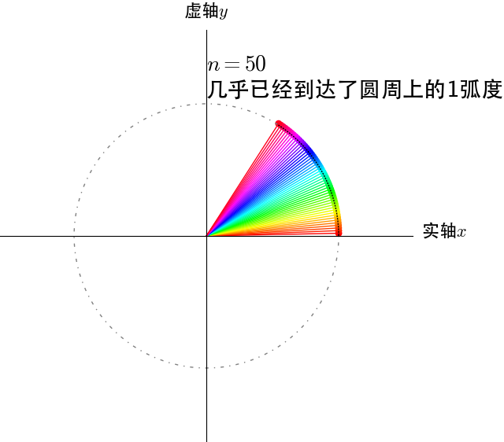

从图上可以推出$n \to \infty$时，$e^i$在单位圆上转动了1弧度。

再来看看$e^{i\pi}$，这个应该是在单位圆上转动$\pi$弧度：

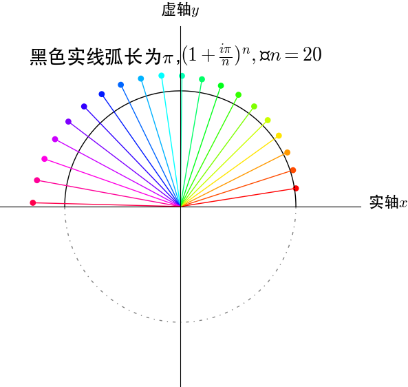

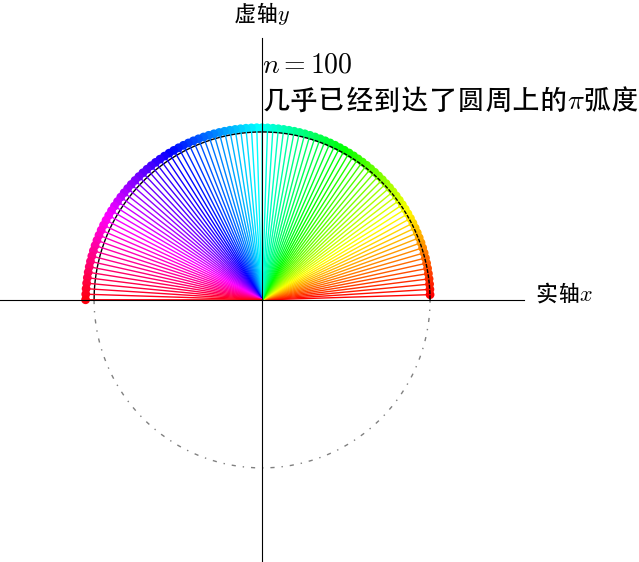

#### $2^i$的几何含义是什么？

$2^i$看不出来有什么几何含义，不过我们稍微做个变换$e^{i\ln2}$，几何含义还是挺明显的，沿圆周运动$\ln2$弧度。

#### 欧拉公式与三角函数

根据欧拉公式$e^{iθ}=cosθ+isinθ$，可以轻易推出：

$sinθ=\frac{e^{i\theta} - e^{-i\theta}}{2i}$和$cosθ=\frac{e^{i\theta} + e^{-i\theta}}{2}$。三角函数定义域被扩大到了复数域。

我们把复数当作向量来看待，复数的实部是$x$方向，虚部是$y$方向，很容易观察出其几何意义。

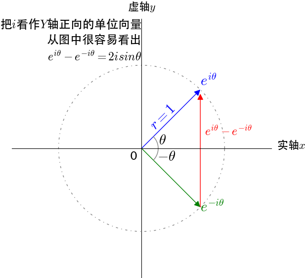

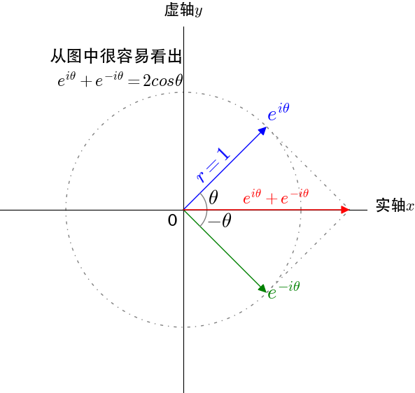

#### 欧拉恒等式

当$\theta=\pi$的时候，代入欧拉公式：

$$
e^{i\pi} = cos\pi + i sin\pi = -1 \implies e^{i\pi} + 1 = 0
$$

$e^{i\pi} + 1 = 0$就是欧拉恒等式，被誉为上帝公式，$e$、$\pi$、$i$、乘法单位元$1$、加法单位元$0$，这五个重要的数学元素全部被包含在内，在数学爱好者眼里，仿佛一行诗道尽了数学的美好。

