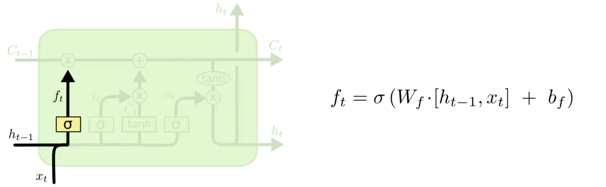
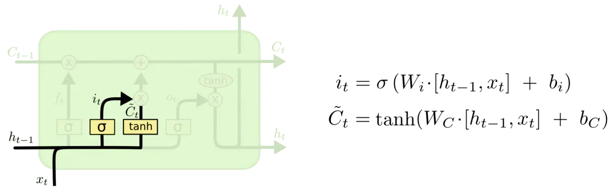

## 循环神经网络

人类并不是每时每刻都从一片空白的大脑开始他们的思考。在你阅读这篇文章时候，你都是基于自己已经拥有的对先前所见词的理解来推断当前词的真实含义。我们不会将所有的东西都全部丢弃，然后用空白的大脑进行思考。我们的思想拥有持久性。

传统的神经网络并不能做到这点，看起来也像是一种巨大的弊端。例如，假设你希望对电影中的每个时间点的时间类型进行分类。传统的神经网络应该很难来处理这个问题——使用电影中先前的事件推断后续的事件。

RNN 解决了这个问题。RNN 是包含循环的网络，允许信息的持久化。


<center>RNN包含循环</center>

在上面的示例图中，神经网络的模块，$A$，正在读取某个输入 $x_i$，并输出一个值 $h_i$。循环可以使得信息可以从当前步传递到下一步。

这些循环使得 RNN 看起来非常神秘。然而，如果你仔细想想，这样也不比一个正常的神经网络难于理解。RNN 可以被看做是同一神经网络的多次复制，每个神经网络模块会把消息传递给下一个。所以，如果我们将这个循环展开：


<center>展开的 RNN</center>

链式的特征揭示了 RNN 本质上是与序列和列表相关的。他们是对于这类数据的最自然的神经网络架构。

并且 RNN 也已经被人们应用了！在过去几年中，应用 RNN 在语音识别，语言建模，翻译，图片描述等问题上已经取得一定成功，并且这个列表还在增长。我建议大家参考 Andrej Karpathy 的博客文章——[The Unreasonable Effectiveness of Recurrent Neural Networks](https://links.jianshu.com/go?to=http%3A%2F%2Fkarpathy.github.io%2F2015%2F05%2F21%2Frnn-effectiveness%2F) 来看看更丰富有趣的 RNN 的成功应用。

而这些成功应用的关键之处就是 LSTM 的使用，这是一种特别的 RNN，比标准的 RNN 在很多的任务上都表现得更好。几乎所有的令人振奋的关于 RNN 的结果都是通过 LSTM 达到的。这篇博文也会就 LSTM 进行展开。

## 长期依赖（Long-Term Dependencies）问题

RNN 的关键点之一就是他们可以用来连接先前的信息到当前的任务上，例如使用过去的视频段来推测对当前段的理解。如果 RNN 可以做到这个，他们就变得非常有用。但是真的可以么？答案是，还有很多依赖因素。

有时候，我们仅仅需要知道先前的信息来执行当前的任务。例如，我们有一个语言模型用来基于先前的词来预测下一个词。如果我们试着预测 “the clouds are in the sky” 最后的词，我们并不需要任何其他的上下文 —— 因此下一个词很显然就应该是 sky。在这样的场景中，相关的信息和预测的词位置之间的间隔是非常小的，RNN 可以学会使用先前的信息。


<center>不太长的相关信息和位置间隔</center>

但是同样会有一些更加复杂的场景。假设我们试着去预测“I grew up in France... I speak fluent French”最后的词。当前的信息建议下一个词可能是一种语言的名字，但是如果我们需要弄清楚是什么语言，我们是需要先前提到的离当前位置很远的 France 的上下文的。这说明相关信息和当前预测位置之间的间隔就肯定变得相当的大。

不幸的是，在这个间隔不断增大时，RNN 会丧失学习到连接如此远的信息的能力。


<center>相当长的相关信息和位置间隔</center>

在理论上，RNN 绝对可以处理这样的 长期依赖 问题。人们可以仔细挑选参数来解决这类问题中的最初级形式，但在实践中，RNN 肯定不能够成功学习到这些知识。[Bengio, et al. (1994)](https://links.jianshu.com/go?to=http%3A%2F%2Fwww-dsi.ing.unifi.it%2F~paolo%2Fps%2Ftnn-94-gradient.pdf)等人对该问题进行了深入的研究，他们发现一些使训练 RNN 变得非常困难的相当根本的原因。

然而，幸运的是，LSTM 并没有这个问题！

## LSTM 网络

Long Short Term 网络—— 一般就叫做 LSTM ——是一种 RNN 特殊的类型，可以学习长期依赖信息。LSTM 由[Hochreiter & Schmidhuber (1997)](https://links.jianshu.com/go?to=http%3A%2F%2Fdeeplearning.cs.cmu.edu%2Fpdfs%2FHochreiter97_lstm.pdf)提出，并在近期被[Alex Graves](https://links.jianshu.com/go?to=https%3A%2F%2Fscholar.google.com%2Fcitations%3Fuser%3DDaFHynwAAAAJ%26hl%3Den)进行了改良和推广。在很多问题，LSTM 都取得相当巨大的成功，并得到了广泛的使用。

LSTM 通过刻意的设计来避免长期依赖问题。记住长期的信息在实践中是 LSTM 的默认行为，而非需要付出很大代价才能获得的能力！

所有 RNN 都具有一种重复神经网络模块的链式的形式。在标准的 RNN 中，这个重复的模块只有一个非常简单的结构，例如一个 `tanh` 层。


<center>标准 RNN 中的重复模块包含单一的层</center>

LSTM 同样是这样的结构，但是重复的模块拥有一个不同的结构。不同于 单一神经网络层，这里是有四个，以一种非常特殊的方式进行交互。


<center>LSTM 中的重复模块包含四个交互的层</center>

不必担心这里的细节。我们会一步一步地剖析 LSTM 解析图。现在，我们先来熟悉一下图中使用的各种元素的图标。


<center>LSTM 中的图标</center>

在上面的图例中，每一条黑线传输着一整个向量，从一个节点的输出到其他节点的输入。粉色的圈代表按位 pointwise 的操作，诸如向量的和，而黄色的矩阵就是学习到的神经网络层。合在一起的线表示向量的连接，分开的线表示内容被复制，然后分发到不同的位置。

## LSTM 的核心思想

LSTM 的关键就是细胞状态，水平线在图上方贯穿运行。

细胞状态类似于传送带。直接在整个链上运行，只有一些少量的线性交互。信息在上面流传保持不变会很容易。


<center>Paste_Image.png</center>

LSTM 有通过精心设计的称作为“门”的结构来去除或者增加信息到细胞状态的能力。门是一种让信息选择式通过的方法。他们包含一个 `sigmoid` 神经网络层和一个按位的乘法操作。


<center>Paste_Image.png</center>

Sigmoid 层输出$0$到$1$之间的数值，描述每个部分有多少量可以通过。$0$代表“不许任何量通过”，$1$就指"允许任意量通过”！

LSTM 拥有三个门，来保护和控制细胞状态。

## 逐步理解 LSTM

在我们 LSTM 中的第一步是决定我们会从细胞状态中丢弃什么信息。这个决定通过一个称为**忘记门层**完成。该门会读取 $h_{t-1}$和$x_t$，输出一个在$0$到$1$之间的数值给每个在细胞状态$C_{t-1}$中的数字。$1$表示“完全保留”， $0$表示“完全舍弃”。

让我们回到语言模型的例子中来基于已经看到的预测下一个词。在这个问题中，细胞状态可能包含当前**主语**的性别，因此正确的**代词**可以被选择出来。当我们看到新的**主语**，我们希望忘记旧的**主语**。



<center>决定丢弃信息</center>

下一步是确定什么样的新信息被存放在细胞状态中。这里包含两个部分。第一，`sigmoid` 层称 “输入门层” 决定什么值我们将要更新。然后，一个 `tanh` 层创建一个新的候选值向量，$\tilde{C}_t$，会被加入到状态中。下一步，我们会讲这两个信息来产生对状态的更新。

在我们语言模型的例子中，我们希望增加新的主语的性别到细胞状态中，来替代旧的需要忘记的主语。



<center>确定更新的信息</center>

现在是更新旧细胞状态的时间了，$C_{t-1}$更新为。$C_{t}$前面的步骤已经决定了将会做什么，我们现在就是实际去完成。

我们把旧状态与$f_t$ 相乘，丢弃掉我们确定需要丢弃的信息。接着加上 $i_t * \tilde{C}_t$。这就是新的候选值，根据我们决定更新每个状态的程度进行变化。

在语言模型的例子中，这就是我们实际根据前面确定的目标，丢弃旧代词的性别信息并添加新的信息的地方。


<center>更新细胞状态</center>

最终，我们需要确定输出什么值。这个输出将会基于我们的细胞状态，但是也是一个过滤后的版本。首先，我们运行一个 `sigmoid` 层来确定细胞状态的哪个部分将输出出去。接着，我们把细胞状态通过 `tanh` 进行处理（得到一个在$-1$到$1$之间的值）并将它和 `sigmoid` 门的输出相乘，最终我们仅仅会输出我们确定输出的那部分。

在语言模型的例子中，因为他就看到了一个 **代词**，可能需要输出与一个 **动词** 相关的信息。例如，可能输出是否代词是单数还是负数，这样如果是动词的话，我们也知道动词需要进行的词形变化。


<center>输出信息</center>

## LSTM 的变体

我们到目前为止都还在介绍正常的 LSTM。但是不是所有的 LSTM 都长成一个样子的。实际上，几乎所有包含 LSTM 的论文都采用了微小的变体。差异非常小，但是也值得拿出来讲一下。

其中一个流形的 LSTM 变体，就是由 [Gers & Schmidhuber (2000)](https://links.jianshu.com/go?to=ftp%3A%2F%2Fftp.idsia.ch%2Fpub%2Fjuergen%2FTimeCount-IJCNN2000.pdf) 提出的，增加了 “peephole connection”。是说，我们让 门层 也会接受细胞状态的输入。


<center>peephole 连接</center>

上面的图例中，我们增加了 peephole 到每个门上，但是许多论文会加入部分的 peephole 而非所有都加。

另一个变体是通过使用 coupled 忘记和输入门。不同于之前是分开确定什么忘记和需要添加什么新的信息，这里是一同做出决定。我们仅仅会当我们将要输入在当前位置时忘记。我们仅仅输入新的值到那些我们已经忘记旧的信息的那些状态 。


<center>coupled 忘记门和输入门</center>

另一个改动较大的变体是 Gated Recurrent Unit (GRU)，这是由 [Cho, et al. (2014)](https://links.jianshu.com/go?to=http%3A%2F%2Farxiv.org%2Fpdf%2F1406.1078v3.pdf) 提出。它将忘记门和输入门合成了一个单一的 更新门。同样还混合了细胞状态和隐藏状态，和其他一些改动。最终的模型比标准的 LSTM 模型要简单，也是非常流行的变体。


<center>GRU</center>

这里只是部分流行的 LSTM 变体。当然还有很多其他的，如[Yao, et al. (2015)](https://links.jianshu.com/go?to=http%3A%2F%2Farxiv.org%2Fpdf%2F1508.03790v2.pdf) 提出的 Depth Gated RNN。还有用一些完全不同的观点来解决长期依赖的问题，如[Koutnik, et al. (2014)](https://links.jianshu.com/go?to=http%3A%2F%2Farxiv.org%2Fpdf%2F1402.3511v1.pdf) 提出的 Clockwork RNN。

要问哪个变体是最好的？其中的差异性真的重要吗？[Greff, et al. (2015)](https://links.jianshu.com/go?to=http%3A%2F%2Farxiv.org%2Fpdf%2F1503.04069.pdf) 给出了流行变体的比较，结论是他们基本上是一样的。[Jozefowicz, et al. (2015)](https://links.jianshu.com/go?to=http%3A%2F%2Fjmlr.org%2Fproceedings%2Fpapers%2Fv37%2Fjozefowicz15.pdf) 则在超过 1 万种 RNN 架构上进行了测试，发现一些架构在某些任务上也取得了比 LSTM 更好的结果。


Jozefowicz等人论文截图

## 结论

刚开始，我提到通过 RNN 得到重要的结果。本质上所有这些都可以使用 LSTM 完成。对于大多数任务确实展示了更好的性能！

由于 LSTM 一般是通过一系列的方程表示的，使得 LSTM 有一点令人费解。然而本文中一步一步地解释让这种困惑消除了不少。

LSTM 是我们在 RNN 中获得的重要成功。很自然地，我们也会考虑：哪里会有更加重大的突破呢？在研究人员间普遍的观点是：“Yes! 下一步已经有了——那就是**注意力**！” 这个想法是让 RNN 的每一步都从更加大的信息集中挑选信息。例如，如果你使用 RNN 来产生一个图片的描述，可能会选择图片的一个部分，根据这部分信息来产生输出的词。实际上，[Xu, *et al.*(2015)](https://links.jianshu.com/go?to=http%3A%2F%2Farxiv.org%2Fpdf%2F1502.03044v2.pdf)已经这么做了——如果你希望深入探索**注意力**可能这就是一个有趣的起点！还有一些使用注意力的相当振奋人心的研究成果，看起来有更多的东西亟待探索……
 注意力也不是 RNN 研究领域中唯一的发展方向。例如，[Kalchbrenner, *et al.* (2015)](https://links.jianshu.com/go?to=http%3A%2F%2Farxiv.org%2Fpdf%2F1507.01526v1.pdf) 提出的 Grid LSTM 看起来也是很有前途。使用生成模型的 RNN，诸如[Gregor, *et al.* (2015)](https://links.jianshu.com/go?to=http%3A%2F%2Farxiv.org%2Fpdf%2F1502.04623.pdf) [Chung, *et al.* (2015)](https://links.jianshu.com/go?to=http%3A%2F%2Farxiv.org%2Fpdf%2F1506.02216v3.pdf) 和 [Bayer & Osendorfer (2015)](https://links.jianshu.com/go?to=http%3A%2F%2Farxiv.org%2Fpdf%2F1411.7610v3.pdf) 提出的模型同样很有趣。在过去几年中，RNN 的研究已经相当的燃，而研究成果当然也会更加丰富！


作者：朱小虎XiaohuZhu
链接：https://www.jianshu.com/p/9dc9f41f0b29
来源：简书
著作权归作者所有。商业转载请联系作者获得授权，非商业转载请注明出处。

## 输入输出

参考资料：https://www.zhihu.com/question/41949741

## LSTM 有状态模型（stateful LSTM）和无状态模型（stateless LSTM）

参考资料：https://blog.csdn.net/qq_27586341/article/details/88239404

## LSTM中的batch_size到底是什么

参考资料：https://blog.csdn.net/ch206265/article/details/107088040/

真正的LSTM输入数据并不是按照原始数据这样的顺序输入网络的，


（数据太多，没展示完。。） 而是根据time_step=n将数据重构成下列形式进行输入的。这个案例中n=30，可以看到： 第一行数据就是按照t排列的前30条数据，y也就是预测值是第31条数据。依次类推……

```
"""此为generate_data_by_n_days构建好的数据格式
           c0       c1       c2       c3  ...      c27      c28      c29        y
0     4144.68  4124.73  4126.94  4109.36  ...  3946.43  3945.20  3952.20  3972.53
1     4124.73  4126.94  4109.36  4047.56  ...  3945.20  3952.20  3972.53  3970.11
2     4126.94  4109.36  4047.56  4018.61  ...  3952.20  3972.53  3970.11  3998.10
3     4109.36  4047.56  4018.61  4014.57  ...  3972.53  3970.11  3998.10  3979.66
4     4047.56  4018.61  4014.57  4007.14  ...  3970.11  3998.10  3979.66  3941.48
...       ...      ...      ...      ...  ...      ...      ...      ...      ...
2011  2631.05  2624.32  2618.25  2705.75  ...  2546.03  2534.16  2489.03  2520.76
2012  2624.32  2618.25  2705.75  2681.33  ...  2534.16  2489.03  2520.76  2514.65
2013  2618.25  2705.75  2681.33  2666.43  ...  2489.03  2520.76  2514.65  2486.24
2014  2705.75  2681.33  2666.43  2664.41  ...  2520.76  2514.65  2486.24  2481.66
2015  2681.33  2666.43  2664.41  2645.95  ...  2514.65  2486.24  2481.66  2472.84
"""
```

那么batch_size=60是什么呢，我们看看构建的模型LSTM网络一个batch中的输入数据格式吧：

我们查看的数据是从DataLoader中提取的X和Y，其中X是构建好的LSTM网络的输入数据，控制台终的输出：

```python
tensor([[4144.6797, 4124.7300, 4126.9399,  ..., 3946.4299, 3945.1997,
         3952.2000],
        [4124.7300, 4126.9399, 4109.3599,  ..., 3945.1997, 3952.2000,
         3972.5298],
        [4126.9399, 4109.3599, 4047.5598,  ..., 3952.2000, 3972.5298,
         3970.1099],
        ...,
        [3716.0698, 3690.6399, 3758.7798,  ..., 4184.4399, 4148.5298,
         4085.1699],
        [3690.6399, 3758.7798, 3736.2500,  ..., 4148.5298, 4085.1699,
         4076.3899],
        [3758.7798, 3736.2500, 3732.6499,  ..., 4085.1699, 4076.3899,
         4077.4500]], device='cuda:0')
torch.Size([60, 30])
tensor([3972.5298, 3970.1099, 3998.0999, 3979.6599, 3941.4800, 3937.6899,
        3921.7000, 3880.7397, 3859.6799, 3842.8699, 3827.2100, 3857.4700,
        3839.3799, 3838.2300, 3853.7998, 3863.4500, 3807.3599, 3829.7998,
        3825.7598, 3769.8799, 3824.7397, 3801.7197, 3793.0000, 3803.6299,
        3738.8298, 3734.5298, 3731.7798, 3716.0698, 3690.6399, 3758.7798,
        3736.2500, 3732.6499, 3627.7598, 3585.7998, 3663.9500, 3647.9897,
        3775.8499, 3786.8899, 3899.8599, 3937.1799, 3987.4299, 4091.2700,
        4092.9998, 4063.0798, 4181.3101, 4215.8501, 4115.2598, 4147.6499,
        4092.5398, 4031.1499, 4110.5298, 4132.7798, 4126.7100, 4149.0098,
        4184.4399, 4148.5298, 4085.1699, 4076.3899, 4077.4500, 4001.5598],
       device='cuda:0')
torch.Size([60])
```

第一个tensor是X第二个tensor是Y

**从X可以看到batchsize就是有多少个sequence（重构后的数据有2015个sequence），一个sequence有time_step=30条数据**

**Y的数量也是batch_size=60个。**

## 理解LSTM在keras API中参数return_sequences和return_state

原文：https://blog.csdn.net/u011327333/article/details/78501054/

Kears LSTM API 中给出的两个参数描述

- **return_sequences**：默认 False。在输出序列中，返回单个 hidden state值还是返回全部time step 的 hidden state值。 False 返回单个， true 返回全部。
- **return_state**：默认 False。是否返回除输出之外的最后一个状态。

#### 区别 cell state 和 hidden state

LSTM 的网络结构中，直接根据当前 input 数据，得到的输出称为 hidden state。
还有一种数据是不仅仅依赖于当前输入数据，而是一种伴随整个网络过程中用来记忆，遗忘，选择并最终影响 hidden state 结果的东西，称为 cell state。 cell state 就是实现 long short memory 的关键。


如图所示， C 表示的就是 cell state。h 就是hidden state。（选的图不太好，h的颜色比较浅）。整个绿色的矩形方框就是一个 cell。

cell state 是不输出的，它仅对输出 hidden state 产生影响。

通常情况，我们不需要访问 cell state，除非想设计复杂的网络结构时。例如在设计 encoder-decoder 模型时，我们可能需要对 cell state 的初始值进行设定。

#### keras 中设置两种参数的讨论

**1.return_sequences=False && return_state=False**

```
h = LSTM(X)1
```

Keras API 中，return_sequences和return_state默认就是false。此时只会返回一个hidden state 值。如果input 数据包含多个时间步，则这个hidden state 是最后一个时间步的结果

**2.return_sequences=True && return_state=False**

```
LSTM(1, return_sequences=True)1
```

输出的hidden state 包含全部时间步的结果。

**3.return_sequences=False && return_state=True**

```
lstm1, state_h, state_c = LSTM(1, return_state=True)1
```

lstm1 和 state_h 结果都是 hidden state。在这种参数设定下，它们俩的值相同。都是最后一个时间步的 hidden state。 state_c 是最后一个时间步 cell state结果。

为什么要保留两个值一样的参数？ 马上看配置4就会明白

为了便于说明问题，我们给配置3和配置4一个模拟的结果，程序结果参考reference文献。

```
[array([[ 0.10951342]], dtype=float32), # lstm1
 array([[ 0.10951342]], dtype=float32), # state_h
 array([[ 0.24143776]], dtype=float32)] # state_c123
```

**3.return_sequences=True && return_state=True**

```
lstm1, state_h, state_c = LSTM(1, return_sequences=True, return_state=True)1
```

此时，我们既要输出全部时间步的 hidden state ，又要输出 cell state。

lstm1 存放的就是全部时间步的 hidden state。

state_h 存放的是最后一个时间步的 hidden state

state_c 存放的是最后一个时间步的 cell state

一个输出例子，假设我们输入的时间步 time step=3

```
[array([[[-0.02145359],
        [-0.0540871 ],
        [-0.09228823]]], dtype=float32),
 array([[-0.09228823]], dtype=float32),
 array([[-0.19803026]], dtype=float32)]12345
```

可以看到state_h 的值和lstm1的最后一个时间步的值相同。

state_c 则表示最后一个时间步的 cell state

#### Reference

1. https://machinelearningmastery.com/return-sequences-and-return-states-for-lstms-in-keras/

# LSTM函数的各个参数的含义

参考原文：https://blog.csdn.net/sinat_35576477/article/details/91340437