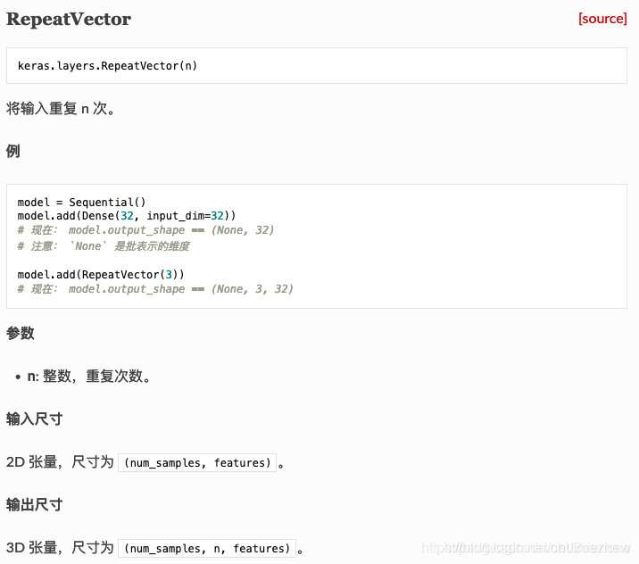
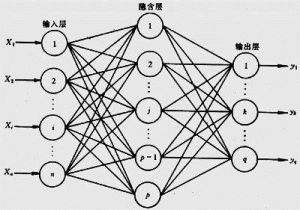
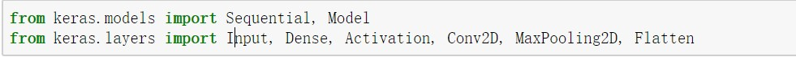
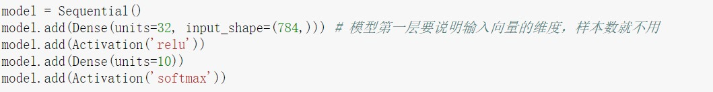
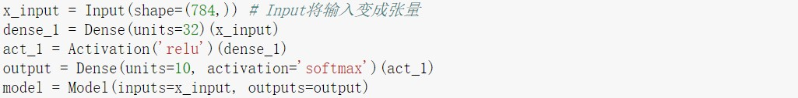
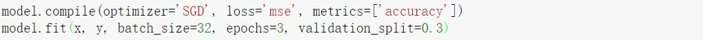
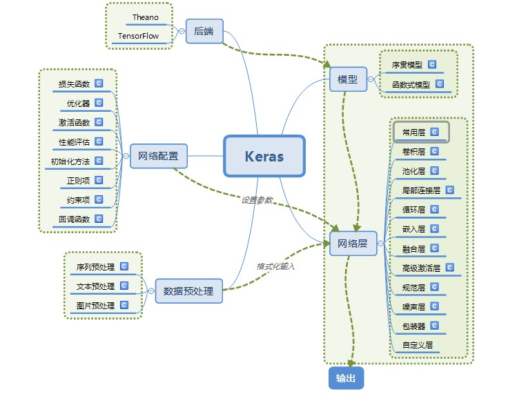

参考资料：https://www.keraschina.com/keras_intro/

Keras是Python中以CNTK、Tensorflow或者Theano为计算后台的一个深度学习建模环境。相对于其他深度学习的计算软件，如：Tensorflow、Theano、Caffe等，Keras在实际应用中有一些显著的优点，其中最主要的优点就是Keras已经高度模块化了，支持现有的常见模型（CNN、RNN等），更重要的是建模过程相当方便快速，加快了开发速度。

笔者使用的是基于Tensorflow为计算后台。接下来将介绍一些建模过程的常用层、搭建模型和训练过程，而Keras中的文字、序列和图像数据预处理，我们将在相应的实践项目中进行讲解。

 

## 1.常用层（各层函数只介绍一些常用参数，详细参数介绍可查阅Keras文档）

### 1.1 全连接层

==**神经网络中最常用到的，实现对神经网络里的神经元激活。**==

Dense（units, activation=’relu’, use_bias=True）

参数说明：

units: 全连接层输出的维度，即下一层神经元的个数。

activation：激活函数，默认使用Relu。

use_bias：是否使用bias偏置项。

 

### 1.2 激活层

**==对上一层的输出应用激活函数。==**

Activation(activation)

参数说明：

Activation：想要使用的激活函数，如：’relu’、’tanh’、‘sigmoid’等。

 

### 1.3 Dropout层

**==对上一层的神经元随机选取一定比例的失活，不更新，但是权重仍然保留，防止过拟合。==**

Dropout(rate)

参数说明:

rate：失活的比例，0-1的浮点数。

 

### 1.4 Flatten层

**==将一个维度大于或等于3的高维矩阵，“压扁”为一个二维矩阵。即保留第一个维度（如：batch的个数），然后将剩下维度的值相乘作为“压扁”矩阵的第二个维度。==**

Flatten()

 

### 1.5 Reshape层

**==该层的作用和reshape一样，就是将输入的维度重构成特定的shape。==**

Reshape(target_shape)

参数说明：

target_shape：目标矩阵的维度，不包含batch样本数。

如我们想要一个9个元素的输入向量重构成一个(None, 3, 3)的二维矩阵：

Reshape((3,3), input_length=(16, ))

 

### 1.6 卷积层

**==卷积操作分为一维、二维、三维，分别为Conv1D、Conv2D、Conv3D。一维卷积主要应用于以时间序列数据或文本数据，二维卷积通常应用于图像数据。由于这三种的使用和参数都基本相同，所以主要以处理图像数据的Conv2D进行说明。==**

Conv2D(filters, kernel_size, strides=(1, 1), padding='valid')

参数说明：

filters：卷积核的个数。

kernel_size：卷积核的大小。

strdes：步长，二维中默认为(1, 1)，一维默认为1。

Padding：补“0”策略，’valid‘指卷积后的大小与原来的大小可以不同，’same‘则卷积后大小与原来大小一致。

 

### 1.7 池化层

**==与卷积层一样，最大统计量池化和平均统计量池化也有三种，分别为MaxPooling1D、MaxPooling2D、MaxPooling3D和AveragePooling1D、AveragePooling2D、AveragePooling3D，由于使用和参数基本相同，所以主要以MaxPooling2D进行说明。==**

MaxPooling(pool_size=(2,2), strides=None, padding=’valid’)

参数说明：

pool_size：长度为2的整数tuple，表示在横向和纵向的下采样样子，一维则为纵向的下采样因子。

padding：和卷积层的padding一样。

 

### 1.8 循环层

**==循环神经网络中的RNN、LSTM和GRU都继承本层，所以该父类的参数同样使用于对应的子类SimpleRNN、LSTM和GRU。==**

Recurrent(return_sequences=False)

return_sequences：控制返回的类型，“False”返回输出序列的最后一个输出，“True”则返回整个序列。当我们要搭建多层神经网络（如深层LSTM）时，若不是最后一层，则需要将该参数设为True。

 

### 1.9 嵌入层

**==该层只能用在模型的第一层，是将所有索引标号的稀疏矩阵映射到致密的低维矩阵。如我们对文本数据进行处理时，我们对每个词编号后，我们希望将词编号变成词向量就可以使用嵌入层。==**

Embedding(input_dim, output_dim, input_length)

参数说明：

Input_dim：大于或等于0的整数，字典的长度即输入数据的个数。

output_dim：输出的维度，如词向量的维度。

input_length：当输入序列的长度为固定时为该长度，然后要在该层后加上Flatten层，然后再加上Dense层，则必须指定该参数，否则Dense层无法自动推断输出的维度。

该层可能有点费解，举个例子，当我们有一个文本，该文本有100句话，我们已经通过一系列操作，使得文本变成一个(100,32)矩阵，每行代表一句话，每个元素代表一个词，我们希望将该词变为64维的词向量：

Embedding(100, 64, input_length=32)

则输出的矩阵的shape变为(100, 32, 64)：即每个词已经变成一个64维的词向量。

 

### 1.10 输入层

input()

```python
def Input(shape=None, batch_shape=None,
          name=None, dtype=None, sparse=False,
          tensor=None):
```

\#参数：

shape: 形状元组（整型），不包括batch size。例如, shape=(32,) 表示了预期的输入将是一批一维向量，每个向量含有32个元素。

batch_shape: 形状元组（整型），包括了batch size。例如, batch_shape=(10,32)表示了预期的输入将是10个32维向量的批次。

name: 对于该层是可选的名字字符串。在一个模型中是独一无二的（同一个名字不能复用2次）。如果name没有被特指将会自动生成。

dtype: 预期的输入数据类型

sparse: 特定的布尔值，占位符是否为sparse

tensor: 可选的存在的向量包装到Input层，如果设置了，该层将不会创建一个占位张量。

\#返回

一个张量

### 1.11 RepeatVector




## 2.Keras模型搭建

讲完了一些常用层的语法后，通过模型搭建来说明Keras的方便性。Keras中设定了两类深度学习的模型，一类是序列模型（Sequential类）；一类是通用模型（Model类），接下来我们通过搭建下图模型进行讲解。



<center>图 1：两层神经网络</center>

假设我们有一个两层神经网络，其中输入层为784个神经元，隐藏层为32个神经元，输出层为10个神经元，隐藏层使用relu激活函数，输出层使用softmax激活函数。分别使用序列模型和通用模型实现如下：



<center>图 2：导入相关库</center>



<center>图 3：序列模型实现</center>

使用序列模型，首先我们要实例化Sequential类，之后就是使用该类的add函数加入我们想要的每一层，从而实现我们的模型。





<center>图 4：通用模型实现</center>

使用通用模型，首先要使用Input函数将输入转化为一个tensor，然后将每一层用变量存储后，作为下一层的参数，最后使用Model类将输入和输出作为参数即可搭建模型。


从以上两类模型的简单搭建，都可以发现Keras在搭建模型比起Tensorflow等简单太多了，如Tensorflow需要定义每一层的权重矩阵，输入用占位符等，这些在Keras中都不需要，我们只要在第一层定义输入维度，其他层定义输出维度就可以搭建起模型，通俗易懂，方便高效，这是Keras的一个显著的优势。

## 3.模型优化和训练

### 3.1 compile

compile(optimizer, loss, metrics=None)

参数说明：

optimizer：优化器，如：’SGD‘，’Adam‘等。

loss：定义模型的损失函数，如：’mse’，’mae‘等。

metric：模型的评价指标，如：’accuracy‘等。

 

### 3.2 fit

fit(x=None, y=None, batch_size=None, epochs=1, verbose=1, validation_split=0.0)

参数说明：

x：输入数据。

y：标签。

batch_size：梯度下降时每个batch包含的样本数。

epochs：整数，所有样本的训练次数。

verbose：日志显示，0为不显示，1为显示进度条记录，2为每个epochs输出一行记录。

validation_split：0-1的浮点数，切割输入数据的一定比例作为验证集。



<center>图 5：优化和训练实现</center>

最后用以下图片总结keras的模块，下一篇文章我们将会使用keras来进行项目实践，从而更好的体会Keras的魅力。




# keras中loss与val_loss的关系

参考资料：https://www.cnblogs.com/niulang/p/11752605.html

loss是训练集的损失值，val_loss是测试集的损失值

以下是loss与val_loss的变化反映出训练走向的规律总结：

train loss 不断下降，test loss不断下降，说明网络仍在学习;（最好的）

train loss 不断下降，test loss趋于不变，说明网络过拟合;（max pool或者正则化）

train loss 趋于不变，test loss不断下降，说明数据集100%有问题;（检查dataset）

train loss 趋于不变，test loss趋于不变，说明学习遇到瓶颈，需要减小学习率或批量数目;（减少学习率）

train loss 不断上升，test loss不断上升，说明网络结构设计不当，训练超参数设置不当，数据集经过清洗等问题。（最不好的情况）

# Keras FAQ: 常见问题解答

参考资料：https://keras.io/zh/getting-started/faq/

- [如何引用 Keras?](https://keras.io/zh/getting-started/faq/#how-should-i-cite-keras)
- [如何在 GPU 上运行 Keras?](https://keras.io/zh/getting-started/faq/#how-can-i-run-keras-on-gpu)
- [如何在多 GPU 上运行 Keras 模型？](https://keras.io/zh/getting-started/faq/#how-can-i-run-a-keras-model-on-multiple-gpus)
- ["sample", "batch", "epoch" 分别是什么？](https://keras.io/zh/getting-started/faq/#what-does-sample-batch-epoch-mean)
- [如何保存 Keras 模型？](https://keras.io/zh/getting-started/faq/#how-can-i-save-a-keras-model)
- [为什么训练集误差比测试集的误差高很多？](https://keras.io/zh/getting-started/faq/#why-is-the-training-loss-much-higher-than-the-testing-loss)
- [如何获取中间层的输出？](https://keras.io/zh/getting-started/faq/#how-can-i-obtain-the-output-of-an-intermediate-layer)
- [如何用 Keras 处理超过内存的数据集？](https://keras.io/zh/getting-started/faq/#how-can-i-use-keras-with-datasets-that-dont-fit-in-memory)
- [在验证集的误差不再下降时，如何中断训练？](https://keras.io/zh/getting-started/faq/#how-can-i-interrupt-training-when-the-validation-loss-isnt-decreasing-anymore)
- [验证集划分是如何计算的？](https://keras.io/zh/getting-started/faq/#how-is-the-validation-split-computed)
- [在训练过程中数据是否会混洗？](https://keras.io/zh/getting-started/faq/#is-the-data-shuffled-during-training)
- [如何在每个 epoch 后记录训练集和验证集的误差和准确率？](https://keras.io/zh/getting-started/faq/#how-can-i-record-the-training-validation-loss-accuracy-at-each-epoch)
- [如何「冻结」网络层？](https://keras.io/zh/getting-started/faq/#how-can-i-freeze-keras-layers)
- [如何使用状态 RNNs (stateful RNNs)?](https://keras.io/zh/getting-started/faq/#how-can-i-use-stateful-rnns)
- [如何从 Sequential 模型中移除一个层？](https://keras.io/zh/getting-started/faq/#how-can-i-remove-a-layer-from-a-sequential-model)
- [如何在 Keras 中使用预训练的模型？](https://keras.io/zh/getting-started/faq/#how-can-i-use-pre-trained-models-in-keras)
- [如何在 Keras 中使用 HDF5 输入？](https://keras.io/zh/getting-started/faq/#how-can-i-use-hdf5-inputs-with-keras)
- [Keras 配置文件保存在哪里？](https://keras.io/zh/getting-started/faq/#where-is-the-keras-configuration-file-stored)
- [如何在 Keras 开发过程中获取可复现的结果？](https://keras.io/zh/getting-started/faq/#how-can-i-obtain-reproducible-results-using-keras-during-development)
- [如何在 Keras 中安装 HDF5 或 h5py 来保存我的模型？](https://keras.io/zh/getting-started/faq/#how-can-i-install-HDF5-or-h5py-to-save-my-models-in-Keras)

### 如何引用 Keras?

如果 Keras 有助于您的研究，请在你的出版物中引用它。以下是 BibTeX 条目引用的示例：

```
@misc{chollet2015keras,
  title={Keras},
  author={Chollet, Fran\c{c}ois and others},
  year={2015},
  publisher={GitHub},
  howpublished={\url{https://github.com/keras-team/keras}},
}
```

------

### 如何在 GPU 上运行 Keras?

如果你以 TensorFlow 或 CNTK 后端运行，只要检测到任何可用的 GPU，那么代码将自动在 GPU 上运行。

如果你以 Theano 后端运行，则可以使用以下方法之一：

**方法 1**: 使用 Theano flags。

```
THEANO_FLAGS=device=gpu,floatX=float32 python my_keras_script.py
```

"gpu" 可能需要根据你的设备标识符（例如gpu0，gpu1等）进行更改。

**方法 2**: 创建 `.theanorc`: [指导教程](http://deeplearning.net/software/theano/library/config.html)

**方法 3**: 在代码的开头手动设置 `theano.config.device`, `theano.config.floatX`：

```
import theano
theano.config.device = 'gpu'
theano.config.floatX = 'float32'
```

------


### 如何在多 GPU 上运行 Keras 模型?

我们建议使用 TensorFlow 后端来执行这项任务。有两种方法可在多个 GPU 上运行单个模型：**数据并行**和**设备并行**。

在大多数情况下，你最需要的是数据并行。

#### 数据并行

数据并行包括在每个设备上复制一次目标模型，并使用每个模型副本处理不同部分的输入数据。Keras 有一个内置的实用函数 `keras.utils.multi_gpu_model`，它可以生成任何模型的数据并行版本，在多达 8 个 GPU 上实现准线性加速。

有关更多信息，请参阅 [multi_gpu_model](https://keras.io/utils/#multi_gpu_model) 的文档。这里是一个快速的例子：

```
from keras.utils import multi_gpu_model

# 将 `model` 复制到 8 个 GPU 上。
# 假定你的机器有 8 个可用的 GPU。
parallel_model = multi_gpu_model(model, gpus=8)
parallel_model.compile(loss='categorical_crossentropy',
                       optimizer='rmsprop')

# 这个 `fit` 调用将分布在 8 个 GPU 上。
# 由于 batch size 为 256，每个 GPU 将处理 32 个样本。
parallel_model.fit(x, y, epochs=20, batch_size=256)
```

#### 设备并行

设备并行性包括在不同设备上运行同一模型的不同部分。对于具有并行体系结构的模型，例如有两个分支的模型，这种方式很合适。

这种并行可以通过使用 TensorFlow device scopes 来实现。这里是一个简单的例子：

```
# 模型中共享的 LSTM 用于并行编码两个不同的序列
input_a = keras.Input(shape=(140, 256))
input_b = keras.Input(shape=(140, 256))

shared_lstm = keras.layers.LSTM(64)

# 在一个 GPU 上处理第一个序列
with tf.device_scope('/gpu:0'):
    encoded_a = shared_lstm(tweet_a)
# 在另一个 GPU上 处理下一个序列
with tf.device_scope('/gpu:1'):
    encoded_b = shared_lstm(tweet_b)

# 在 CPU 上连接结果
with tf.device_scope('/cpu:0'):
    merged_vector = keras.layers.concatenate([encoded_a, encoded_b],
                                             axis=-1)
```

------


### "sample", "batch", "epoch" 分别是什么？

为了正确地使用 Keras，以下是必须了解和理解的一些常见定义：

- Sample

  : 样本，数据集中的一个元素，一条数据。

  - *例1:* 在卷积神经网络中，一张图像是一个样本。
  - *例2:* 在语音识别模型中，一段音频是一个样本。

- Batch

  : 批，含有

   

  N

   

  个样本的集合。每一个 batch 的样本都是独立并行处理的。在训练时，一个 batch 的结果只会用来更新一次模型。

  - 一个 **batch** 的样本通常比单个输入更接近于总体输入数据的分布，batch 越大就越近似。然而，每个 batch 将花费更长的时间来处理，并且仍然只更新模型一次。在推理（评估/预测）时，建议条件允许的情况下选择一个尽可能大的 batch，（因为较大的 batch 通常评估/预测的速度会更快）。

- Epoch

  : 轮次，通常被定义为 「在整个数据集上的一轮迭代」，用于训练的不同的阶段，这有利于记录和定期评估。

  - 当在 Keras 模型的 `fit` 方法中使用 `validation_data` 或 `validation_split` 时，评估将在每个 **epoch** 结束时运行。
  - 在 Keras 中，可以添加专门的用于在 epoch 结束时运行的 [callbacks 回调](https://keras.io/callbacks/)。例如学习率变化和模型检查点（保存）。

------


### 如何保存 Keras 模型？

#### 保存/加载整个模型（结构 + 权重 + 优化器状态）

*不建议使用 pickle 或 cPickle 来保存 Keras 模型。*

你可以使用 `model.save(filepath)` 将 Keras 模型保存到单个 HDF5 文件中，该文件将包含：

- 模型的结构，允许重新创建模型
- 模型的权重
- 训练配置项（损失函数，优化器）
- 优化器状态，允许准确地从你上次结束的地方继续训练。

你可以使用 `keras.models.load_model(filepath)` 重新实例化模型。`load_model` 还将负责使用保存的训练配置项来编译模型（除非模型从未编译过）。

例子：

```
from keras.models import load_model

model.save('my_model.h5')  # 创建 HDF5 文件 'my_model.h5'
del model  # 删除现有模型

# 返回一个编译好的模型
# 与之前那个相同
model = load_model('my_model.h5')
```

另请参阅[如何安装 HDF5 或 h5py 以在 Keras 中保存我的模型？](https://keras.io/zh/getting-started/faq/#how-can-i-install-HDF5-or-h5py-to-save-my-models-in-Keras)，查看有关如何安装 h5py 的说明。

#### 只保存/加载模型的结构

如果您只需要保存**模型的结构**，而非其权重或训练配置项，则可以执行以下操作：

```
# 保存为 JSON
json_string = model.to_json()

# 保存为 YAML
yaml_string = model.to_yaml()
```

生成的 JSON/YAML 文件是人类可读的，如果需要还可以手动编辑。

你可以从这些数据建立一个新的模型：

```
# 从 JSON 重建模型：
from keras.models import model_from_json
model = model_from_json(json_string)

# 从 YAML 重建模型：
from keras.models import model_from_yaml
model = model_from_yaml(yaml_string)
```

#### 只保存/加载模型的权重

如果您只需要 **模型的权重**，可以使用下面的代码以 HDF5 格式进行保存。

请注意，我们首先需要安装 HDF5 和 Python 库 h5py，它们不包含在 Keras 中。

```
model.save_weights('my_model_weights.h5')
```

假设你有用于实例化模型的代码，则可以将保存的权重加载到具有相同结构的模型中：

```
model.load_weights('my_model_weights.h5')
```

如果你需要将权重加载到不同的结构（有一些共同层）的模型中，例如微调或迁移学习，则可以按层的名字来加载权重：

```
model.load_weights('my_model_weights.h5', by_name=True)
```

例子：

```
"""
假设原始模型如下所示：
    model = Sequential()
    model.add(Dense(2, input_dim=3, name='dense_1'))
    model.add(Dense(3, name='dense_2'))
    ...
    model.save_weights(fname)
"""

# 新模型
model = Sequential()
model.add(Dense(2, input_dim=3, name='dense_1'))  # 将被加载
model.add(Dense(10, name='new_dense'))  # 将不被加载

# 从第一个模型加载权重；只会影响第一层，dense_1
model.load_weights(fname, by_name=True)
```

#### 处理已保存模型中的自定义层（或其他自定义对象）

如果要加载的模型包含自定义层或其他自定义类或函数，则可以通过 `custom_objects` 参数将它们传递给加载机制：

```
from keras.models import load_model
# 假设你的模型包含一个 AttentionLayer 类的实例
model = load_model('my_model.h5', custom_objects={'AttentionLayer': AttentionLayer})
```

或者，你可以使用 [自定义对象作用域](https://keras.io/utils/#customobjectscope)：

```
from keras.utils import CustomObjectScope

with CustomObjectScope({'AttentionLayer': AttentionLayer}):
    model = load_model('my_model.h5')
```

自定义对象的处理与 `load_model`, `model_from_json`, `model_from_yaml` 的工作方式相同：

```
from keras.models import model_from_json
model = model_from_json(json_string, custom_objects={'AttentionLayer': AttentionLayer})
```

------


### 为什么训练误差比测试误差高很多？

Keras 模型有两种模式：训练和测试。正则化机制，如 Dropout 和 L1/L2 权重正则化，在测试时是关闭的。

此外，训练误差是每批训练数据的平均误差。由于你的模型是随着时间而变化的，一个 epoch 中的第一批数据的误差通常比最后一批的要高。另一方面，测试误差是模型在一个 epoch 训练完后计算的，因而误差较小。

------


### 如何获取中间层的输出？

一个简单的方法是创建一个新的 `Model` 来输出你所感兴趣的层：

```
from keras.models import Model

model = ...  # 创建原始模型

layer_name = 'my_layer'
intermediate_layer_model = Model(inputs=model.input,
                                 outputs=model.get_layer(layer_name).output)
intermediate_output = intermediate_layer_model.predict(data)
```

或者，你也可以构建一个 Keras 函数，该函数将在给定输入的情况下返回某个层的输出，例如：

```
from keras import backend as K

# 以 Sequential 模型为例
get_3rd_layer_output = K.function([model.layers[0].input],
                                  [model.layers[3].output])
layer_output = get_3rd_layer_output([x])[0]
```

同样，你可以直接建立一个 Theano 或 TensorFlow 函数。

注意，如果你的模型在训练和测试阶段有不同的行为（例如，使用 `Dropout`, `BatchNormalization` 等），则需要将学习阶段标志传递给你的函数：

```
get_3rd_layer_output = K.function([model.layers[0].input, K.learning_phase()],
                                  [model.layers[3].output])

# 测试模式 = 0 时的输出
layer_output = get_3rd_layer_output([x, 0])[0]

# 测试模式 = 1 时的输出
layer_output = get_3rd_layer_output([x, 1])[0]
```

------


### 如何用 Keras 处理超过内存的数据集？

你可以使用 `model.train_on_batch(x，y)` 和 `model.test_on_batch(x，y)` 进行批量训练与测试。请参阅 [模型文档](https://keras.io/models/sequential)。

或者，你可以编写一个生成批处理训练数据的生成器，然后使用 `model.fit_generator(data_generator，steps_per_epoch，epochs)` 方法。

你可以在 [CIFAR10 example](https://github.com/keras-team/keras/blob/master/examples/cifar10_cnn.py) 中找到实践代码。

------


### 在验证集的误差不再下降时，如何中断训练？

你可以使用 `EarlyStopping` 回调：

```
from keras.callbacks import EarlyStopping
early_stopping = EarlyStopping(monitor='val_loss', patience=2)
model.fit(x, y, validation_split=0.2, callbacks=[early_stopping])
```

更多信息请查看 [callbacks 文档](https://keras.io/callbacks)。

------


### 验证集划分是如何计算的？

如果您将 `model.fit` 中的 `validation_split` 参数设置为 0.1，那么使用的验证数据将是最后 10％ 的数据。如果设置为 0.25，就是最后 25% 的数据。注意，在提取分割验证集之前，数据不会被混洗，因此验证集仅仅是传递的输入中最后一个 x％ 的样本。

所有 epoch 都使用相同的验证集（在同一个 `fit` 中调用）。

------


### 在训练过程中数据是否会混洗？

是的，如果 `model.fit`中的 `shuffle`参数设置为 True（默认值），则训练数据将在每个 epoch 混洗。

验证集永远不会混洗。

------


### 如何在每个 epoch 后记录训练集和验证集的误差和准确率？

`model.fit` 方法返回一个 `History` 回调，它具有包含连续误差的列表和其他度量的 `history` 属性。

```
hist = model.fit(x, y, validation_split=0.2)
print(hist.history)
```

------


### 如何「冻结」网络层？

「冻结」一个层意味着将其排除在训练之外，即其权重将永远不会更新。这在微调模型或使用固定的词向量进行文本输入中很有用。

您可以将 `trainable` 参数（布尔值）传递给一个层的构造器，以将该层设置为不可训练的：

```
frozen_layer = Dense(32, trainable=False)
```

另外，可以在实例化之后将网络层的 `trainable` 属性设置为 True 或 False。为了使之生效，在修改 `trainable` 属性之后，需要在模型上调用 `compile()`。这是一个例子：

```
x = Input(shape=(32,))
layer = Dense(32)
layer.trainable = False
y = layer(x)

frozen_model = Model(x, y)
# 在下面的模型中，训练期间不会更新层的权重
frozen_model.compile(optimizer='rmsprop', loss='mse')

layer.trainable = True
trainable_model = Model(x, y)
# 使用这个模型，训练期间 `layer` 的权重将被更新
# (这也会影响上面的模型，因为它使用了同一个网络层实例)
trainable_model.compile(optimizer='rmsprop', loss='mse')

frozen_model.fit(data, labels)  # 这不会更新 `layer` 的权重
trainable_model.fit(data, labels)  # 这会更新 `layer` 的权重
```

------


### 如何使用有状态 RNN (stateful RNNs)?

使 RNN 具有状态意味着每批样品的状态将被重新用作下一批样品的初始状态。

当使用有状态 RNN 时，假定：

- 所有的批次都有相同数量的样本
- 如果 `x1` 和 `x2` 是连续批次的样本，则 `x2[i]` 是 `x1[i]` 的后续序列，对于每个 `i`。

要在 RNN 中使用状态，你需要:

- 通过将 `batch_size` 参数传递给模型的第一层来显式指定你正在使用的批大小。例如，对于 10 个时间步长的 32 样本的 batch，每个时间步长具有 16 个特征，`batch_size = 32`。
- 在 RNN 层中设置 `stateful = True`。
- 在调用 `fit()` 时指定 `shuffle = False`。

重置累积状态：

- 使用 `model.reset_states()` 来重置模型中所有层的状态
- 使用 `layer.reset_states()` 来重置指定有状态 RNN 层的状态

例子：

```
x  # 输入数据，尺寸为 (32, 21, 16)
# 将步长为 10 的序列输送到模型中

model = Sequential()
model.add(LSTM(32, input_shape=(10, 16), batch_size=32, stateful=True))
model.add(Dense(16, activation='softmax'))

model.compile(optimizer='rmsprop', loss='categorical_crossentropy')

# 训练网络，根据给定的前 10 个时间步，来预测第 11 个时间步：
model.train_on_batch(x[:, :10, :], np.reshape(x[:, 10, :], (32, 16)))

# 网络的状态已经改变。我们可以提供后续序列：
model.train_on_batch(x[:, 10:20, :], np.reshape(x[:, 20, :], (32, 16)))

# 重置 LSTM 层的状态：
model.reset_states()

# 另一种重置方法：
model.layers[0].reset_states()
```

请注意，`predict`, `fit`, `train_on_batch`, `predict_classes` 等方法*全部*都会更新模型中有状态层的状态。这使你不仅可以进行有状态的训练，还可以进行有状态的预测。

------


### 如何从 Sequential 模型中移除一个层？

你可以通过调用 `.pop()` 来删除 `Sequential` 模型中最后添加的层：

```
model = Sequential()
model.add(Dense(32, activation='relu', input_dim=784))
model.add(Dense(32, activation='relu'))

print(len(model.layers))  # "2"

model.pop()
print(len(model.layers))  # "1"
```

------


### 如何在 Keras 中使用预训练的模型？

我们提供了以下图像分类模型的代码和预训练的权重：

- Xception
- VGG16
- VGG19
- ResNet50
- Inception v3
- Inception-ResNet v2
- MobileNet v1
- DenseNet
- NASNet
- MobileNet v2

它们可以使用 `keras.applications` 模块进行导入：

```
from keras.applications.xception import Xception
from keras.applications.vgg16 import VGG16
from keras.applications.vgg19 import VGG19
from keras.applications.resnet50 import ResNet50
from keras.applications.inception_v3 import InceptionV3
from keras.applications.inception_resnet_v2 import InceptionResNetV2
from keras.applications.mobilenet import MobileNet
from keras.applications.densenet import DenseNet121
from keras.applications.densenet import DenseNet169
from keras.applications.densenet import DenseNet201
from keras.applications.nasnet import NASNetLarge
from keras.applications.nasnet import NASNetMobile
from keras.applications.mobilenet_v2 import MobileNetV2

model = VGG16(weights='imagenet', include_top=True)
```

有关一些简单的用法示例，请参阅 [Applications 模块的文档](https://keras.io/applications)。

有关如何使用此类预训练的模型进行特征提取或微调的详细示例，请参阅 [此博客文章](http://blog.keras.io/building-powerful-image-classification-models-using-very-little-data.html)。

VGG16 模型也是以下几个 Keras 示例脚本的基础：

- [Style transfer](https://github.com/keras-team/keras/blob/master/examples/neural_style_transfer.py)
- [Feature visualization](https://github.com/keras-team/keras/blob/master/examples/conv_filter_visualization.py)
- [Deep dream](https://github.com/keras-team/keras/blob/master/examples/deep_dream.py)

------


### 如何在 Keras 中使用 HDF5 输入？

你可以使用 `keras.utils.io_utils` 中的 `HDF5Matrix` 类。有关详细信息，请参阅 [HDF5Matrix文档](https://keras.io/utils/#hdf5matrix)。

你也可以直接使用 HDF5 数据集：

```
import h5py
with h5py.File('input/file.hdf5', 'r') as f:
    x_data = f['x_data']
    model.predict(x_data)
```

------


### Keras 配置文件保存在哪里？

所有 Keras 数据存储的默认目录是：

```
$HOME/.keras/
```

注意，Windows 用户应该将 `$HOME` 替换为 `％USERPROFILE％`。如果 Keras 无法创建上述目录（例如，由于权限问题），则使用 `/tmp/.keras/` 作为备份。

Keras配置文件是存储在 `$HOME/.keras/keras.json` 中的 JSON 文件。默认的配置文件如下所示：

```
{
    "image_data_format": "channels_last",
    "epsilon": 1e-07,
    "floatx": "float32",
    "backend": "tensorflow"
}
```

它包含以下字段：

- 图像处理层和实用程序所使用的默认值图像数据格式（`channels_last` 或 `channels_first`）。
- 用于防止在某些操作中被零除的 `epsilon` 模糊因子。
- 默认浮点数据类型。
- 默认后端。详见 [backend 文档](https://keras.io/backend)。

同样，缓存的数据集文件（如使用 `get_file()` 下载的文件）默认存储在 `$HOME/.keras/datasets/` 中。

------


### 如何在 Keras 开发过程中获取可复现的结果？

在模型的开发过程中，能够在一次次的运行中获得可复现的结果，以确定性能的变化是来自模型还是数据集的变化，或者仅仅是一些新的随机样本点带来的结果，有时候是很有用处的。

首先，你需要在程序启动之前将 `PYTHONHASHSEED` 环境变量设置为 0（不在程序本身内）。对于 Python 3.2.3 以上版本，它对于某些基于散列的操作具有可重现的行为是必要的（例如，集合和字典的 item 顺序，请参阅 [Python 文档](https://docs.python.org/3.7/using/cmdline.html#envvar-PYTHONHASHSEED)和 [issue #2280](https://github.com/keras-team/keras/issues/2280#issuecomment-306959926) 获取更多详细信息）。设置环境变量的一种方法是，在这样启动 python 时：

```
$ cat test_hash.py
print(hash("keras"))
$ python3 test_hash.py                  # 无法复现的 hash (Python 3.2.3+)
-8127205062320133199
$ python3 test_hash.py                  # 无法复现的 hash (Python 3.2.3+)
3204480642156461591
$ PYTHONHASHSEED=0 python3 test_hash.py # 可复现的 hash
4883664951434749476
$ PYTHONHASHSEED=0 python3 test_hash.py # 可复现的 hash
4883664951434749476
```

此外，当使用 TensorFlow 后端并在 GPU 上运行时，某些操作具有非确定性输出，特别是 `tf.reduce_sum()`。这是因为 GPU 并行运行许多操作，因此并不总能保证执行顺序。由于浮点数的精度有限，即使添加几个数字，也可能会产生略有不同的结果，具体取决于添加它们的顺序。你可以尝试避免某些非确定性操作，但有些操作可能是由 TensorFlow 在计算梯度时自动创建的，因此在 CPU 上运行代码要简单得多。为此，你可以将 `CUDA_VISIBLE_DEVICES` 环境变量设置为空字符串，例如：

```
$ CUDA_VISIBLE_DEVICES="" PYTHONHASHSEED=0 python your_program.py
```

下面的代码片段提供了一个如何获得可复现结果的例子 - 针对 Python 3 环境的 TensorFlow 后端。

```
import numpy as np
import tensorflow as tf
import random as rn

# 以下是 Numpy 在一个明确的初始状态生成固定随机数字所必需的。

np.random.seed(42)

# 以下是 Python 在一个明确的初始状态生成固定随机数字所必需的。

rn.seed(12345)

# 强制 TensorFlow 使用单线程。
# 多线程是结果不可复现的一个潜在因素。
# 更多详情，见: https://stackoverflow.com/questions/42022950/

session_conf = tf.ConfigProto(intra_op_parallelism_threads=1,
                              inter_op_parallelism_threads=1)

from keras import backend as K

# `tf.set_random_seed()` 将会以 TensorFlow 为后端，
# 在一个明确的初始状态下生成固定随机数字。
# 更多详情，见: https://www.tensorflow.org/api_docs/python/tf/set_random_seed

tf.set_random_seed(1234)

sess = tf.Session(graph=tf.get_default_graph(), config=session_conf)
K.set_session(sess)

# 剩余代码 ...
```

------


### 如何在 Keras 中安装 HDF5 或 h5py 来保存我的模型？

为了将你的 Keras 模型保存为 HDF5 文件，例如通过 `keras.callbacks.ModelCheckpoint`，Keras 使用了 h5py Python 包。h5py 是 Keras 的依赖项，应默认被安装。在基于 Debian 的发行版本上，你需要再额外安装 `libhdf5`：

```
sudo apt-get install libhdf5-serial-dev
```

如果你不确定是否安装了 h5py，则可以打开 Python shell 并通过下面的命令加载模块

```
import h5py
```

如果模块导入没有错误，那么说明模块已经安装成功，否则你可以在 http://docs.h5py.org/en/latest/build.html 中找到详细的安装说明。

# scikit-learn用train_test_split随机划分数据集和训练集

train_test_split()函数是用来随机划分样本数据为训练集和测试集的，当然也可以人为的切片划分。

优点：随机客观的划分数据，减少人为因素

完整模板：

train_X,test_X,train_y,test_y = train_test_split(train_data,train_target,test_size=0.3,random_state=5)

参数解释：

train_data：待划分样本数据

train_target：待划分样本数据的结果（标签）

test_size：测试数据占样本数据的比例，若整数则样本数量

random_state：设置随机数种子，保证每次都是同一个随机数。若为0或不填，则每次得到数据都不一样

```python
from sklearn.model_selection import train_test_split
train_X,test_X,train_y,test_y = train_test_split(X,y,test_size=0.3,random_state=17)
```


————————————————
版权声明：本文为CSDN博主「不论如何未来很美好」的原创文章，遵循CC 4.0 BY-SA版权协议，转载请附上原文出处链接及本声明。
原文链接：https://blog.csdn.net/qq_36523839/article/details/80280771

# Save Model: TypeError

https://blog.csdn.net/Funkdub/article/details/100069905

环境：win10，keras-2.2.4，tensorflow-1.13.1，python3.6

使用keras训练时 保存模型的时候报错，解决方案比较扯淡- -貌似是一个不愿意解决的bug

这个需改keras的源码，具体的改正方法见github的issues9342 https://github.com/keras-team/keras/issues/9342

```python
from tensorflow.python.framework.tensor_shape import Dimension
if type(obj) == Dimension:
  return int(obj.value or 0)
```

在keras的源码路径下tensorflow/python/keras/_impl/keras/engine/saving.py中的get_json_type中按如上方法修改即可避免报错。
————————————————
版权声明：本文为CSDN博主「NeuralNifeK」的原创文章，遵循CC 4.0 BY-SA版权协议，转载请附上原文出处链接及本声明。
原文链接：https://blog.csdn.net/Funkdub/article/details/100069905