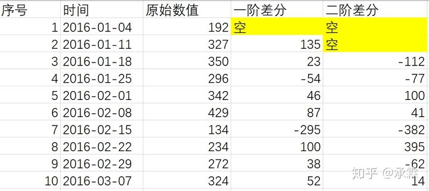
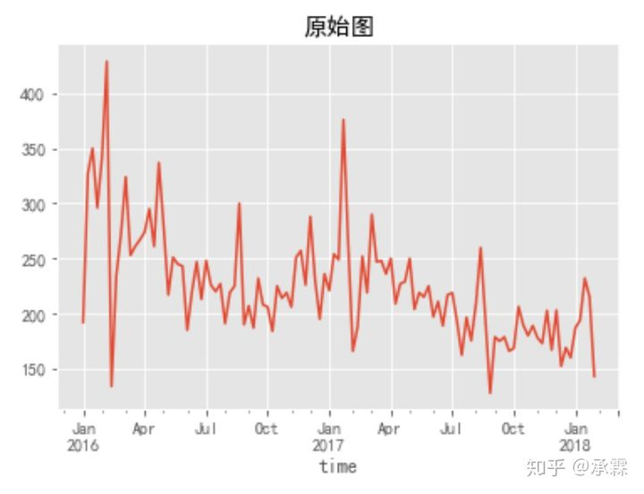
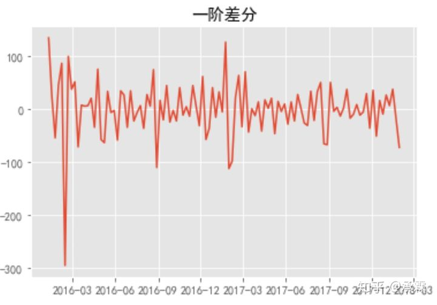

参考资料：https://zhuanlan.zhihu.com/p/46699931
差分，一般在大数据里用在以时间为统计维度的分析中，其实就是下一个数值 ，减去上一个数值 。

当间距相等时，用下一个数值，减去上一个数值 ，就叫“一阶差分”，做两次相同的动作，即再在一阶差分的基础上用后一个数值再减上一个数值一次，就叫“二阶差分"。

间距相等定义：即下图中要么1,2,3,4,5,6,7,8,9,10行后一个向前一个相减；要么2,4,6,8,10或1,3,5,7,9行后一个向前一个相减；但不要1,5,6,10这样不规律跳动着减，就是间距相等的定义（当然还有其它组合，如3,6,9，但无论怎样，之间间距必须相等）。

差分形像点理解，可以看下图

如果数值图不好理解，划个折线图，会看得更清晰。可以看得出来，做完一阶差分之后，除了个别地方，数值之间的跳动并没有之前明显。

**因此，差分的作用是减轻数据之间的不规律波动，使其波动曲线更平稳**

当然，差分也可以用在其它地方，例如其它人常说的用在离散值上面，但一谈到这些专业述语，就会使解释更复杂，也更难明白，所以不再举其它例子解释了。不过其实也是一样的，无论什么场景，都是用后一个值减前一个值，就叫差分。另外，某些情况下，前一个值减后一个值，也可以叫差分，但这种用法不常见。

相关知识点：时间序列，ARIMA