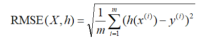
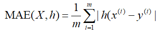
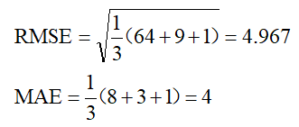
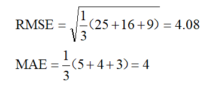
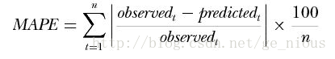
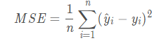

# 交叉熵损失函数「Cross Entropy Loss」

参考资料：https://www.jianshu.com/p/b07f4cd32ba6
$$L=-[ylog\widehat{y}+(1-y)log(1-\widehat{y})]$$

# RMSE：均方根误差（[Root-mean-square error](https://en.wikipedia.org/wiki/Root-mean-square_deviation)）,

观测值与真值偏差的平方和与观测次数m比值的平方根。

假如有2000次观测，即m=2000，对于某一次（第i次）观测来说，y值是真实值，而h(x)是观测值，对所有m次观测的的偏差取平方后相加，得到的值再除以m，然后再开根号，就得到RMSE了。

# MAE，平均绝对误差（[Mean Absolute Error](https://en.wikipedia.org/wiki/Mean_absolute_error)）

观测值与真实值的误差绝对值的平均值。

上面的两个指标是用来描述预测值与真实值的误差情况。它们之间在的区别在于，RMSE先对偏差做了一次平方，这样，如果误差的离散度高，也就是说，如果最大偏差值大的话，RMSE就放大了。比如真实值是0，对于3次测量值分别是8，3，1，那么

如果3次测量值分别是5，4，3，那么

可以看出，两种情况下MAE相同，但是因为前一种情况下有更大的偏离值，所以RMSE就大的多了。

# MAPE平均绝对百分误差

# MSE（均方误差）

MSE是真实值与预测值的差值的平方然后求和平均。

