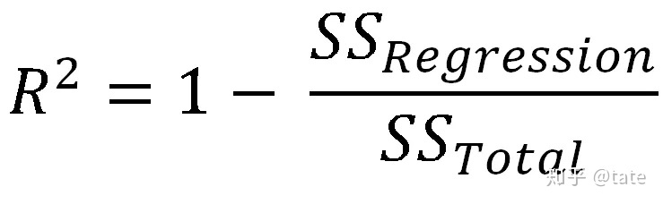
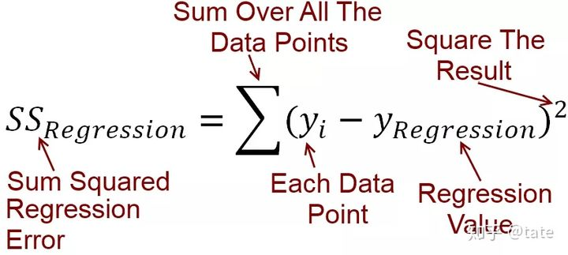
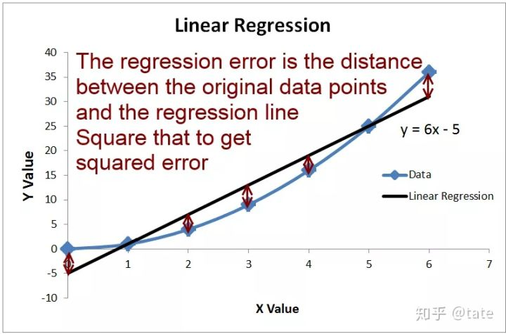
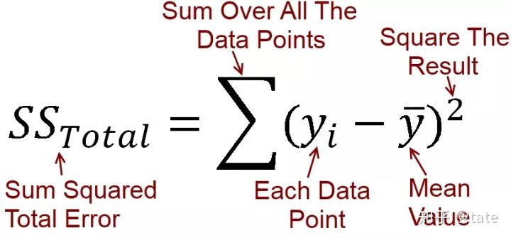
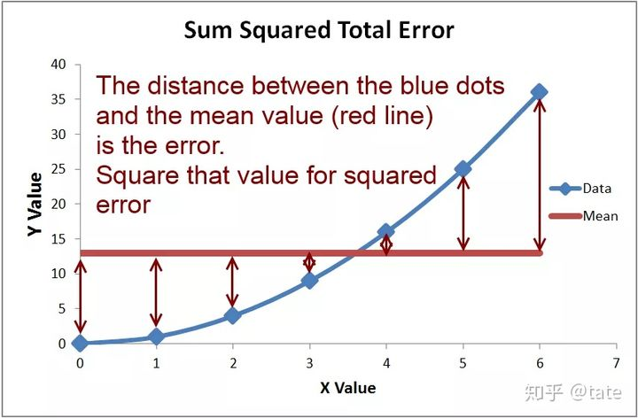

# 交叉熵损失函数「Cross Entropy Loss」

参考资料：https://www.jianshu.com/p/b07f4cd32ba6
$$L=-[ylog\widehat{y}+(1-y)log(1-\widehat{y})]$$

# RMSE：均方根误差（[Root-mean-square error](https://en.wikipedia.org/wiki/Root-mean-square_deviation)）,

观测值与真值偏差的平方和与观测次数m比值的平方根。


假如有2000次观测，即m=2000，对于某一次（第i次）观测来说，y值是真实值，而h(x)是观测值，对所有m次观测的的偏差取平方后相加，得到的值再除以m，然后再开根号，就得到RMSE了。

# MAE，平均绝对误差（[Mean Absolute Error](https://en.wikipedia.org/wiki/Mean_absolute_error)）

平均绝对误差（Mean Absolute Error，MAE），观测值与真实值的误差绝对值的平均值。用于评估预测结果和真实数据集的接近程度的程度，其值越小说明拟合效果越好


上面的两个指标是用来描述预测值与真实值的误差情况。它们之间在的区别在于，RMSE先对偏差做了一次平方，这样，如果误差的离散度高，也就是说，如果最大偏差值大的话，RMSE就放大了。比如真实值是0，对于3次测量值分别是8，3，1，那么


如果3次测量值分别是5，4，3，那么


可以看出，两种情况下MAE相同，但是因为前一种情况下有更大的偏离值，所以RMSE就大的多了。

# MAPE平均绝对百分误差


# MSE（均方误差）

MSE是真实值与预测值的差值的平方然后求和平均。

均方差（Mean squared error，MSE），该指标计算的是拟合数据和原始数据对应样本点的误差的平方和的均值，其值越小说明拟合效果越好


# R2判定系数

是对估计的回归方程拟合优度的度量，是表达因变量与所有自变量之间的总体关系。即反映因变量的全部变化能通过回归关系被自变量解释的比例。其值取值范围是[0,1]，越接近于1说明自变量越能解释因变量的方差变化，值越小则说明效果越差。

R2用于比较回归模型的预测误差与简单的 Y=样本点平均值 的误差。


R2的公式如下：



SS_Regression表示的是函数拟合得到的回归模型的预测值与真实值的误差的平方和



可以看下面这张图片，这里的黑色曲线就是通过数据拟合出来的一条回归曲线，上面计算的SS_Regression就是蓝色线（真实值）与黑色线（回归预测值）之间的误差。



SS_Total是表示Y=所有样本点平均值这么一条水平线与真实值之间误差的平方和。



我们计算出来了回归曲线的误差以后，跟谁去比较呢？这里选择了Y=所有样本点平均值这么一条水平线。计算真实值（蓝色线）和Y=所有样本点平均值这条直线的误差平方和。



通过上面的分析，我们可以得到以下结论：

1. 决定系数R2是回归函数与Y=平均值这条水平线误差的比较；
2. 只要样本点固定，SSTotal是固定不变的，回归函数或模型误差越小则SS_Regression这一项越小，R2就越趋近于1。

**什么时候R2为负数？**

R2为负数就是你得到的拟合函数预测误差大于Y=平均值这条函数的预测误差。

**但是，这不是在侮辱人吗？**

辛辛苦苦设置参数调整模型得到的拟合结果误差还比盲猜一个平均值大，这样的腊鸡模型咱也不敢放到台面上来。所以在市面上咱们很少见到R2小于零的模型。

**所以一般认为有用的模型的R2的取值范围在0-1之间。**

**结论 回归函数拟合效果差于取平均值时R2会为负数**

```c
import keras.backend as K
def r2(y_true, y_pred):
    SS_reg = K.sum(K.square(y_pred - y_true))
    mean_y = K.mean(y_true)
    SS_tot = K.sum(K.square(y_true - mean_y))
    f = 1 - SS_reg/SS_tot
    return f
```

# explained_variance_score

解释回归模型的方差得分，其值取值范围是[0,1]，越接近于1说明自变量越能解释因变量的方差变化，值越小则说明效果越差