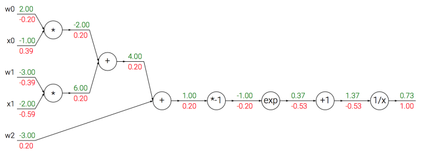
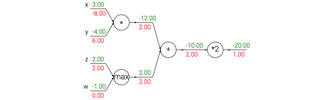
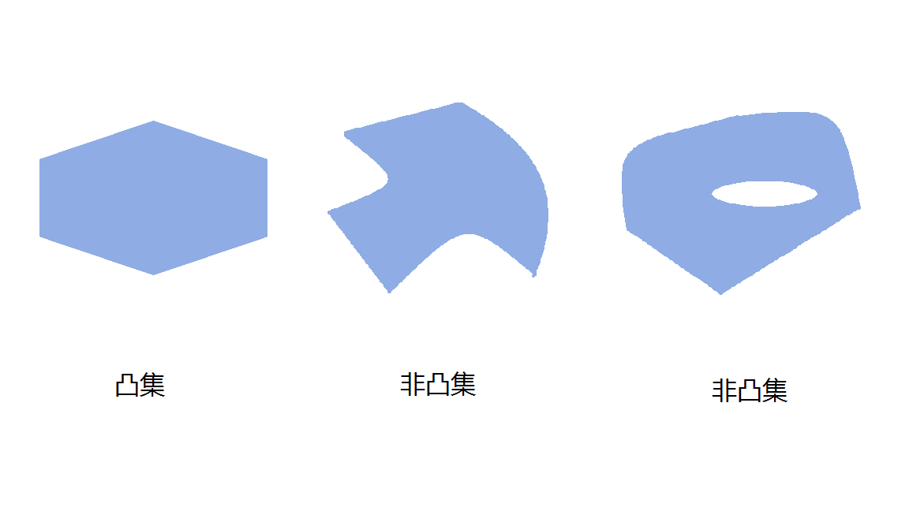
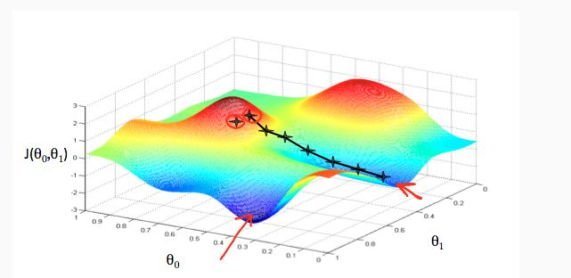

# 梯度反向传播

参考资料：https://blog.csdn.net/weixin_41803874/article/details/88817640

## 反向传播的直观理解

反向传播是一个优美的局部过程。在整个计算线路图中，每个门单元都会得到一些输入并立即计算两个东西：1. 这个门的输出值，和2.其输出值关于输入值的局部梯度。门单元完成这两件事是完全独立的，它不需要知道计算线路中的其他细节。然而，一旦前向传播完毕，在反向传播的过程中，门单元门将最终获得整个网络的最终输出值在自己的输出值上的梯度。链式法则指出，门单元应该将回传的梯度乘以它对其的输入的局部梯度，从而得到整个网络的输出对该门单元的每个输入值的梯度。

> 这里对于每个输入的乘法操作是基于链式法则的。该操作让一个相对独立的门单元变成复杂计算线路中不可或缺的一部分，这个复杂计算线路可以是神经网络等。

下面通过例子来对这一过程进行理解。加法门收到了输入[-2, 5]，计算输出是3。既然这个门是加法操作，那么对于两个输入的局部梯度都是+1。网络的其余部分计算出最终值为-12。在反向传播时将递归地使用链式法则，算到加法门（是乘法门的输入）的时候，知道加法门的输出的梯度是-4。如果网络如果想要输出值更高，那么可以认为它会想要加法门的输出更小一点（因为负号），而且还有一个4的倍数。继续递归并对梯度使用链式法则，加法门拿到梯度，然后把这个梯度分别乘到每个输入值的局部梯度（就是让-4乘以**x**和**y**的局部梯度，x和y的局部梯度都是1，所以最终都是-4）。可以看到得到了想要的效果：如果**x，y减小**（它们的梯度为负），那么加法门的输出值减小，这会让乘法门的输出值增大。

因此，反向传播可以看做是门单元之间在通过梯度信号相互通信，只要让它们的输入沿着梯度方向变化，无论它们自己的输出值在何种程度上升或降低，都是为了让整个网络的输出值更高。

## 模块化：Sigmoid例子

上面介绍的门是相对随意的。任何可微分的函数都可以看做门。可以将多个门组合成一个门，也可以根据需要将一个函数分拆成多个门。现在看看一个表达式：

$$
f(w,x)=\frac{1}{1+e^{-(w_0x_0+w_1x_1+w_2)}}
$$
在后面的课程中可以看到，这个表达式描述了一个含输入**x**和权重**w**的2维的神经元，该神经元使用了*sigmoid激活*函数。但是现在只是看做是一个简单的输入为x和w，输出为一个数字的函数。这个函数是由多个门组成的。除了上文介绍的加法门，乘法门，取最大值门，还有下面这4种：
$$
f(x)=\frac{1}{x} \to \frac{df}{dx}=-1/x^2\\
f_c(x)=c+x \to \frac{df}{dx}=1\\
f(x)=e^x \to \frac{df}{dx}=e^x\\
f_a(x)=ax \to \frac{df}{dx}=a
$$

其中，函数$f_c$使用对输入值进行了常量$c$的平移，$f_a$将输入值扩大了常量$a$倍。它们是加法和乘法的特例，但是这里将其看做一元门单元，因为确实需要计算常量$c,a$的梯度。整个计算线路如下：



使用sigmoid激活函数的2维神经元的例子。输入是[x0, x1]，可学习的权重是[w0, w1, w2]。一会儿会看见，这个神经元对输入数据做点积运算，然后其激活数据被sigmoid函数挤压到0到1之间。

在上面的例子中可以看见一个函数操作的长链条，链条上的门都对**w**和**x**的点积结果进行操作。该函数被称为sigmoid函数$\sigma (x)$。sigmoid函数关于其输入的求导是可以简化的(使用了在分子上先加后减1的技巧)：

$$
\sigma(x)=\frac{1}{1+e^{-x}}\\
\frac{d\sigma(x)}{dx}=\frac{e^{-x}}{(1+e^{-x})^2}=(\frac{1+e^{-x}-1}{1+e^{-x}})(\frac{1}{1+e^{-x}})=(1-\sigma(x))\sigma(x)
$$


可以看到梯度计算简单了很多。举个例子，sigmoid表达式输入为1.0，则在前向传播中计算出输出为0.73。根据上面的公式，局部梯度为(1-0.73)*0.73~=0.2，和之前的计算流程比起来，现在的计算使用一个单独的简单表达式即可。因此，在实际的应用中将这些操作装进一个单独的门单元中将会非常有用。该神经元反向传播的代码实现如下：

```python
w = [2,-3,-3] # 假设一些随机数据和权重
x = [-1, -2]
 
# 前向传播
dot = w[0]*x[0] + w[1]*x[1] + w[2]
f = 1.0 / (1 + math.exp(-dot)) # sigmoid函数
 
# 对神经元反向传播
ddot = (1 - f) * f # 点积变量的梯度, 使用sigmoid函数求导
dx = [w[0] * ddot, w[1] * ddot] # 回传到x
dw = [x[0] * ddot, x[1] * ddot, 1.0 * ddot] # 回传到w
# 完成！得到输入的梯度
```

**实现提示：分段反向传播**。上面的代码展示了在实际操作中，为了使反向传播过程更加简洁，把向前传播分成不同的阶段将是很有帮助的。比如我们创建了一个中间变量**dot**，它装着**w**和**x**的点乘结果。在反向传播的时，就可以（反向地）计算出装着**w**和**x**等的梯度的对应的变量（比如**ddot**，**dx**和**dw**）。

 

本节的要点就是展示反向传播的细节过程，以及前向传播过程中，哪些函数可以被组合成门，从而可以进行简化。知道表达式中哪部分的局部梯度计算比较简洁非常有用，这样他们可以“链”在一起，让代码量更少，效率更高。

## 反向传播实践：分段计算

看另一个例子。假设有如下函数：

$$
f(x,y)=\frac{x+\sigma(y)}{\sigma(x)+(x+y)^2}
$$


首先要说的是，这个函数完全没用，读者是不会用到它来进行梯度计算的，这里只是用来作为实践反向传播的一个例子，需要强调的是，如果对$x$或$y$进行微分运算，运算结束后会得到一个巨大而复杂的表达式。然而做如此复杂的运算实际上并无必要，因为我们不需要一个明确的函数来计算梯度，只需知道如何使用反向传播计算梯度即可。下面是构建前向传播的代码模式：

```python
x = 3 # 例子数值
y = -4
 
# 前向传播
sigy = 1.0 / (1 + math.exp(-y)) # 分子中的sigmoi          #(1)
num = x + sigy # 分子                                    #(2)
sigx = 1.0 / (1 + math.exp(-x)) # 分母中的sigmoid         #(3)
xpy = x + y                                              #(4)
xpysqr = xpy**2                                          #(5)
den = sigx + xpysqr # 分母                                #(6)
invden = 1.0 / den                                       #(7)
f = num * invden # 搞定！                                 #(8)
```

┗|｀O′|┛ 嗷~~，到了表达式的最后，就完成了前向传播。注意在构建代码s时创建了多个中间变量，每个都是比较简单的表达式，它们计算局部梯度的方法是已知的。这样计算反向传播就简单了：我们对前向传播时产生每个变量(**sigy, num, sigx, xpy, xpysqr, den, invden**)进行回传。我们会有同样数量的变量，但是都以**d**开头，用来存储对应变量的梯度。注意在反向传播的每一小块中都将包含了表达式的局部梯度，然后根据使用链式法则乘以上游梯度。对于每行代码，我们将指明其对应的是前向传播的哪部分。

```python
# 回传 f = num * invden
dnum = invden # 分子的梯度                                         #(8)
dinvden = num                                                     #(8)
# 回传 invden = 1.0 / den 
dden = (-1.0 / (den**2)) * dinvden                                #(7)
# 回传 den = sigx + xpysqr
dsigx = (1) * dden                                                #(6)
dxpysqr = (1) * dden                                              #(6)
# 回传 xpysqr = xpy**2
dxpy = (2 * xpy) * dxpysqr                                        #(5)
# 回传 xpy = x + y
dx = (1) * dxpy                                                   #(4)
dy = (1) * dxpy                                                   #(4)
# 回传 sigx = 1.0 / (1 + math.exp(-x))
dx += ((1 - sigx) * sigx) * dsigx # Notice += !! See notes below  #(3)
# 回传 num = x + sigy
dx += (1) * dnum                                                  #(2)
dsigy = (1) * dnum                                                #(2)
# 回传 sigy = 1.0 / (1 + math.exp(-y))
dy += ((1 - sigy) * sigy) * dsigy                                 #(1)
# 完成! 嗷~~
```

需要注意的一些东西：

**对前向传播变量进行缓存**：在计算反向传播时，前向传播过程中得到的一些中间变量非常有用。在实际操作中，最好代码实现对于这些中间变量的缓存，这样在反向传播的时候也能用上它们。如果这样做过于困难，也可以（但是浪费计算资源）重新计算它们。

**在不同分支的梯度要相加**：如果变量x，y在前向传播的表达式中出现多次，那么进行反向传播的时候就要非常小心，使用**+=**而不是**=**来累计这些变量的梯度（不然就会造成覆写）。这是遵循了在微积分中的*多元链式法则*，该法则指出如果变量在线路中分支走向不同的部分，那么梯度在回传的时候，就应该进行累加。

 

## 回传流中的模式

一个有趣的现象是在多数情况下，反向传播中的梯度可以被很直观地解释。例如神经网络中最常用的加法、乘法和取最大值这三个门单元，它们在反向传播过程中的行为都有非常简单的解释。先看下面这个例子：

------



一个展示反向传播的例子。加法操作将梯度相等地分发给它的输入。取最大操作将梯度路由给更大的输入。乘法门拿取输入激活数据，对它们进行交换，然后乘以梯度。

------

从上例可知：

**加法门单元**把输出的梯度相等地分发给它所有的输入，这一行为与输入值在前向传播时的值无关。这是因为加法操作的局部梯度都是简单的+1，所以所有输入的梯度实际上就等于输出的梯度，因为乘以1.0保持不变。上例中，加法门把梯度2.00不变且相等地路由给了两个输入。

**取最大值门单元**对梯度做路由。和加法门不同，取最大值门将梯度转给其中一个输入，这个输入是在前向传播中值最大的那个输入。这是因为在取最大值门中，最高值的局部梯度是1.0，其余的是0。上例中，取最大值门将梯度2.00转给了**z**变量，因为**z**的值比**w**高，于是**w**的梯度保持为0。

**乘法门单元**相对不容易解释。它的局部梯度就是输入值，但是是相互交换之后的，然后根据链式法则乘以输出值的梯度。上例中，**x**的梯度是-4.00x2.00=-8.00。

*非直观影响及其结果*。注意一种比较特殊的情况，如果乘法门单元的其中一个输入非常小，而另一个输入非常大，那么乘法门的操作将会不是那么直观：它将会把大的梯度分配给小的输入，把小的梯度分配给大的输入。在线性分类器中，权重和输入是进行点积$w^Tx_i$，这说明输入数据的大小对于权重梯度的大小有影响。例如，在计算过程中对所有输入数据样本$x_i$乘以1000，那么权重的梯度将会增大1000倍，这样就必须降低学习率来弥补。这就是为什么数据预处理关系重大，它即使只是有微小变化，也会产生巨大影响。对于梯度在计算线路中是如何流动的有一个直观的理解，可以帮助读者调试网络。

## 用向量化操作计算梯度

上述内容考虑的都是单个变量情况，但是所有概念都适用于矩阵和向量操作。然而，在操作的时候要注意关注维度和转置操作。

**矩阵相乘的梯度**：可能最有技巧的操作是矩阵相乘（也适用于矩阵和向量，向量和向量相乘）的乘法操作：

```python
# 前向传播
W = np.random.randn(5, 10)
X = np.random.randn(10, 3)
D = W.dot(X)
 
# 假设我们得到了D的梯度
dD = np.random.randn(*D.shape) # 和D一样的尺寸
dW = dD.dot(X.T) #.T就是对矩阵进行转置
dX = W.T.dot(dD)
 
```

*提示：要分析维度！*注意不需要去记忆**dW**和**dX**的表达，因为它们很容易通过维度推导出来。例如，权重的梯度dW的尺寸肯定和权重矩阵W的尺寸是一样的，而这又是由**X**和**dD**的矩阵乘法决定的（在上面的例子中**X**和**W**都是数字不是矩阵）。总有一个方式是能够让维度之间能够对的上的。例如，**X**的尺寸是[10x3]，**dD**的尺寸是[5x3]，如果你想要dW和W的尺寸是[5x10]，那就要**dD.dot(X.T)**。

**使用小而具体的例子**：有些读者可能觉得向量化操作的梯度计算比较困难，建议是写出一个很小很明确的向量化例子，在纸上演算梯度，然后对其一般化，得到一个高效的向量化操作形式。

# 梯度下降法

## 参考资料

https://www.zhihu.com/question/264189719

## 凸集

参考资料：http://sofasofa.io/forum_main_post.php?postid=1000329

如果对于一个集合$S$中的任意两个点$A$和$B$，这两个点的连线$AB$也在$S$内，那么$S$就是一个凸集。

换句话说，凸集不能有洞，不同有任何凹陷。



凸函数：

对于实数集上的凸函数，一般的判别方法是求它的二阶导数，如果其二阶导数在区间上小于等于零，就称为凸函数。如果其二阶导数在区间上恒小于0，就称为严格凸函数

凸函数是一个定义在某个向量空间的凸子集C上的实值函数f，而且对于凸子集C中任意两个向量$x_1$、$x_2$有$f((x_1+x_2)/2)\leq(f(x_1)+f(x_2))/2$成立

于是容易得出对于任意（0,1）中有理数$\lambda$，有$f(\lambda x_1 + (1-\lambda)x_2)\leq\lambda f(x_1)+(1-\lambda)f(x_2)$

如果f连续，那么$\lambda$可以改变成区间$(0,1)$中的任意实数。

## 凸优化中局部最优解就是全局最优解

参考资料：http://sofasofa.io/forum_main_post.php?postid=1000322

于凸优化来说，局部最优就是全局最优，换句话说，极小值就是最小值。

用反证法来证明。已知$x_0$是个局部最优点，假设在全集$S$上存在一个点$x^∗$，使得
$$
f(x^∗)<f(x_0)​
$$
因为$f(x)$是凸函数，所以对于任意的$t\in(0,1)$
$$
f(tx^∗+(1−t)x_0)≤tf(x^∗)+(1−t)f(x_0)
$$
所以$t$可以非常接近0，此时$(tx^∗+(1−t)x_0)$这个点就可以无限接近$x_0$，但是函数在这个点的值又比$f(x_0)$小，所以$f(x_0)$不可能是局部最小值。故假设矛盾，因此不存在这样的$x∗$。$f(x0)$必定为最小值。

## 梯度下降法

参考资料：

https://www.zhihu.com/question/264189719/answer/291167114

http://sofasofa.io/tutorials/python_gradient_descent/index.php


这里假设有$n$个样本。要求拟合出一个函数，使得其能够输入$x$，输出$y$。

假设有函数$f=wx+b$。$w$为权重矩阵，$b$为偏置矩阵。

目标就是找出最合适的$w$和$b$矩阵，使得$f$的值更接近$y$，误差尽可能的小。

所以我们是对$w$求导，根据误差，使用链式法则修改$w$权值矩阵的值。


对于凸优化问题来说，导数为0（梯度为0向量）的点，就是优化问题的解。

为了找到这个解，我们沿着梯度的反方向进行线性搜索，每次搜索的步长为某个特定的数值$\alpha$，直到梯度与0向量非常接近为止。上面描述的这个方法就是梯度下降法。迭代算法的步骤如下：

1. 当$i=0$，自己设置初始矩阵$w^0$，设置步长（也叫做学习率）$\alpha$，设置迭代终止的误差$tol$。

2. 计算目标函数$f$在点$w^i$上的梯度$\nabla f_{w^i}$。

3. 计算$w^{i+1}$，公式如下

$$
w^{i+1}=w^i-\alpha \nabla f_{w^i}
$$

4. 计算梯度$\nabla f_{w^{i+1}}$。如果$\|\nabla f_{w^{i+1}}\|_F\leq tol$则迭代停止，最优解的取值为$w^{i+1}$；如果梯度的二范数大于$tol$，那么$i=i+1$，并返回第3步。


在直观上，我们可以这样理解，看下图，一开始的时候我们随机站在一个点，把他看成一座山，每一步，我们都以下降最多的路线来下山，那么，在这个过程中我们到达山底（最优点）是最快的，而上面的a，它决定了我们“向下山走”时每一步的大小，过小的话收敛太慢，过大的话可能错过最小值。这是一种很自然的算法，每一步总是寻找使J下降最“陡”的方向（就像找最快下山的路一样）




## 批量梯度下降

在每次更新时用所有样本。其计算得到的是一个标准梯度，**对于最优化问题，凸问题，**也肯定可以达到一个全局最优。因而理论上来说一次更新的幅度是比较大的。如果样本不多的情况下，当然是这样收敛的速度会更快。但是很多时候，样本很多，更新一次要很久，这样的方法就不合适。

## 随机梯度下降

在每次更新时用1个样本，可以看到多了随机两个字，随机也就是说我们用样本中的一个例子来近似我所有的样本，来调整*w*，因而随机梯度下降是会带来一定的问题，因为计算得到的并不是准确的一个梯度，**对于最优化问题，凸问题，**虽然不是每次迭代得到的损失函数都向着全局最优方向， 但是大的整体的方向是向全局最优解的，最终的结果往往是在全局最优解附近。但是相比于批量梯度，这样的方法更快，更快收敛，虽然不是全局最优，但很多时候是我们可以接受的，所以这个方法用的也比上面的多。

## mini-batch梯度下降

在每次更新时用b个样本,其实批量的梯度下降就是一种折中的方法，他用了一些小样本来近似全部的，其本质就是我1个指不定不太准，而且批量的话还是非常可以反映样本的一个分布情况的。在深度学习中，这种方法用的是最多的，因为这个方法收敛也不会很慢，收敛的局部最优也是更多的可以接受。
