# 欧拉公式

参考资料：https://www.matongxue.com/madocs/8

在复平面上画一个单位圆，单位圆上的点可以用三角函数来表示：

## 复数

## 复平面上的单位圆

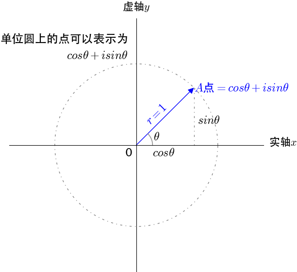

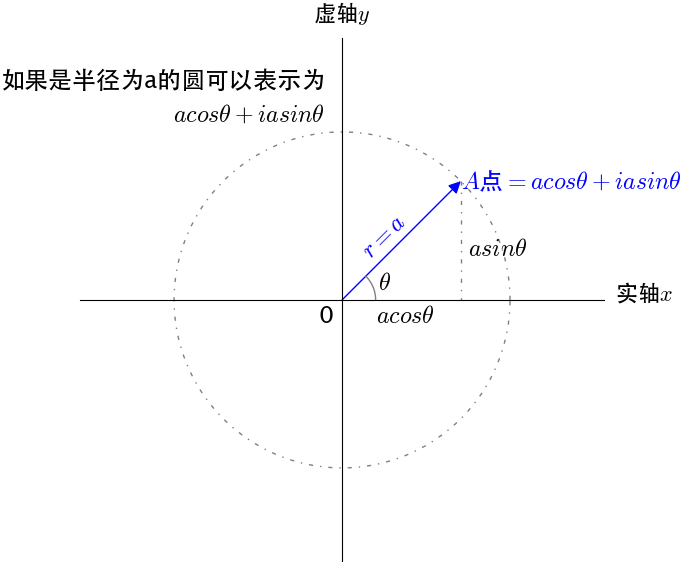

## 复平面上乘法的几何意义

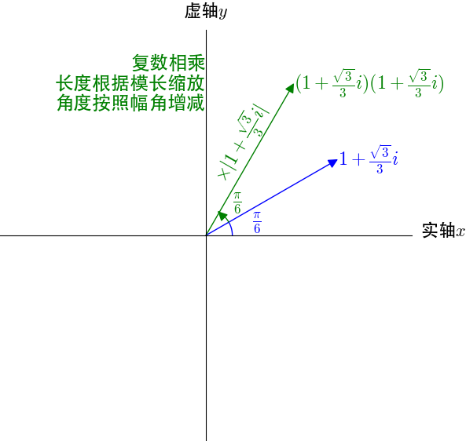

## 欧拉公式

对于$\theta \in R$,有。$e^{iθ}=cosθ+isinθ$

欧拉公式在形式上很简单，是怎么发现的呢？

## 欧拉公式与泰勒公式

关于泰勒公式可以参看这篇详尽的科普文章：

[如何通俗地解释泰勒公式？](https://zhihu.com/question/21149770/answer/111173412) 。

欧拉最早是通过泰勒公式观察出欧拉公式的：
$$
\begin{aligned}
&e^x = 1 + x + \frac{1}{2!}x^2 + \frac{1}{3!}x^3+\cdots
\\
&sin(x) = x - \frac{1}{3!}x^3 + \frac{1}{5!}x^5
\\
&cos(x) = 1 - \frac{1}{2!}x^2 + \frac{1}{4!}x^4
\end{aligned}
$$
将$x = i\theta$代入$e$可得：
$$
\begin{aligned}
&e^{i\theta} = 1 + i\theta + \frac{(i\theta)^2}{2!} + \frac{(i\theta)^3}{3!}  + \frac{(i\theta)^4}{4!} + + \frac{(i\theta)^5}{5!} + \frac{(i\theta)^6}{6!} + + \frac{(i\theta)^7}{7!} + \frac{(i\theta)^8}{8!}  + \cdots
\\
&=1+i\theta - \frac{\theta^2}{2!} - \frac{i\theta^3}{3!} + \frac{\theta^4}{4!} + \frac{i\theta^5}{5!} - \frac{\theta^6}{6!} - \frac{i\theta^7}{7!} + \frac{\theta^8}{8!} + \cdots
\\
&=(1-\frac{\theta^2}{2!} + \frac{\theta^4}{4!} - \frac{\theta^6}{6!} + \frac{\theta^8}{8!}) + i(\theta - \frac{\theta^3}{3!} + \frac{\theta^5}{5!} - \frac{\theta^7}{7!} + \cdots)
\\
&=cos\theta + isin\theta
\end{aligned}
$$
那欧拉公式怎么可以有一个直观的理解呢？

## 对同一个点不同的描述方式

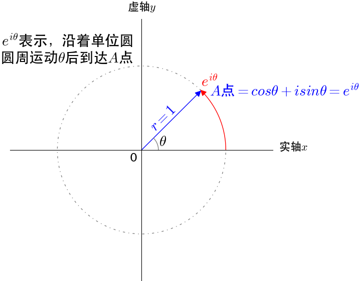

我们可以把$e^{iθ}$看作通过单位圆的圆周运动来描述单位圆上的点，$cosθ+isinθ$通过复平面的坐标来描述单位圆上的点，是同一个点不同的描述方式，所以有$e^{iθ}=cosθ+isinθ$。

## **为什么$e^{i\theta}$是圆周运动？**

定义$e$为：$e=\lim_{n \to \infty}(1+\frac{1}{n})^n$

这是实数域上的定义，可以推广到复数域$e^i=\lim_{n \to \infty}(1+\frac{i}{n})^n$。根据之前对复数乘法的描述，乘上$(1+\frac{i}{n})$是进行伸缩和旋转运动，$n$取值不同，伸缩和旋转的幅度不同。

我们来看看$e^i=e^{i×1}$如何在圆周上完成1弧度的圆周运动的：

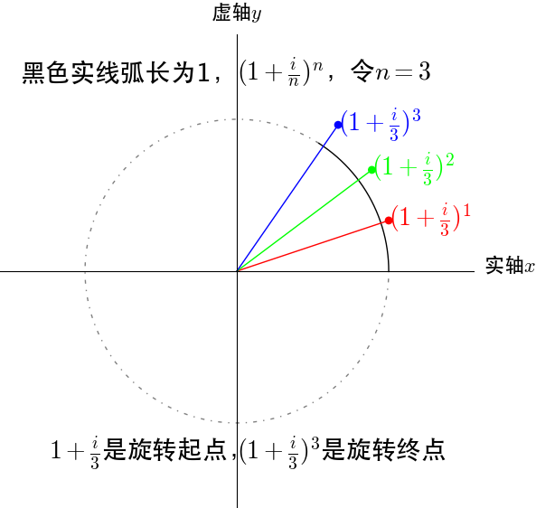

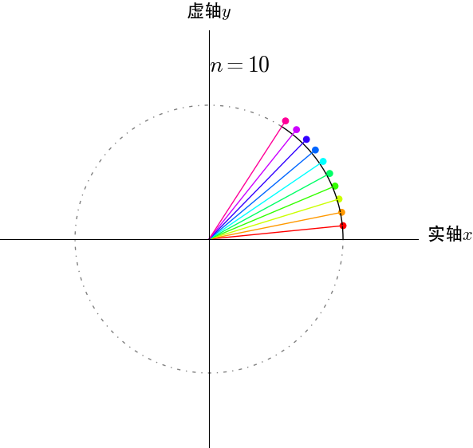

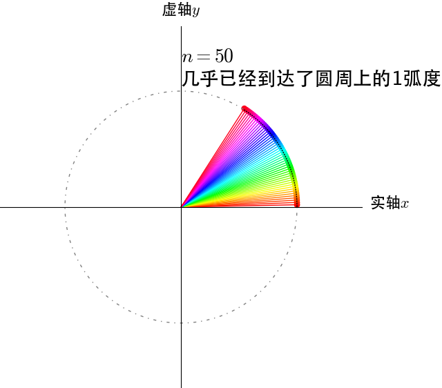

从图上可以推出$n \to \infty$时，$e^i$在单位圆上转动了1弧度。

再来看看$e^{i\pi}$，这个应该是在单位圆上转动$\pi$弧度：

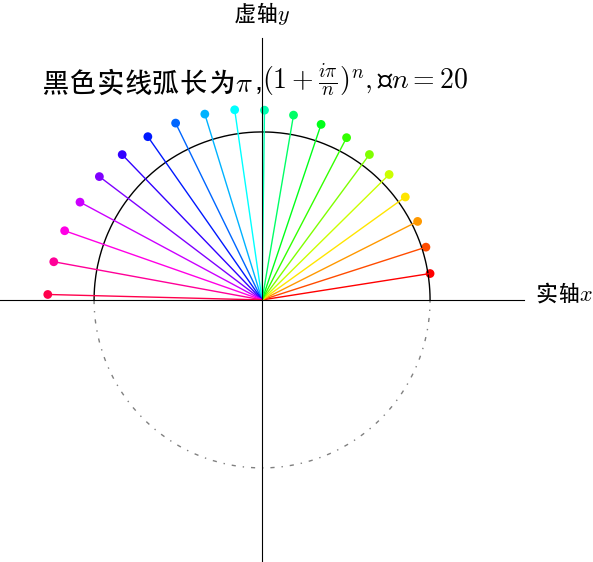

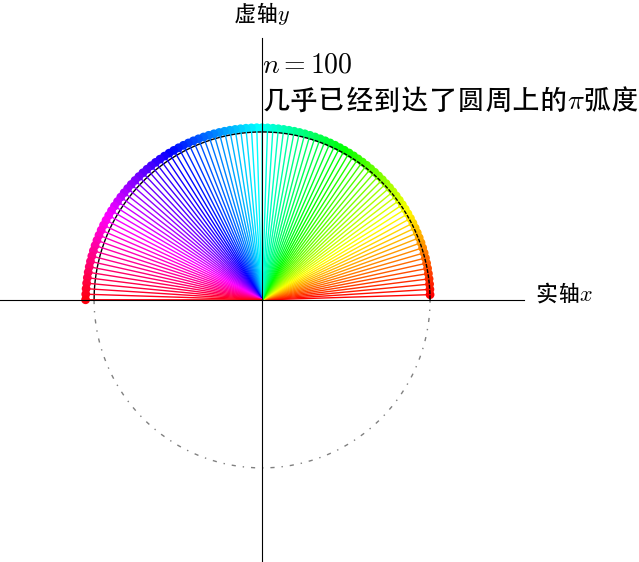

## $2^i$的几何含义是什么？

$2^i$看不出来有什么几何含义，不过我们稍微做个变换$e^{i\ln2}$，几何含义还是挺明显的，沿圆周运动$\ln2$弧度。

## 欧拉公式与三角函数

根据欧拉公式$e^{iθ}=cosθ+isinθ$，可以轻易推出：

$sinθ=\frac{e^{i\theta} - e^{-i\theta}}{2i}$和$cosθ=\frac{e^{i\theta} + e^{-i\theta}}{2}$。三角函数定义域被扩大到了复数域。

我们把复数当作向量来看待，复数的实部是$x$方向，虚部是$y$方向，很容易观察出其几何意义。

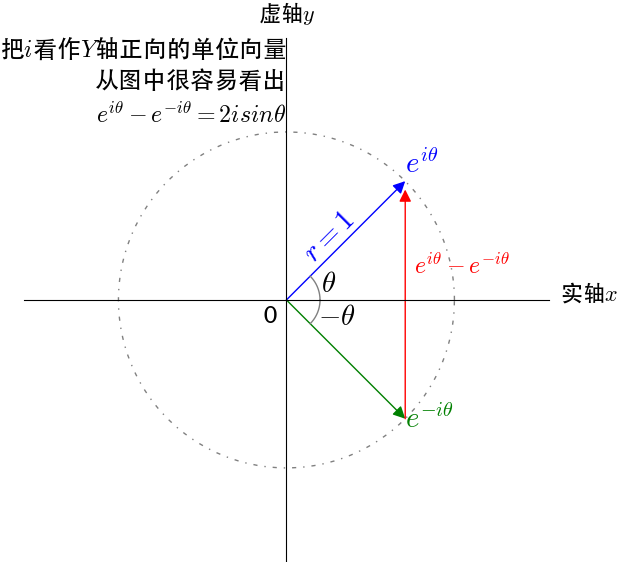

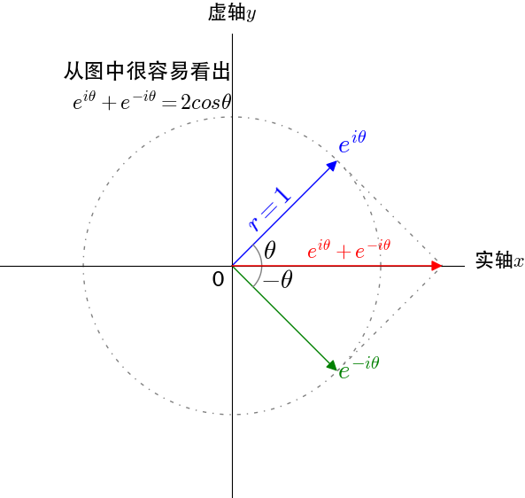

## 欧拉恒等式

当$\theta=\pi$的时候，代入欧拉公式：

$$
e^{i\pi} = cos\pi + i sin\pi = -1 \implies e^{i\pi} + 1 = 0
$$

$e^{i\pi} + 1 = 0$就是欧拉恒等式，被誉为上帝公式，$e$、$\pi$、$i$、乘法单位元$1$、加法单位元$0$，这五个重要的数学元素全部被包含在内，在数学爱好者眼里，仿佛一行诗道尽了数学的美好。

