# 数据

## 站点station

| 编号(Num) | 站点名称(StationName) | 线路(SubWayLine) | 行政(AdministrativeArea) |
| --------- | --------------------- | ---------------- | ------------------------ |
| 1004      | Sta1                  | 1号线            | Dist1                    |

- 共163条数据，一条数据对应一个站点名称

- 编号：最小1004，最大1191

- | 线路   | 站点数 |
  | ------ | ------ |
  | 1号线  | 19     |
  | 2号线  | 23     |
  | 3号线  | 39     |
  | 4号线  | 7      |
  | 5号线  | 8      |
  | 10号线 | 19     |
  | 11号线 | 31     |
  | 12号线 | 17     |

- 行政区：Dist1到Dist10，没有Dist9

## 是否是工作日workdays2020

| 日期(date) | 类型(type) |
| ---------- | ---------- |
| 20200101   | 3          |

- 共366条数据
- 日期：2020全年日期
- 类型：1为工作日（包括周末调休变成的工作日）；2为正常周末；3为节假日，包括法定节假日，以及与法定节假日相连的周末

## 用户users

| 用户ID(UserID)                   | 区域(Area) | 出生年份(BirthYear) | 性别(Sex) |
| -------------------------------- | ---------- | ------------------- | --------- |
| 4bd084423e63c9bcf3dd66761506d8cf | 4115       | 1996                | 0         |

- 124782条数据
- 用户ID：和trip.csv里面的用户ID关联可获取用户对应的行程
- 省市：450个省市。（不知道与现实的对应情况）
- 出生年份：1930-2010
- 性别：0男，1女。男性51593条，女性73189条

## 出行轨迹trips

| 用户ID(UserID)                   | 进站名称(InStationName) | 进站时间(InTime)    | 出站名称(OutStationName) | 出站时间(OutTime)   | 渠道编号(Type) | 价格(Price) |
| -------------------------------- | ----------------------- | ------------------- | ------------------------ | ------------------- | -------------- | ----------- |
| d4ec5a712f2b24ce226970a8d315dfce | Sta18                   | 2020-07-15 14:21:58 | Sta9                     | 2020-07-15 14:39:29 | 03             | 200         |

- 共791995条数据

- 83049个不同的UserID，与User.csv表中的用户id想关联。

- 渠道编号没有意义

- 日期从2019-12-25到2020-07-16。

- 与Station的站点名称相关联

- 存在23点以及凌晨的工作人员刷卡数据，需要清洗

- 2019-12-25 到 2019-12 30数据量不正常，需要删去，从12月31号开始统计。

  考虑到31号数据也少于1月1日的数据，考虑删去，猜测给的数据应该是从2020年1月1日开始。其中混进了2019年的数据

拟合一个站点一天的总客流

线路 行政区域 日期 日期类型 疫情严重程度（距离1月23号的天数？）

拟合一个站点24小时的客流量

## total（清洗过后的数据）

删除所属地铁线路为NULL的地铁站（有64827条）

删除金额不是整百的记录（27条）

删除2019年的数据(3433条)

### 总共记录数量：717221条

### 总共天数：198天

### 每天的出行记录

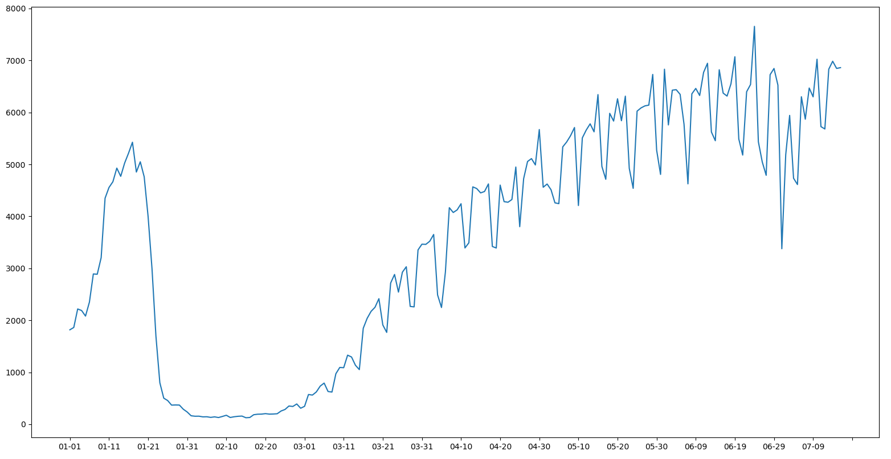

| 日期  | 数量 |
| ----- | ---- |
| 01-01 | 1818 |
| 01-02 | 1863 |
| 01-03 | 2219 |
| 01-04 | 2189 |
| 01-05 | 2082 |
| 01-06 | 2351 |
| 01-07 | 2893 |
| 01-08 | 2887 |
| 01-09 | 3206 |
| 01-10 | 4350 |
| 01-11 | 4556 |
| 01-12 | 4667 |
| 01-13 | 4929 |
| 01-14 | 4771 |
| 01-15 | 5026 |
| 01-16 | 5217 |
| 01-17 | 5427 |
| 01-18 | 4853 |
| 01-19 | 5051 |
| 01-20 | 4762 |
| 01-21 | 3997 |
| 01-22 | 2991 |
| 01-23 | 1697 |
| 01-24 | 800  |
| 01-25 | 503  |
| 01-26 | 457  |
| 01-27 | 369  |
| 01-28 | 372  |
| 01-29 | 370  |
| 01-30 | 290  |
| 01-31 | 236  |
| 02-01 | 164  |
| 02-02 | 155  |
| 02-03 | 156  |
| 02-04 | 143  |
| 02-05 | 145  |
| 02-06 | 133  |
| 02-07 | 143  |
| 02-08 | 130  |
| 02-09 | 151  |
| 02-10 | 174  |
| 02-11 | 131  |
| 02-12 | 145  |
| 02-13 | 154  |
| 02-14 | 158  |
| 02-15 | 126  |
| 02-16 | 131  |
| 02-17 | 184  |
| 02-18 | 194  |
| 02-19 | 196  |
| 02-20 | 205  |
| 02-21 | 196  |
| 02-22 | 198  |
| 02-23 | 203  |
| 02-24 | 256  |
| 02-25 | 285  |
| 02-26 | 352  |
| 02-27 | 343  |
| 02-28 | 391  |
| 02-29 | 309  |
| 03-01 | 346  |
| 03-02 | 573  |
| 03-03 | 562  |
| 03-04 | 622  |
| 03-05 | 735  |
| 03-06 | 793  |
| 03-07 | 631  |
| 03-08 | 620  |
| 03-09 | 973  |
| 03-10 | 1094 |
| 03-11 | 1089 |
| 03-12 | 1330 |
| 03-13 | 1295 |
| 03-14 | 1136 |
| 03-15 | 1052 |
| 03-16 | 1848 |
| 03-17 | 2039 |
| 03-18 | 2173 |
| 03-19 | 2251 |
| 03-20 | 2417 |
| 03-21 | 1911 |
| 03-22 | 1768 |
| 03-23 | 2718 |
| 03-24 | 2883 |
| 03-25 | 2543 |
| 03-26 | 2926 |
| 03-27 | 3031 |
| 03-28 | 2268 |
| 03-29 | 2259 |
| 03-30 | 3355 |
| 03-31 | 3465 |
| 04-01 | 3462 |
| 04-02 | 3522 |
| 04-03 | 3652 |
| 04-04 | 2489 |
| 04-05 | 2247 |
| 04-06 | 2930 |
| 04-07 | 4168 |
| 04-08 | 4075 |
| 04-09 | 4125 |
| 04-10 | 4244 |
| 04-11 | 3393 |
| 04-12 | 3492 |
| 04-13 | 4568 |
| 04-14 | 4536 |
| 04-15 | 4452 |
| 04-16 | 4479 |
| 04-17 | 4625 |
| 04-18 | 3421 |
| 04-19 | 3392 |
| 04-20 | 4602 |
| 04-21 | 4284 |
| 04-22 | 4272 |
| 04-23 | 4325 |
| 04-24 | 4950 |
| 04-25 | 3802 |
| 04-26 | 4726 |
| 04-27 | 5056 |
| 04-28 | 5112 |
| 04-29 | 4990 |
| 04-30 | 5671 |
| 05-01 | 4561 |
| 05-02 | 4623 |
| 05-03 | 4513 |
| 05-04 | 4261 |
| 05-05 | 4245 |
| 05-06 | 5338 |
| 05-07 | 5432 |
| 05-08 | 5554 |
| 05-09 | 5710 |
| 05-10 | 4209 |
| 05-11 | 5510 |
| 05-12 | 5661 |
| 05-13 | 5781 |
| 05-14 | 5627 |
| 05-15 | 6343 |
| 05-16 | 4962 |
| 05-17 | 4714 |
| 05-18 | 5983 |
| 05-19 | 5834 |
| 05-20 | 6263 |
| 05-21 | 5841 |
| 05-22 | 6313 |
| 05-23 | 4924 |
| 05-24 | 4540 |
| 05-25 | 6025 |
| 05-26 | 6087 |
| 05-27 | 6126 |
| 05-28 | 6141 |
| 05-29 | 6731 |
| 05-30 | 5274 |
| 05-31 | 4808 |
| 06-01 | 6832 |
| 06-02 | 5760 |
| 06-03 | 6428 |
| 06-04 | 6438 |
| 06-05 | 6348 |
| 06-06 | 5773 |
| 06-07 | 4626 |
| 06-08 | 6358 |
| 06-09 | 6462 |
| 06-10 | 6326 |
| 06-11 | 6771 |
| 06-12 | 6946 |
| 06-13 | 5624 |
| 06-14 | 5456 |
| 06-15 | 6821 |
| 06-16 | 6372 |
| 06-17 | 6315 |
| 06-18 | 6551 |
| 06-19 | 7071 |
| 06-20 | 5489 |
| 06-21 | 5180 |
| 06-22 | 6398 |
| 06-23 | 6537 |
| 06-24 | 7656 |
| 06-25 | 5437 |
| 06-26 | 5047 |
| 06-27 | 4791 |
| 06-28 | 6726 |
| 06-29 | 6846 |
| 06-30 | 6526 |
| 07-01 | 3378 |
| 07-02 | 5189 |
| 07-03 | 5943 |
| 07-04 | 4734 |
| 07-05 | 4613 |
| 07-06 | 6302 |
| 07-07 | 5870 |
| 07-08 | 6470 |
| 07-09 | 6300 |
| 07-10 | 7024 |
| 07-11 | 5727 |
| 07-12 | 5682 |
| 07-13 | 6832 |
| 07-14 | 6985 |
| 07-15 | 6847 |
| 07-16 | 6862 |

### 每个站点总进站记录

| 进站名称 | 数量  |
| -------- | ----- |
| Sta116   | 67    |
| Sta58    | 156   |
| Sta24    | 203   |
| Sta102   | 210   |
| Sta165   | 289   |
| Sta45    | 336   |
| Sta164   | 357   |
| Sta10    | 377   |
| Sta105   | 415   |
| Sta19    | 425   |
| Sta38    | 462   |
| Sta62    | 486   |
| Sta150   | 536   |
| Sta166   | 619   |
| Sta33    | 636   |
| Sta152   | 652   |
| Sta71    | 694   |
| Sta51    | 708   |
| Sta145   | 727   |
| Sta6     | 746   |
| Sta57    | 761   |
| Sta18    | 826   |
| Sta147   | 841   |
| Sta77    | 849   |
| Sta140   | 866   |
| Sta8     | 910   |
| Sta60    | 943   |
| Sta11    | 1023  |
| Sta128   | 1024  |
| Sta7     | 1028  |
| Sta153   | 1079  |
| Sta75    | 1119  |
| Sta43    | 1148  |
| Sta2     | 1174  |
| Sta13    | 1215  |
| Sta73    | 1221  |
| Sta103   | 1241  |
| Sta66    | 1280  |
| Sta106   | 1329  |
| Sta50    | 1342  |
| Sta96    | 1358  |
| Sta161   | 1368  |
| Sta111   | 1428  |
| Sta133   | 1437  |
| Sta3     | 1457  |
| Sta16    | 1459  |
| Sta124   | 1505  |
| Sta139   | 1517  |
| Sta59    | 1562  |
| Sta117   | 1575  |
| Sta21    | 1658  |
| Sta52    | 1689  |
| Sta113   | 1691  |
| Sta78    | 1710  |
| Sta36    | 1713  |
| Sta82    | 1771  |
| Sta4     | 1781  |
| Sta91    | 1826  |
| Sta101   | 1830  |
| Sta163   | 1838  |
| Sta143   | 1953  |
| Sta26    | 2021  |
| Sta151   | 2024  |
| Sta119   | 2061  |
| Sta148   | 2078  |
| Sta112   | 2118  |
| Sta93    | 2134  |
| Sta53    | 2232  |
| Sta156   | 2274  |
| Sta94    | 2293  |
| Sta48    | 2403  |
| Sta92    | 2461  |
| Sta32    | 2468  |
| Sta109   | 2510  |
| Sta34    | 2660  |
| Sta149   | 2682  |
| Sta125   | 2686  |
| Sta39    | 2689  |
| Sta97    | 2757  |
| Sta85    | 2906  |
| Sta144   | 2963  |
| Sta37    | 2983  |
| Sta44    | 3047  |
| Sta157   | 3054  |
| Sta27    | 3235  |
| Sta137   | 3312  |
| Sta159   | 3329  |
| Sta68    | 3338  |
| Sta35    | 3360  |
| Sta121   | 3362  |
| Sta168   | 3441  |
| Sta46    | 3481  |
| Sta84    | 3498  |
| Sta12    | 3574  |
| Sta76    | 3658  |
| Sta167   | 3682  |
| Sta138   | 3686  |
| Sta130   | 3728  |
| Sta64    | 3735  |
| Sta131   | 3836  |
| Sta160   | 3842  |
| Sta132   | 3888  |
| Sta80    | 3934  |
| Sta72    | 3980  |
| Sta158   | 4062  |
| Sta15    | 4070  |
| Sta31    | 4204  |
| Sta25    | 4247  |
| Sta154   | 4317  |
| Sta120   | 4341  |
| Sta90    | 4369  |
| Sta83    | 4444  |
| Sta28    | 4454  |
| Sta70    | 4478  |
| Sta29    | 4488  |
| Sta55    | 4543  |
| Sta22    | 4699  |
| Sta1     | 4824  |
| Sta69    | 4866  |
| Sta61    | 4926  |
| Sta99    | 5011  |
| Sta79    | 5214  |
| Sta122   | 5366  |
| Sta42    | 5461  |
| Sta74    | 5478  |
| Sta95    | 5549  |
| Sta123   | 5604  |
| Sta136   | 5647  |
| Sta135   | 5675  |
| Sta114   | 5678  |
| Sta65    | 5943  |
| Sta86    | 5952  |
| Sta17    | 5995  |
| Sta142   | 6098  |
| Sta41    | 6132  |
| Sta141   | 6435  |
| Sta100   | 6456  |
| Sta87    | 6461  |
| Sta56    | 6752  |
| Sta54    | 6796  |
| Sta146   | 7079  |
| Sta110   | 7753  |
| Sta88    | 7832  |
| Sta49    | 8402  |
| Sta162   | 8619  |
| Sta118   | 9170  |
| Sta23    | 9864  |
| Sta81    | 9914  |
| Sta67    | 10628 |
| Sta127   | 10914 |
| Sta9     | 11204 |
| Sta47    | 11634 |
| Sta40    | 12090 |
| Sta107   | 13277 |
| Sta30    | 13567 |
| Sta20    | 14150 |
| Sta108   | 14435 |
| Sta129   | 15295 |
| Sta115   | 17274 |
| Sta134   | 24936 |
| Sta63    | 30157 |
| Sta89    | 30733 |
| Sta126   | 35410 |

### 每个站点总出站记录

| 出站名称 | 数量  |
| -------- | ----- |
| Sta116   | 75    |
| Sta58    | 151   |
| Sta24    | 185   |
| Sta102   | 265   |
| Sta45    | 278   |
| Sta165   | 324   |
| Sta10    | 349   |
| Sta164   | 367   |
| Sta105   | 410   |
| Sta62    | 425   |
| Sta19    | 444   |
| Sta38    | 469   |
| Sta166   | 540   |
| Sta33    | 562   |
| Sta150   | 570   |
| Sta57    | 662   |
| Sta8     | 677   |
| Sta51    | 753   |
| Sta152   | 767   |
| Sta147   | 772   |
| Sta145   | 777   |
| Sta77    | 793   |
| Sta71    | 831   |
| Sta18    | 876   |
| Sta153   | 892   |
| Sta60    | 928   |
| Sta128   | 942   |
| Sta6     | 951   |
| Sta7     | 997   |
| Sta140   | 1008  |
| Sta75    | 1018  |
| Sta11    | 1023  |
| Sta13    | 1103  |
| Sta96    | 1130  |
| Sta43    | 1209  |
| Sta50    | 1214  |
| Sta106   | 1220  |
| Sta133   | 1240  |
| Sta73    | 1245  |
| Sta2     | 1255  |
| Sta66    | 1287  |
| Sta103   | 1316  |
| Sta139   | 1350  |
| Sta163   | 1369  |
| Sta16    | 1372  |
| Sta111   | 1440  |
| Sta117   | 1482  |
| Sta59    | 1508  |
| Sta21    | 1575  |
| Sta82    | 1630  |
| Sta124   | 1637  |
| Sta52    | 1651  |
| Sta36    | 1656  |
| Sta91    | 1689  |
| Sta161   | 1700  |
| Sta112   | 1760  |
| Sta101   | 1776  |
| Sta48    | 1785  |
| Sta113   | 1785  |
| Sta148   | 1841  |
| Sta4     | 1872  |
| Sta143   | 1876  |
| Sta151   | 1884  |
| Sta78    | 1888  |
| Sta93    | 1920  |
| Sta119   | 1929  |
| Sta26    | 2118  |
| Sta53    | 2205  |
| Sta32    | 2290  |
| Sta156   | 2405  |
| Sta92    | 2408  |
| Sta39    | 2425  |
| Sta97    | 2486  |
| Sta3     | 2551  |
| Sta149   | 2569  |
| Sta144   | 2627  |
| Sta94    | 2628  |
| Sta34    | 2636  |
| Sta125   | 2752  |
| Sta12    | 2830  |
| Sta27    | 2913  |
| Sta109   | 2940  |
| Sta44    | 2945  |
| Sta85    | 2949  |
| Sta68    | 3210  |
| Sta37    | 3222  |
| Sta137   | 3225  |
| Sta157   | 3288  |
| Sta121   | 3361  |
| Sta160   | 3536  |
| Sta130   | 3539  |
| Sta168   | 3542  |
| Sta80    | 3544  |
| Sta159   | 3552  |
| Sta167   | 3591  |
| Sta35    | 3618  |
| Sta15    | 3661  |
| Sta76    | 3698  |
| Sta84    | 3748  |
| Sta64    | 3748  |
| Sta132   | 3807  |
| Sta138   | 3841  |
| Sta31    | 3875  |
| Sta83    | 3881  |
| Sta131   | 3944  |
| Sta70    | 4047  |
| Sta25    | 4089  |
| Sta120   | 4091  |
| Sta154   | 4236  |
| Sta29    | 4324  |
| Sta158   | 4329  |
| Sta28    | 4353  |
| Sta22    | 4403  |
| Sta72    | 4510  |
| Sta46    | 4578  |
| Sta55    | 4641  |
| Sta90    | 4717  |
| Sta69    | 4901  |
| Sta95    | 4934  |
| Sta99    | 5052  |
| Sta1     | 5171  |
| Sta61    | 5261  |
| Sta74    | 5394  |
| Sta122   | 5419  |
| Sta79    | 5540  |
| Sta123   | 5582  |
| Sta136   | 5600  |
| Sta65    | 5658  |
| Sta42    | 5866  |
| Sta142   | 5878  |
| Sta41    | 5891  |
| Sta135   | 5986  |
| Sta114   | 5994  |
| Sta17    | 6039  |
| Sta86    | 6386  |
| Sta87    | 6456  |
| Sta100   | 6563  |
| Sta141   | 6598  |
| Sta54    | 6725  |
| Sta146   | 6760  |
| Sta56    | 7071  |
| Sta110   | 7702  |
| Sta162   | 8359  |
| Sta88    | 8476  |
| Sta118   | 8560  |
| Sta49    | 8702  |
| Sta23    | 9868  |
| Sta9     | 10267 |
| Sta81    | 10387 |
| Sta67    | 10642 |
| Sta40    | 11339 |
| Sta127   | 11899 |
| Sta47    | 12178 |
| Sta107   | 12908 |
| Sta129   | 14467 |
| Sta20    | 14539 |
| Sta30    | 14844 |
| Sta108   | 15004 |
| Sta134   | 17094 |
| Sta115   | 17856 |
| Sta89    | 31837 |
| Sta63    | 33828 |
| Sta126   | 38639 |

### 每个站点总记录

| 站点   | 数量  |
| ------ | ----- |
| Sta116 | 142   |
| Sta58  | 307   |
| Sta24  | 388   |
| Sta102 | 475   |
| Sta165 | 613   |
| Sta45  | 614   |
| Sta164 | 724   |
| Sta10  | 726   |
| Sta105 | 825   |
| Sta19  | 869   |
| Sta62  | 911   |
| Sta38  | 931   |
| Sta150 | 1106  |
| Sta166 | 1159  |
| Sta33  | 1198  |
| Sta152 | 1419  |
| Sta57  | 1423  |
| Sta51  | 1461  |
| Sta145 | 1504  |
| Sta71  | 1525  |
| Sta8   | 1587  |
| Sta147 | 1613  |
| Sta77  | 1642  |
| Sta6   | 1697  |
| Sta18  | 1702  |
| Sta60  | 1871  |
| Sta140 | 1874  |
| Sta128 | 1966  |
| Sta153 | 1971  |
| Sta7   | 2025  |
| Sta11  | 2046  |
| Sta75  | 2137  |
| Sta13  | 2318  |
| Sta43  | 2357  |
| Sta2   | 2429  |
| Sta73  | 2466  |
| Sta96  | 2488  |
| Sta106 | 2549  |
| Sta50  | 2556  |
| Sta103 | 2557  |
| Sta66  | 2567  |
| Sta133 | 2677  |
| Sta16  | 2831  |
| Sta139 | 2867  |
| Sta111 | 2868  |
| Sta117 | 3057  |
| Sta161 | 3068  |
| Sta59  | 3070  |
| Sta124 | 3142  |
| Sta163 | 3207  |
| Sta21  | 3233  |
| Sta52  | 3340  |
| Sta36  | 3369  |
| Sta82  | 3401  |
| Sta113 | 3476  |
| Sta91  | 3515  |
| Sta78  | 3598  |
| Sta101 | 3606  |
| Sta4   | 3653  |
| Sta143 | 3829  |
| Sta112 | 3878  |
| Sta151 | 3908  |
| Sta148 | 3919  |
| Sta119 | 3990  |
| Sta3   | 4008  |
| Sta93  | 4054  |
| Sta26  | 4139  |
| Sta48  | 4188  |
| Sta53  | 4437  |
| Sta156 | 4679  |
| Sta32  | 4758  |
| Sta92  | 4869  |
| Sta94  | 4921  |
| Sta39  | 5114  |
| Sta97  | 5243  |
| Sta149 | 5251  |
| Sta34  | 5296  |
| Sta125 | 5438  |
| Sta109 | 5450  |
| Sta144 | 5590  |
| Sta85  | 5855  |
| Sta44  | 5992  |
| Sta27  | 6148  |
| Sta37  | 6205  |
| Sta157 | 6342  |
| Sta12  | 6404  |
| Sta137 | 6537  |
| Sta68  | 6548  |
| Sta121 | 6723  |
| Sta159 | 6881  |
| Sta35  | 6978  |
| Sta168 | 6983  |
| Sta84  | 7246  |
| Sta130 | 7267  |
| Sta167 | 7273  |
| Sta76  | 7356  |
| Sta160 | 7378  |
| Sta80  | 7478  |
| Sta64  | 7483  |
| Sta138 | 7527  |
| Sta132 | 7695  |
| Sta15  | 7731  |
| Sta131 | 7780  |
| Sta46  | 8059  |
| Sta31  | 8079  |
| Sta83  | 8325  |
| Sta25  | 8336  |
| Sta158 | 8391  |
| Sta120 | 8432  |
| Sta72  | 8490  |
| Sta70  | 8525  |
| Sta154 | 8553  |
| Sta28  | 8807  |
| Sta29  | 8812  |
| Sta90  | 9086  |
| Sta22  | 9102  |
| Sta55  | 9184  |
| Sta69  | 9767  |
| Sta1   | 9995  |
| Sta99  | 10063 |
| Sta61  | 10187 |
| Sta95  | 10483 |
| Sta79  | 10754 |
| Sta122 | 10785 |
| Sta74  | 10872 |
| Sta123 | 11186 |
| Sta136 | 11247 |
| Sta42  | 11327 |
| Sta65  | 11601 |
| Sta135 | 11661 |
| Sta114 | 11672 |
| Sta142 | 11976 |
| Sta41  | 12023 |
| Sta17  | 12034 |
| Sta86  | 12338 |
| Sta87  | 12917 |
| Sta100 | 13019 |
| Sta141 | 13033 |
| Sta54  | 13521 |
| Sta56  | 13823 |
| Sta146 | 13839 |
| Sta110 | 15455 |
| Sta88  | 16308 |
| Sta162 | 16978 |
| Sta49  | 17104 |
| Sta118 | 17730 |
| Sta23  | 19732 |
| Sta81  | 20301 |
| Sta67  | 21270 |
| Sta9   | 21471 |
| Sta127 | 22813 |
| Sta40  | 23429 |
| Sta47  | 23812 |
| Sta107 | 26185 |
| Sta30  | 28411 |
| Sta20  | 28689 |
| Sta108 | 29439 |
| Sta129 | 29762 |
| Sta115 | 35130 |
| Sta134 | 42030 |
| Sta89  | 62570 |
| Sta63  | 63985 |
| Sta126 | 74049 |

### 属于该客流量范围的站点个数

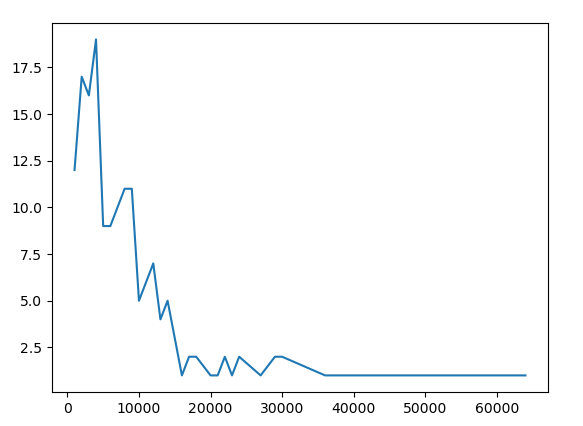

| 数量范围       | 数量 |
| -------------- | ---- |
| (0, 1000]      | 12   |
| (1000, 2000]   | 17   |
| (2000, 3000]   | 16   |
| (3000, 4000]   | 19   |
| (4000, 5000]   | 9    |
| (5000, 6000]   | 9    |
| (6000, 7000]   | 10   |
| (7000, 8000]   | 11   |
| (8000, 9000]   | 11   |
| (9000, 10000]  | 5    |
| (10000, 11000] | 6    |
| (11000, 12000] | 7    |
| (12000, 13000] | 4    |
| (13000, 14000] | 5    |
| (15000, 16000] | 1    |
| (16000, 17000] | 2    |
| (17000, 18000] | 2    |
| (19000, 20000] | 1    |
| (20000, 21000] | 1    |
| (21000, 22000] | 2    |
| (22000, 23000] | 1    |
| (23000, 24000] | 2    |
| (26000, 27000] | 1    |
| (28000, 29000] | 2    |
| (29000, 30000] | 2    |
| (35000, 36000] | 1    |
| (42000, 43000] | 1    |
| (62000, 63000] | 1    |
| (63000, 64000] | 1    |

### 每小时入站客流量

#### 2020-1-1~2020-1-23

绿色为工作日，红色为周末，蓝色为节假日

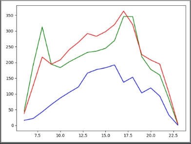 

#### 2020-1-23~2020-3-1

绿色为工作日，红色为周末，蓝色为节假日

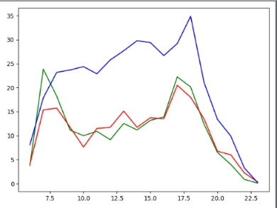 

 #### 2020-3-1~2020-5-1

绿色为工作日，红色为周末，蓝色为节假日

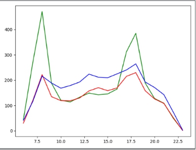 

#### 2020-5-1~2020-7-16

绿色为工作日，红色为周末，蓝色为节假日

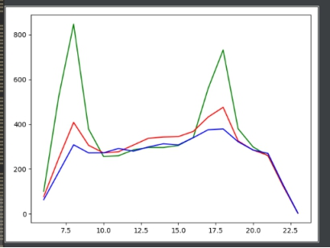 

### 每小时出站客流量

#### 2020-1-1~2020-1-23

绿色为工作日，红色为周末，蓝色为节假日

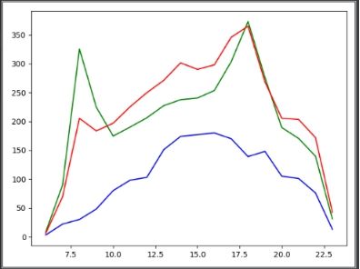 

 #### 2020-1-23~2020-3-1

绿色为工作日，红色为周末，蓝色为节假日

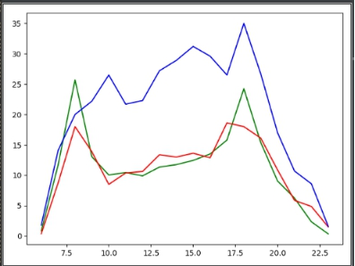 

 #### 2020-3-1~2020-5-1

绿色为工作日，红色为周末，蓝色为节假日 

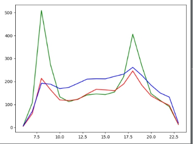 

#### 2020-5-1~2020-7-16

绿色为工作日，红色为周末，蓝色为节假日 

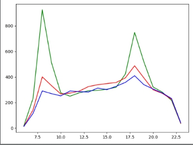 

# 前端

## 管理员页面

页面参考：https://www.proginn.com/w/1320544

按照以下的风格来实现。

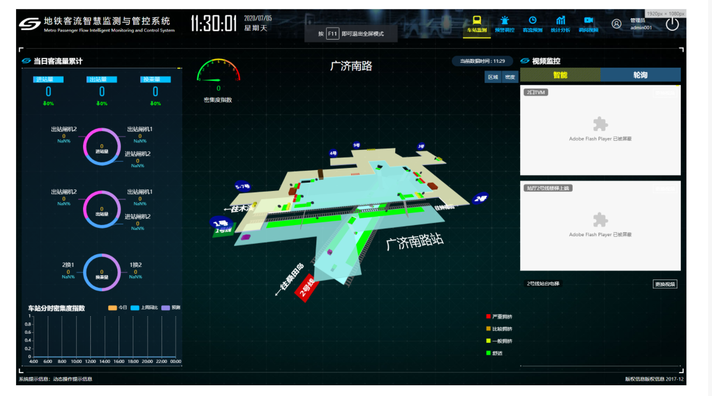

## 单月整体的客流波动分析

折线图。

展示所有站点的一个月内的客流。

从拓扑图上选取站点，展示选定站点的一个月内的客流。

## 工作日和周末的客流分析

### 展示一整天的客流量

柱形图展示。七条柱形。

根据时间粒度：一周、一个月、一年。（默认是一周）如果时间超过一周，则取平均值。峰谷值用标签的形式实现。

增加一个起始时间选项。（默认是当天）

即展示当天开始往前一周的数据分析。

展示平均值、峰值、谷值。

### 工作日及周末分时客流进站量分布。

效果如图所示。

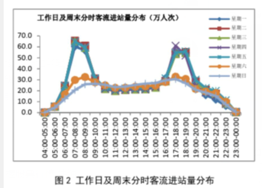

## 单站的点出/入站客流分析 

### 展示当前站点实时的进站量、出站量（数据限制无法实现）

每5分钟刷新一次。

### 展示进站量、出站量

选择站点，选择时间段。显示该段时间的进站量、出站量。（默认当前时间的前一小时）

## 用户年龄结构分析

### 站点进出年龄结构分析

选定站点。选定时间段。饼图展示用户占比，曲线图展示 该类用户 在该时间 的客流量。（默认是所有站点。时间段默认当日）

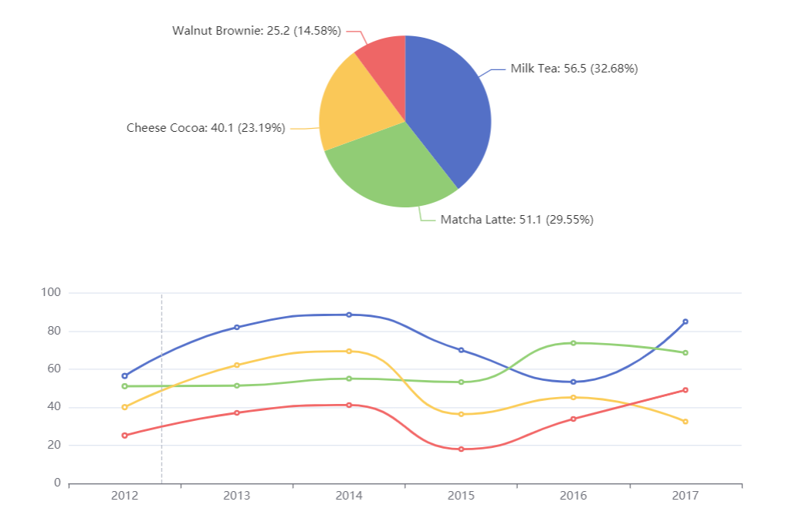

## 早晚高峰客流站点分布分析

### 线路拓扑图展示早晚高峰客流站点

## 站点 OD 客流量分析

### 从该站出发会前往哪里

饼图

### 到达该站会来自哪里

饼图

## 线路断面（按站点）流量分析

## 查询某一地铁线路在未来x小时内哪些站点会拥挤

判断标准：取5,6,7月份的中位数作为是否拥挤的阈值。

### 实时信息通知功能

弹出某个站点处于拥挤状态，通知管理员。