## 单独的LSTM

选用经典的**LSTM模型**进行预测

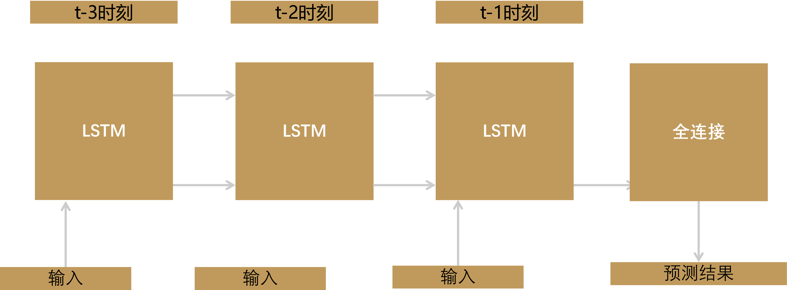

==仅考虑了客流在空间维度上的信息==

## 单独的GCN

描述站点之间关系的是一张图，是**非欧几里得数据**

客流在空间上的传播类似于热在空间上的传播，均具有从不同的初始状态会趋向一个稳态的性质。

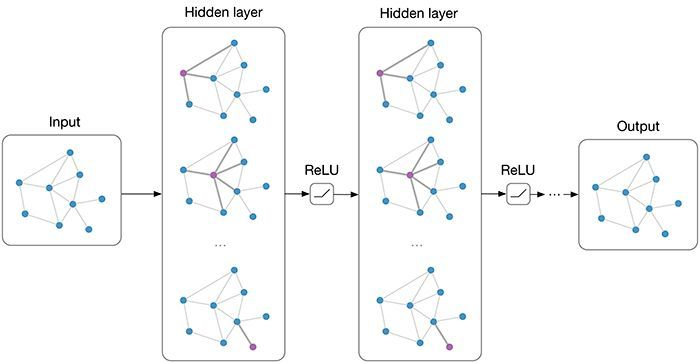

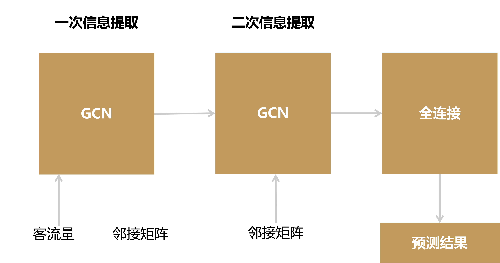

==仅考虑了客流在时间维度上的信息==

## LSTM-GCN

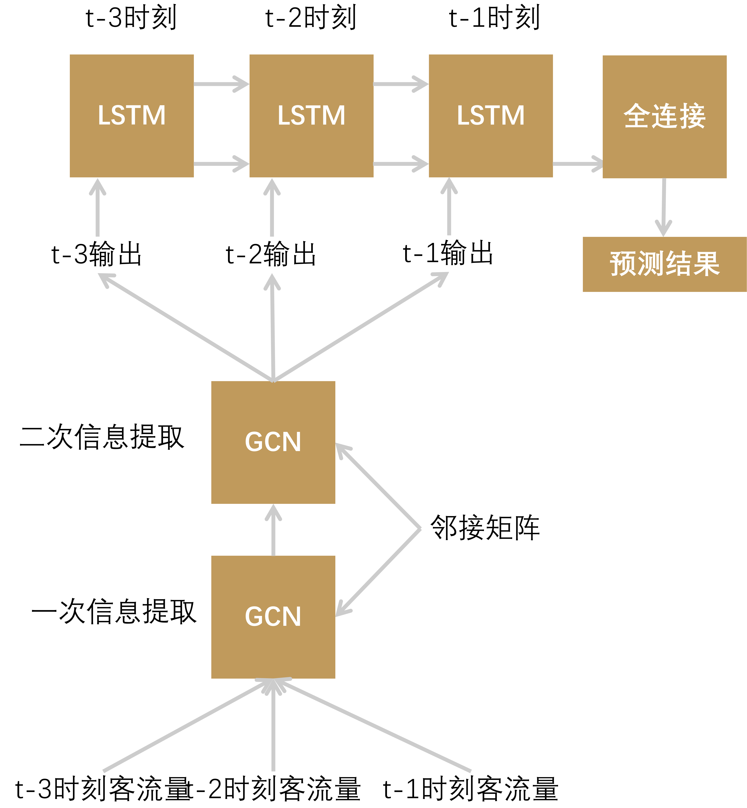

同时考虑客流的时间和空间维度

**三种模型损失函数比较图像**

（展示的时候左边LSTM，右边GCN，中间LSTM+GCN）

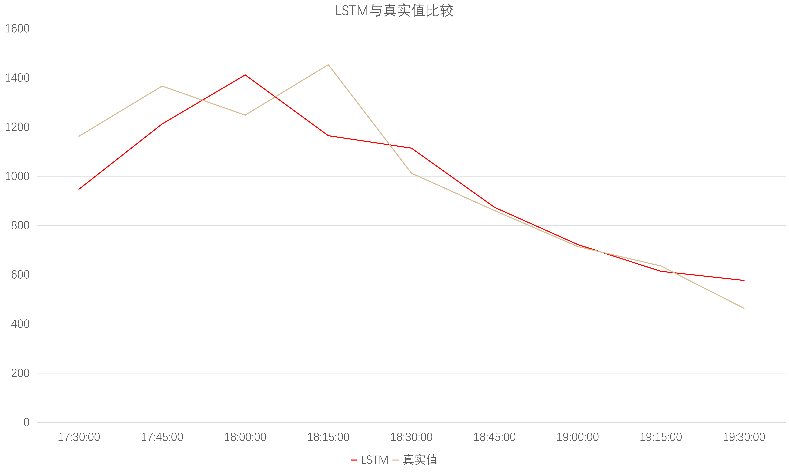

单独的LSTM模型预测结果与真实值比较

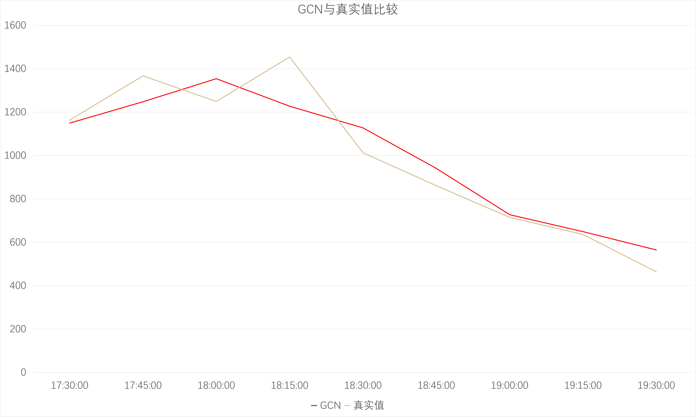

单独的GCN模型预测结果与真实值比较

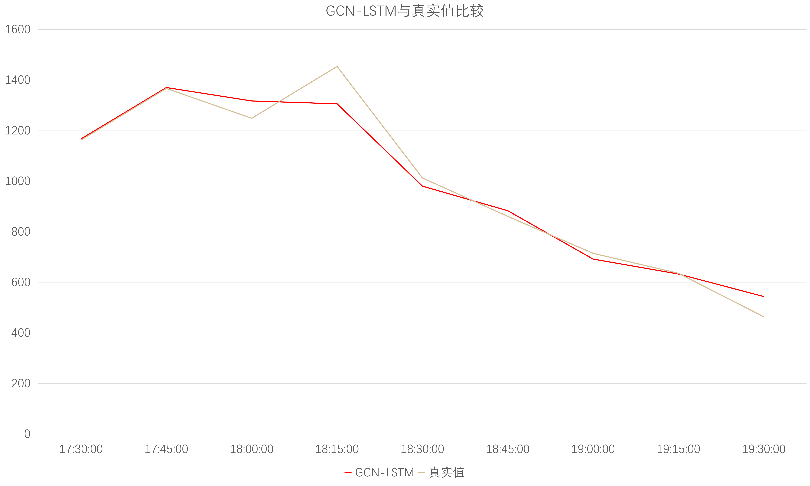

GCN+LSTM模型预测结果与真实值比较

GCN-LSTM模型与LSTM相比，没有LSTM的"滞后性"。与GCN相比，也更好的反应了客流的波动情况

（展示的时候4张图表等距并列排放，上面标注数值）

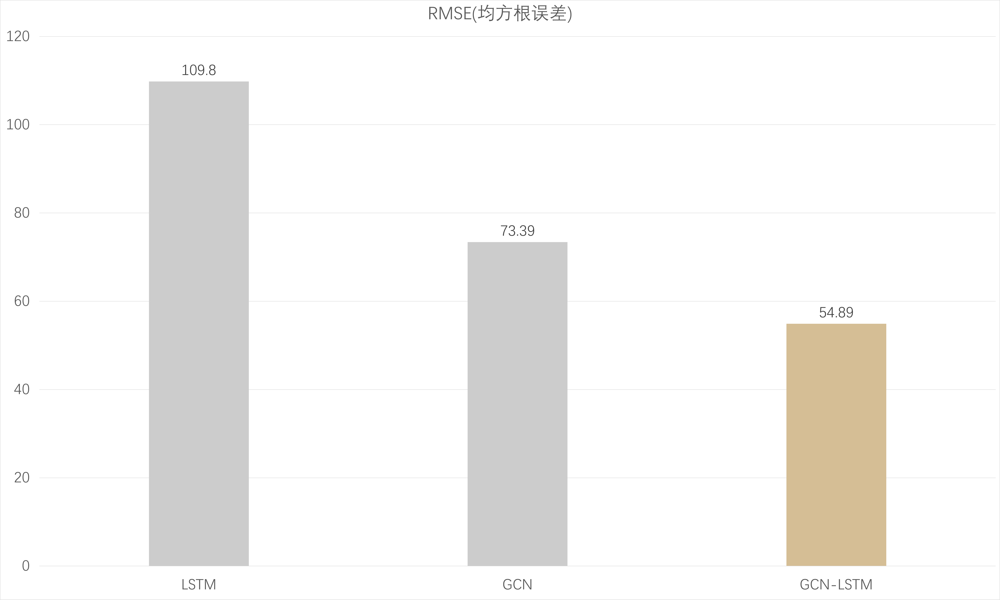

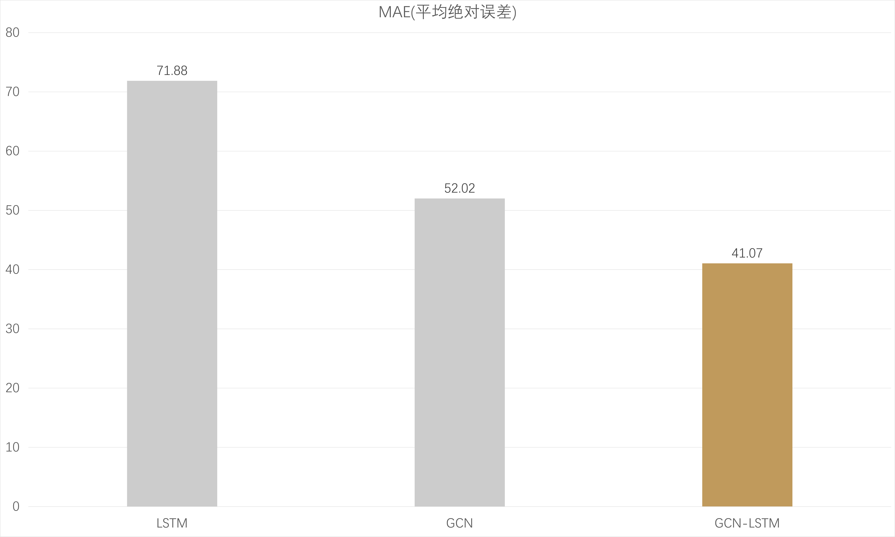

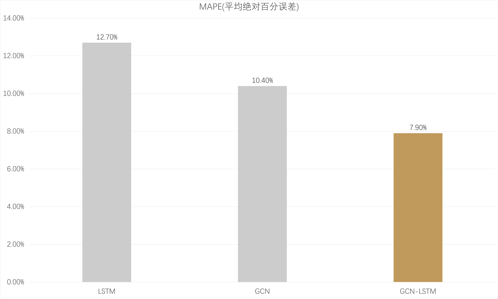

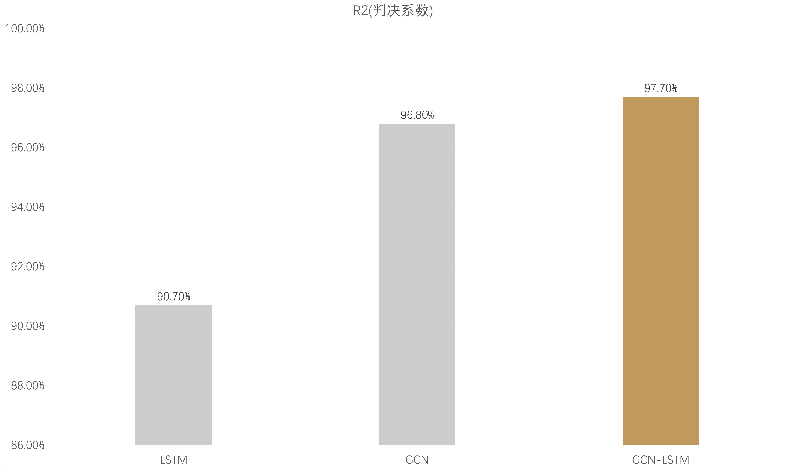

结合以上指标，可以看出预测值与真实值之间的误差有了明显的减小，从原来的12.7%减少到了7.9%，准确率有了大幅度的提升。判决系数从90.7%提升到了97.7%，提升了7%的性能，这说明了模型也更加贴近真实情况。

