# 1天预测1天

by hzw

数据每一行包含：Num,CurrentConfirmedCount,ConfirmedCount,CuredCount,DeadCount,DateType,DiffConfirmedCount

2021.2.18，第一次预测。结果如下，出现预测比实际“提前”的情况

最前面15天因为数据存在错误删去。剩余183天中，取前面152天作为训练集，剩下31天为测试集。

模型如下：

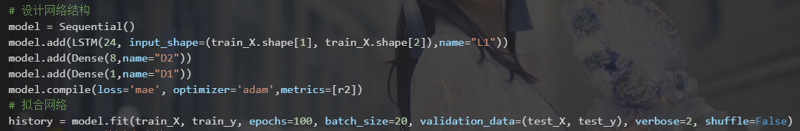

最后的拟合优度和mae如下：

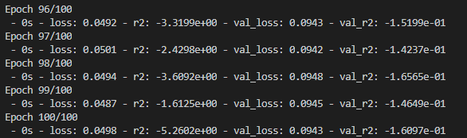

损失函数如图：

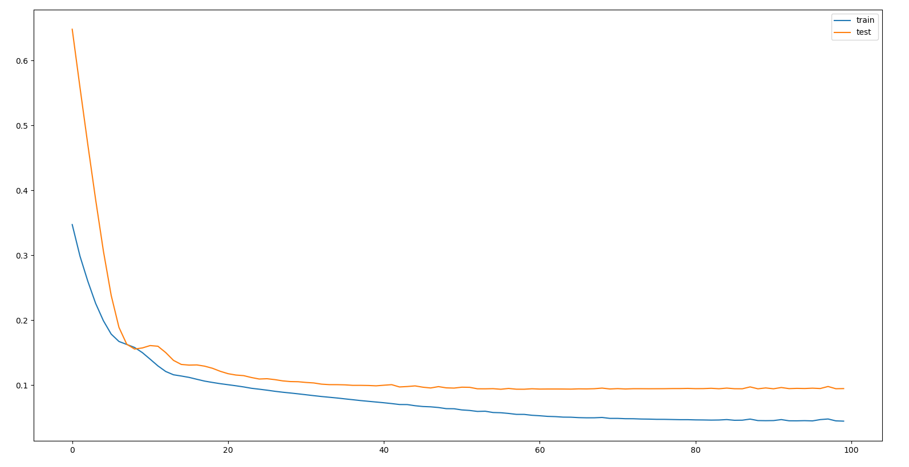

在测试集上的预测结果如下图所示。

|损失函数|数值|
|-|-|
|RMSE|1019.686|
|R2|-0.255|
|MAE|714.259|
|MAPE|0.127|

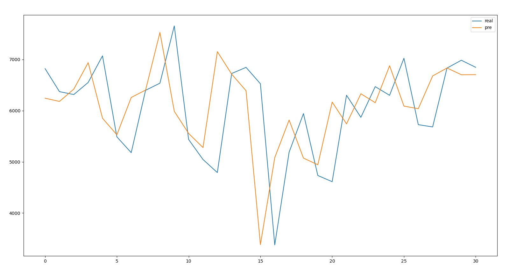

评估：模型过于简单，需要增加隐藏层，增加每层神经元个数

#n天预测1天

by hzw

此处n=5，数据每一行包含Num（人数），ConfirmedCount（确诊人数），DateType（日期类型）三个参数

模型如下

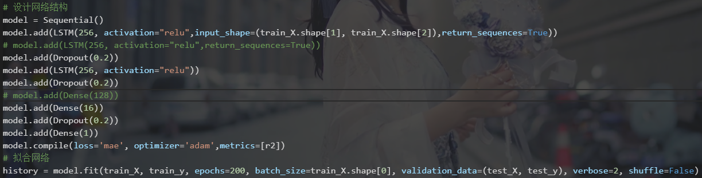

损失函数如下：

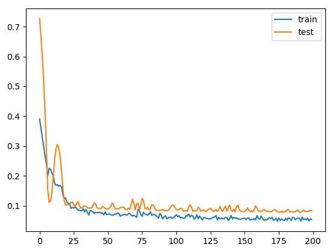


拟合优度与mae如下

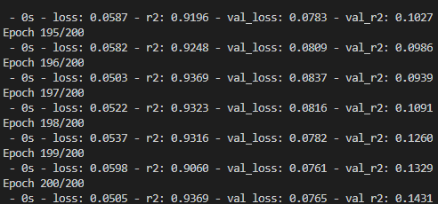

测试集上的预测结果如下。

|损失函数|数值|
|-|-|
|RMSE|909.932|
|R2|0.003|
|MAE|628.348|
|MAPE|0.118|

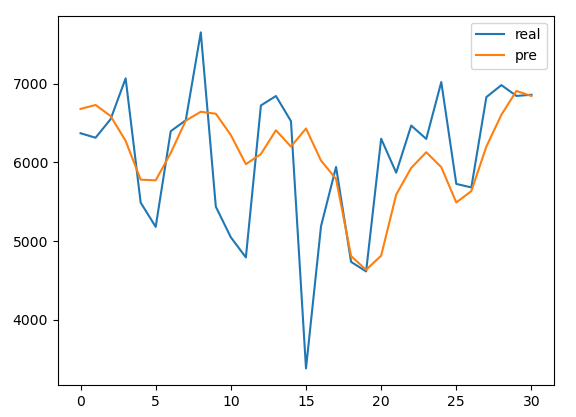

评估：在训练集上拟合度 高达0.93，在测试机上只有0.1以下。模型存在过拟合的情况。

# n天预测1天（预测训练集）

by hzw

此处n=5，数据每一行包含Num（人数），ConfirmedCount（确诊人数），DateType（日期类型）三个参数

模型如下：

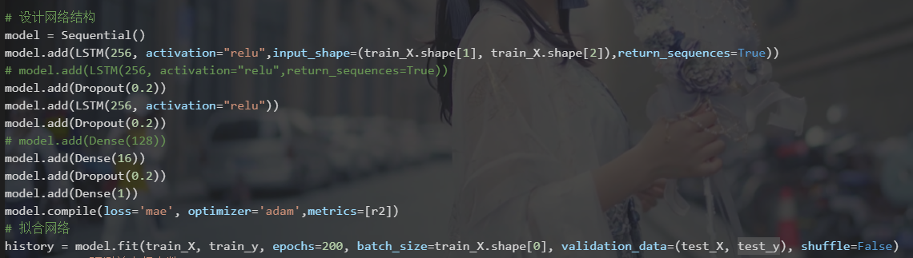

损失函数如下：

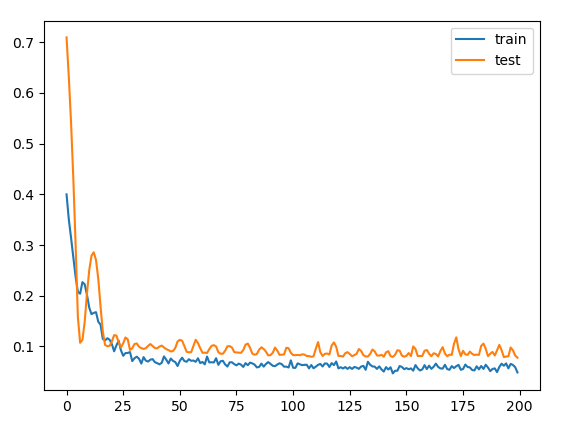

拟合优度和MAE如下

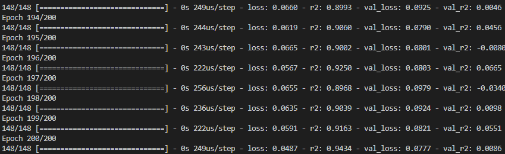

在测试集上的预测结果

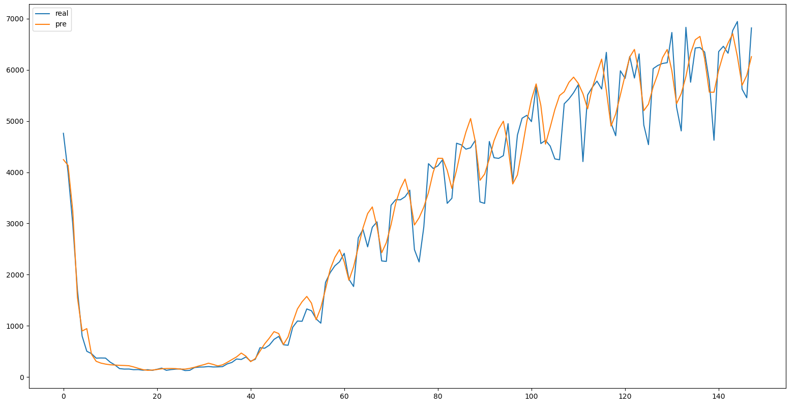

|损失函数|数值|
|-|-|
|RMSE|373.251|
|R2|0.973|
|MAE|257.523|
|MAPE|0.120|

评估：可以看出R2虽然高，但是MAPE也有12%。预测值和真实值比较来看，许多地方预测不够精确

# 尝试只用SAE预测

自变量是前5天的Num，ConfirmedCount，DateType。因变量是当天的客流人数

模型构建、训练代码如下：

```python
def _get_sae(inputs, hidden, output):
    """SAE(Auto-Encoders)
    Build SAE Model.

    # Arguments
        inputs: Integer, number of input units.
        hidden: Integer, number of hidden units.
        output: Integer, number of output units.
    # Returns
        model: Model, nn model.
    """

    model = Sequential()
    model.add(Dense(hidden, input_dim=inputs, name='hidden'))
    model.add(Activation('relu'))
    model.add(Dropout(0.2))
    model.add(Dense(output, activation='sigmoid'))

    return model


def get_saes(layers):
    """SAEs(Stacked Auto-Encoders)
    Build SAEs Model.

    # Arguments
        layers: List(int), number of input, output and hidden units.
    # Returns
        models: List(Model), List of SAE and SAEs.
    """
    part_model = []
    for i in range(len(layers) - 2):
        part_model.append(_get_sae(layers[i], layers[i+1], layers[-1]))

    saes = Sequential()
    saes.add(Dense(layers[1], input_dim=layers[0], name='hidden1'))
    saes.add(Activation('relu'))
    for i in range(2,len(layers) - 1):
        saes.add(Dense(layers[i], name='hidden%d' % (i)))
        saes.add(Activation('relu'))

    saes.add(Dropout(0.2))
    saes.add(Dense(layers[-1]))

    models = [part_model, saes]

    return models

def train_model(model, X_train, y_train, name, config,test_X, test_y):
    """train
    train a single model.

    # Arguments
        model: Model, NN model to train.
        X_train: ndarray(number, lags), Input data for train.
        y_train: ndarray(number, ), result data for train.
        name: String, name of model.
        config: Dict, parameter for train.
    """
    print("\n\n\n\n\n\nStart To Train Whole Mode")
    model.compile(loss="mse", optimizer="rmsprop", metrics=['mape',r2])
    # early = EarlyStopping(monitor='val_loss', patience=30, verbose=0, mode='auto')
    hist = model.fit(
        X_train, y_train,
        batch_size=config["batch"],
        epochs=config["epochs"],
        validation_data=(test_X, test_y),verbose=2)

    model.save('预测总出行人数/model/' + name + '.h5')
    df = pd.DataFrame.from_dict(hist.history)
    df.to_csv('预测总出行人数/model/' + name + ' loss.csv', encoding='utf-8', index=False)
    return hist

def train_seas(models, X_train, y_train, name, config,test_X, test_y):
    """train
    train the SAEs model.

    # Arguments
        models: List, list of SAE model.
        X_train: ndarray(number, lags), Input data for train.
        y_train: ndarray(number, ), result data for train.
        name: String, name of model.
        config: Dict, parameter for train.
    """

    temp = X_train
    temp_test = test_X
    # early = EarlyStopping(monitor='val_loss', patience=30, verbose=0, mode='auto')
    part_models = models[0]
    
    for i in range(len(part_models)):
        if i > 0:
            p = part_models[i - 1]
            hidden_layer_model = Model(input=p.input,
                                       output=p.get_layer('hidden').output)
            temp = hidden_layer_model.predict(temp)
            temp_test = hidden_layer_model.predict(temp_test)

        m = part_models[i]
        m.compile(loss="mse", optimizer="rmsprop", metrics=['mape',r2])

        m.fit(temp, y_train, batch_size=config["batch"],
              epochs=config["epochs"],
              validation_data=(temp_test, test_y),verbose=2)

        part_models[i] = m

    saes = models[-1]
    for i in range(len(part_models)):
        weights = part_models[i].get_layer('hidden').get_weights()
        saes.get_layer('hidden%d' % (i + 1)).set_weights(weights)

    return train_model(saes, X_train, y_train, name, config,test_X, test_y)

config={"epochs":100, "batch":train_X.shape[0]}

model = get_saes([n_days * n_features, 8,4,8, n_days * n_features,1])
history = train_seas(model, train_X, train_y, 'saes', config,test_X, test_y)
```

多次调整SAE隐藏层个数、隐藏层神经元个数，都无法在验证集上得到很好的拟合。

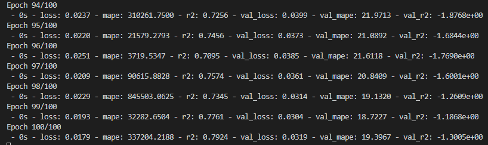

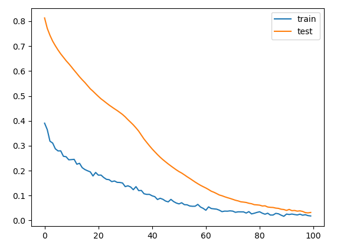

预测最后5天的结果如下

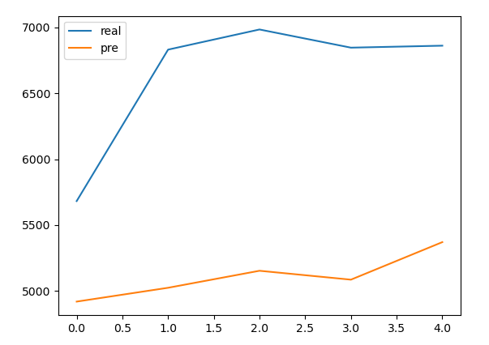

|损失函数|数值|
|-|-|
|RMSE|1583.543|
|R2|-9.755|
|MAE|1531.421|
|MAPE|0.227|

# 1小时预测1小时（5-1~7-16）

by cn

数据每一行包括 Num，Hour，Date，DateType

删除了0点的噪声数据，同时，将每天的小时数定为6时至23小时（保存了客流量为0的情况存在，时段为23时）

模型如下：

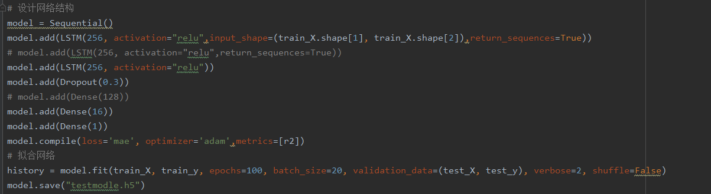

最后的拟合优度和mae如下：

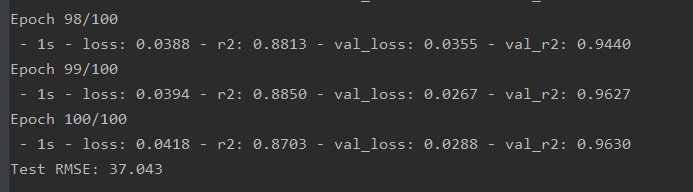

损失函数如图：

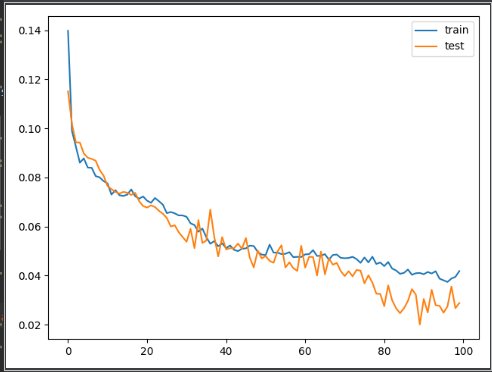


拟合图像：

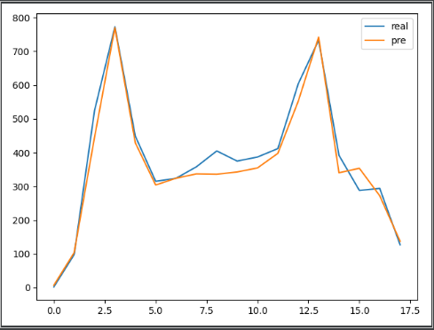

评估：拟合得较好，仍然存在上升的空间

# 前N个小时预测一个小时（前n个数据）（5-1~7-16）

by cn

数据每一行包括Num，Hour，Date，DateType

数据集与一小时预测一小时的数据集相同

不同的在于这次用了前N个数据进行预测，这里选用的N为18，即前一天6-23小时的数据


使用的模型与上面相同：


## 1.预测最后两天

最后的拟合优度和mae如下：

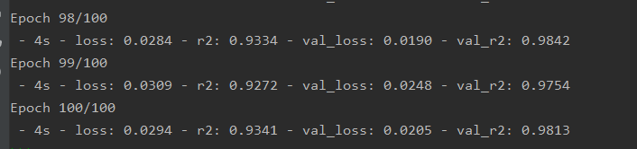

损失函数：

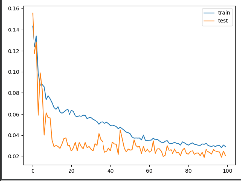

| 损失函数 | 数值   |
| -------- | ------ |
| RMSE     | 25.995 |
| R2       | 0.982  |
| MAE      | 19.937 |
| MAPE     | 0.287  |

预测图像：

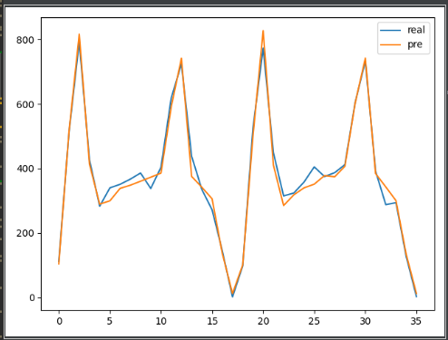

评估：误差比上面的更小

## 2.预测最后一天

最后的拟合优度和mae如下：

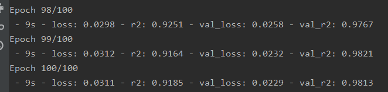

损失函数：

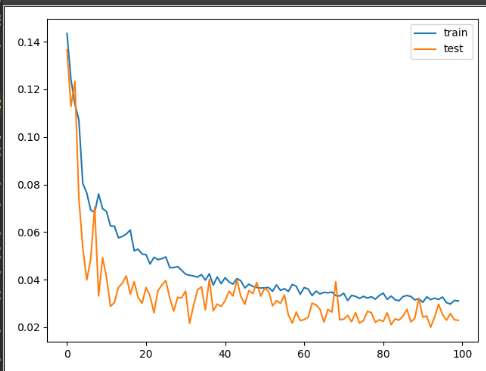

| 损失函数 | 数值   |
| -------- | ------ |
| RMSE     | 26.335 |
| R2       | 0.981  |
| MAE      | 22.235 |
| MAPE     | 0.465  |

预测图像：

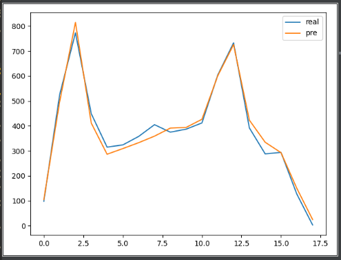

评估：预测的也十分好，十分拟合

# 前N天的相同时段预测一个小时（5-1~7-16）

by cn

数据每一行包括Num，Hour，Date，DateType

数据集与一小时预测一小时的数据集相同

不同的在于这次用了前N天相同时段的数据进行预测，这里选用的N为5，即前五天相同时段的数据


使用的模型与上面相同：


最后的拟合优度和mae如下：

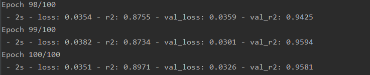


损失函数：

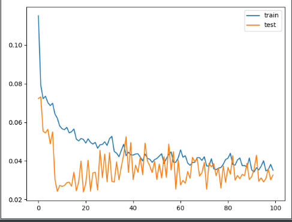

拟合图像：

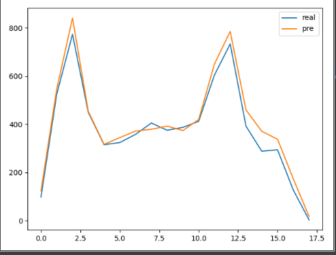

评估：误差略微增大，但是拟合图线趋势较为正确。

# 前N个小时预测一个小时（前n个数据）（1-12~1-23）

by cn

数据每一行包括Num，Hour，Date，DateType

数据集只取了1-12~1-23中的数据

不同的在于这次用了前N个数据进行预测，这里选用的N为18，即前一天6-23小时的数据


使用的模型与上面相同：


最后的拟合优度和mae如下：

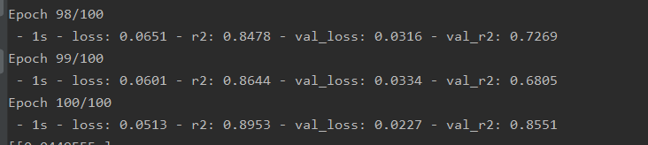

损失函数：

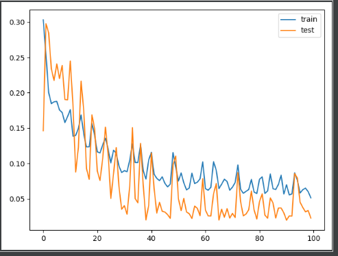

| 损失函数 | 数值   |
| -------- | ------ |
| RMSE     | 14.733 |
| R2       | 0.855  |
| MAE      | 11.791 |
| MAPE     | inf    |

预测图像：

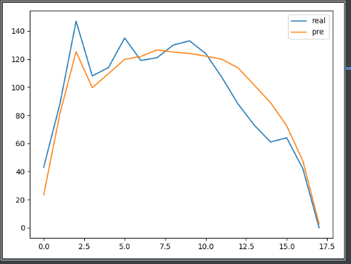

评估：不知怎么说…真实值的数据也感觉有点问题，1-23日也比较特殊，可能效果不是很好，还需要想别的办法。

# 前N个小时预测一个小时（前n个数据）（1-23~3-1）

by cn

数据每一行包括Num，Hour，Date，DateType

数据集为1-23~3-1的数据，但数据量较小

不同的在于这次用了前N个数据进行预测，这里选用的N为18，即前一天6-23小时的数据


使用的模型与上面相同：


最后的拟合优度和mae如下：

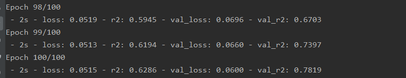

损失函数：

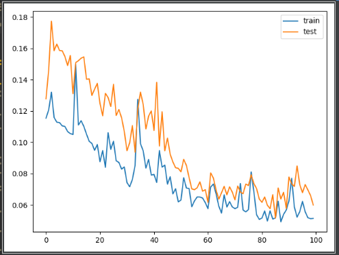

| 损失函数 | 数值  |
| -------- | ----- |
| RMSE     | 5.029 |
| R2       | 0.782 |
| MAE      | 4.018 |
| MAPE     | 0.351 |

预测图像：


评估：由于数据量较小，拟合得图线较差

# 前N个小时预测一个小时（前n个数据）（3-1~5-1）

by cn

据每一行包括Num，Hour，Date，DateType

数据集取得是3-1~5-1的数据

不同的在于这次用了前N个数据进行预测，这里选用的N为18，即前一天6-23小时的数据


使用的模型与上面相同：


最后的拟合优度和mae如下：

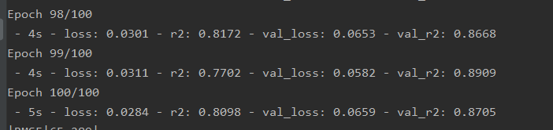

损失函数：

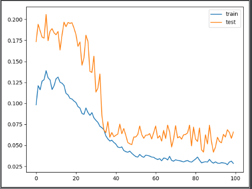

| 损失函数 | 数值   |
| -------- | ------ |
| RMSE     | 65.289 |
| R2       | 0.870  |
| MAE      | 53.344 |
| MAPE     | 0.178  |

预测图像：

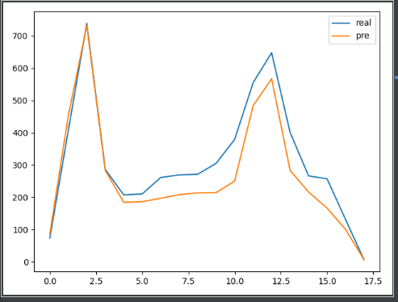

评估：3-1~5-1的数据呈现一种上升的趋势。该模型对峰值的预测较好，能较准确的预测出高峰值，但仍有上升空间。


# 尝试拟合1.15-7.16

总共3294个小时。

最后18个小时作为测试集，3276中80%作为训练集（2620个），20%作为测试集（656个）

自变量为前18个小时的Num,Hour,DateType。因变量为当前小时的客流预测。

模型

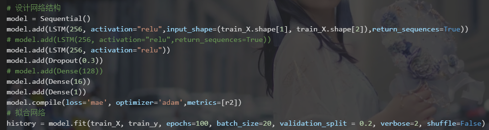

损失函数为mae

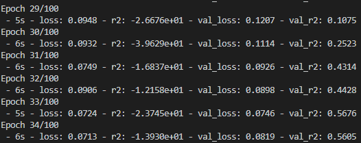

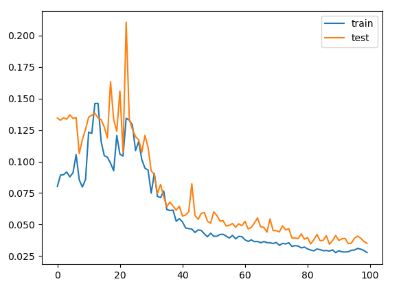

最后的mae和R2

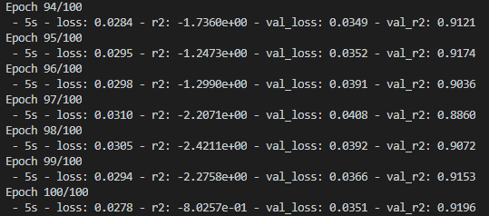

因为模型所实现的是短时预测。训练集因为数据量太大，导致R2为负数，拟合的效果很差。而在验证集上，因为数据量较小，可以更好的进行拟合。

所以模型在测试集上的预测效果也挺好

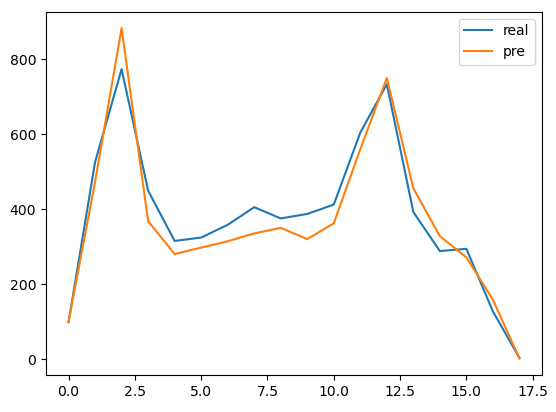

|损失函数|数值|
|-|-|
|RMSE|51.120|
|R2|0.929|
|MAE|43.427|
|MAPE|0.142|

## 将shuffle设置为True

打乱数据之后。可以看出无论是训练集还是验证集，拟合优度都蹭蹭蹭的往上涨

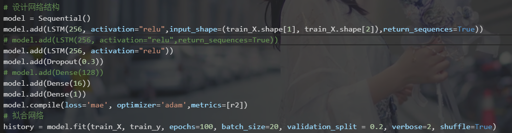


**结论：模型的目标是实现短时的预测。训练集打乱之后，前后的数据之前没有关联，梯度下降的时候就会朝着全局的方向下降。如果将训练集按照时间进行排序，则这20个数据是有关联的，会导致梯度朝着该部分的方向下降，导致无法很好的进行拟合全局数据。**

**可以将batch_size的值增大以实现梯度更好的下降**

**所以可以看出，模型在短时预测上的性能是非常好的。**==**训练集也可以适当进行减小**==**，不至于用到2620个数据，从而缩短训练的时间。**

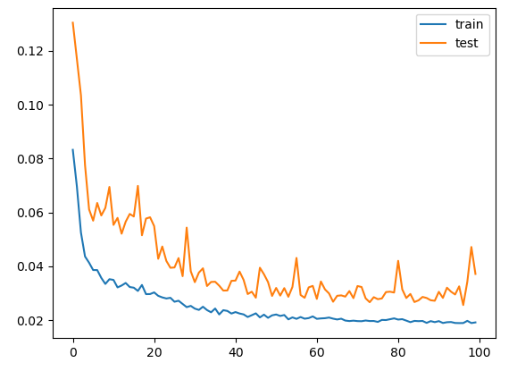

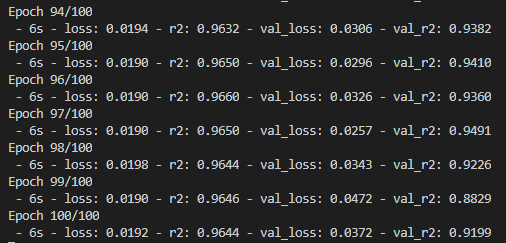

测试集上的结果

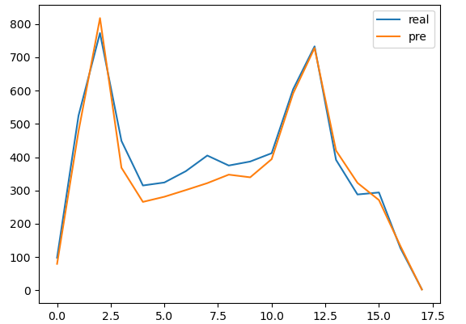


|损失函数|数值|
|-|-|
|RMSE|41.811|
|R2|0.953|
|MAE|34.741|
|MAPE|0.111|

# 出行行为分析

考虑到通勤用户和非通勤用户每日出行存在较大差异，需要根据地铁出行记录分别研究通勤用户和非通勤用户。

根据不同用户的出行规律制定了区分通勤用户与非通勤用户的判决规则，判决流程图如图 3-4 所示，判决算法如算法 3-1所示。

本规则首先分析用户出行数据推断用户的住宅站点和公司站点，取出每名用户上午 10 点前记录的出发站点和下午 5 点后记录的到达站点作为候选住宅站点。若某候选住宅站点的出行频率大于阈值，则定义此站点为该用户的住宅站点。取前述记录中另一站点作为候选公司站点，根据阈值判断是否确定为该用户的公司站点。若没有超过阈值频率的站点，则判定为没有此站点。若用户存在明确的住宅站点和公司站点，定义为通勤用户，若仅存在住宅站点不存在公司站点，则定义为非通勤用户。除了通勤者和非通勤者之外，还存在少量出行习惯不固定

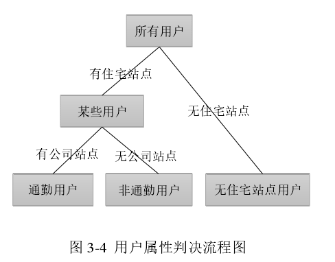

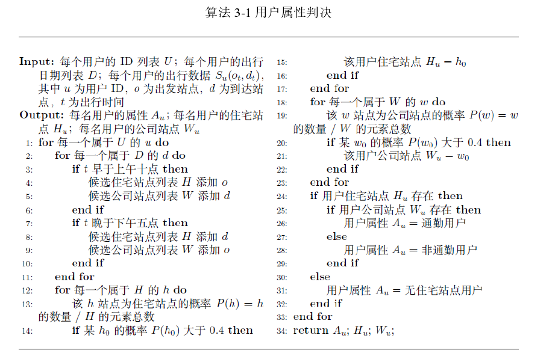

用户提取住宅和公司（用户提取住宅和公司.py）

# 1-15~7-16 加入新增确诊人数一列。测试集为其中某一天

### 1.取其中从后往前数第100天

| 损失函数 | 数值   |
| -------- | ------ |
| RMSE     | 40.232 |
| R2       | 0.929  |
| MAE      | 28.717 |
| MAPE     | 0.394  |


### 2.取其中从后往前数第50天

| 损失函数 | 数值   |
| -------- | ------ |
| RMSE     | 27.405 |
| R2       | 0.982  |
| MAE      | 21.225 |
| MAPE     | 0.110  |


### 3.取其中从后往前数第30天

| 损失函数 | 数值   |
| -------- | ------ |
| RMSE     | 27.014 |
| R2       | 0.985  |
| MAE      | 21.056 |
| MAPE     | 0.191  |


### 4.取其中倒数第二天

| 损失函数 | 数值   |
| -------- | ------ |
| RMSE     | 33.215 |
| R2       | 0.970  |
| MAE      | 28.246 |
| MAPE     | 0.089  |


# ==2019年15分钟预测==

# 单个GCN预测模型

输入：

时间段选择6:00到23:30

选择站点46作为预测的站点。取与其相邻在7个站点距离以内的所有站点。包括站点46一共41个站点。

建立41*41的邻接矩阵。

取前一个时间段的41个站点的客流量作为41个站点的特征值。

进行图卷积。

一共1750组数据。取10%（175个）作为测试集。剩下90%（1575个），80%作为训练集，20%作为测试集。

模型如下：

```python
X_in = Input(shape=(MapSize,1))
Map_in = Input(shape=(MapSize,MapSize))
gcn1 = GraphConv(4,activation="relu")([X_in,Map_in])
gcn2 = GraphConv(4,activation="relu")([gcn1,Map_in])
OutPut = Flatten()(gcn2)
OutPut = Dense(MapSize,activation="relu")(OutPut)
OutPut = Dense(1)(OutPut)

model = Model(inputs = [X_in,Map_in],output = OutPut)
model.compile(loss='mse', optimizer=Adam(lr=0.01),metrics=[r2])

history = model.fit([train_X,train_Map],train_y,batch_size=train_X.shape[0], epochs=300, shuffle=False, verbose=1,validation_split=0.2)
```

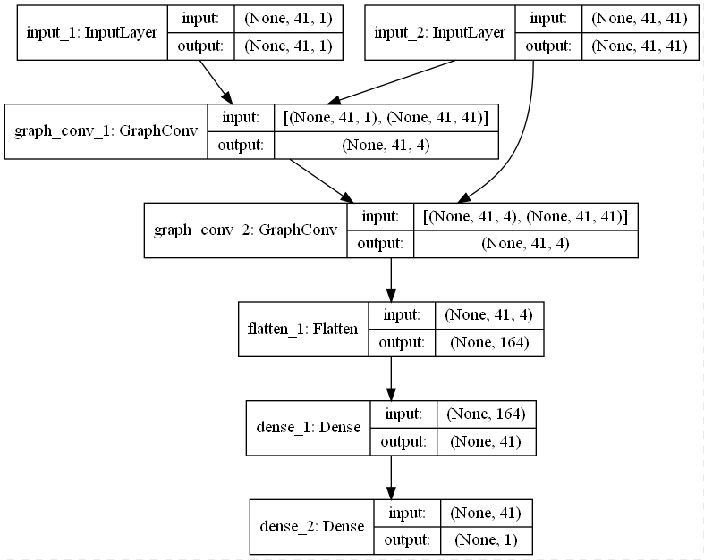

各层参数状况如下：

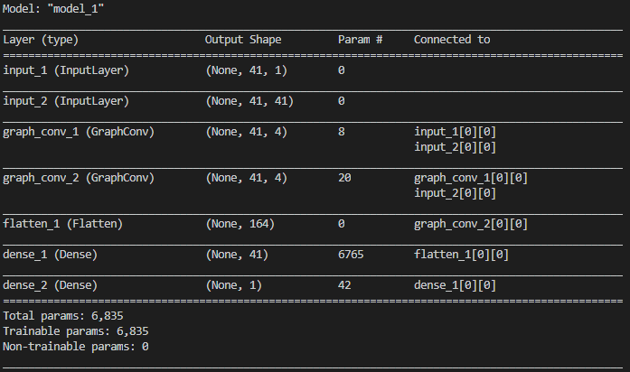

mae随着迭代次数的变化如下所示：

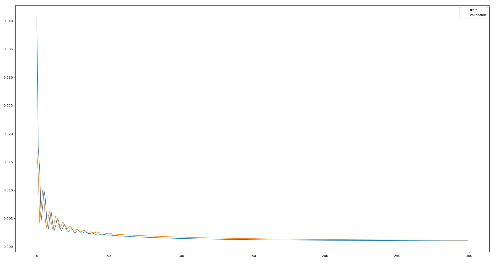

最后10次迭代的mae如下：


在测试集上的结果如下


局部图如下

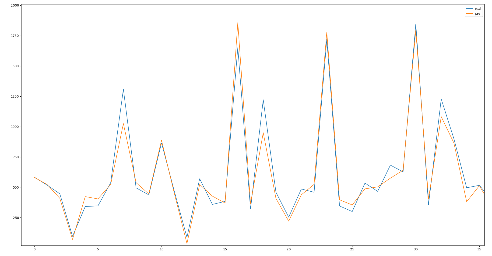

| 损失函数 | 数值   |
|-|-|
|Test RMSE| 74.880 |
|Test MAE| 53.036 |
|Test R2|0.967|
|Test explained_variance_score|0.967|
|Test MAPE|0.108|

# lstm预测模型

输入参数：

时间段选取的是6:00-23:30。

时间步长取15分钟。

前4个时间步长的Num（客流量）DateType（日期类型）,temperature（温度）,weather（天气状况）

一共1750个预测样本，取10%（175个）作为测试集。剩下90%（1575个）中，80%作为训练集，20%作为验证集

模型如下

```python
model = Sequential()
model.add(LSTM(256, activation="relu",input_shape=(train_x.shape[1], train_x.shape[2]),return_sequences=True))
model.add(LSTM(256, activation="relu"))
model.add(Dropout(0.3))
model.add(Dense(16))
model.add(Dense(1))
model.compile(loss='mae', optimizer='adam',metrics=[r2])
```

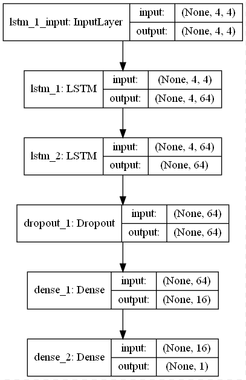

各层参数：

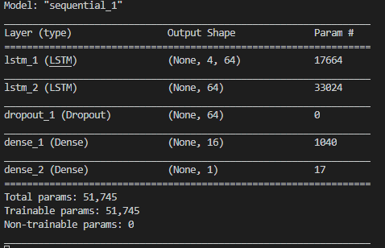

mae在训练时的下降如下：

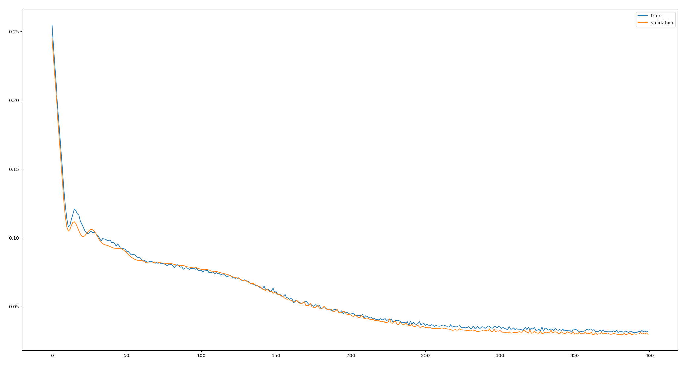

最后10次迭代的mae和r2如下：

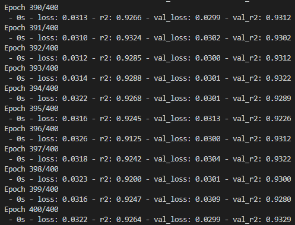

在测试集上的预测结果如下

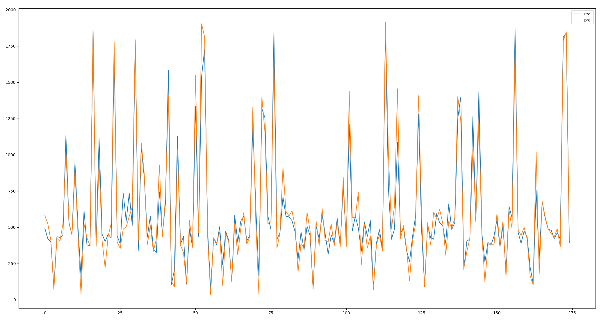

局部结果如下：

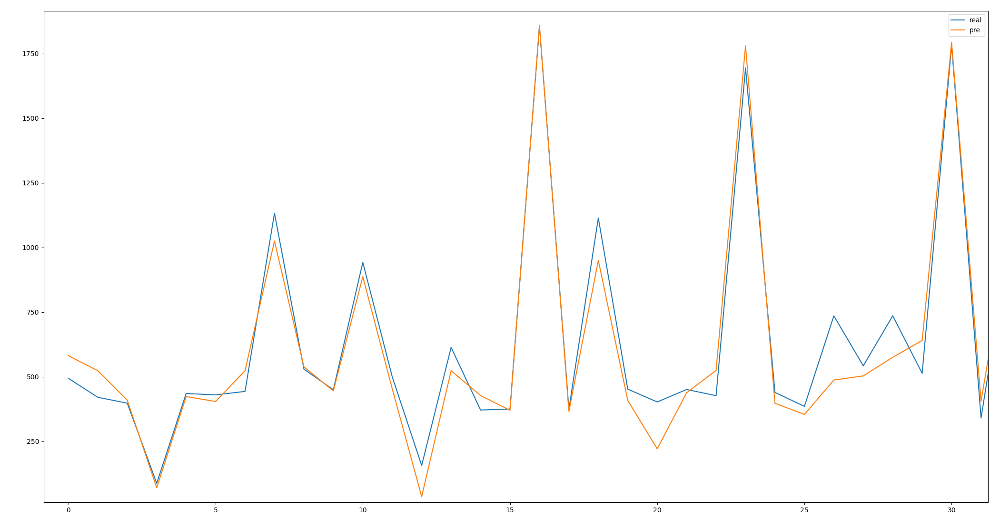

|损失函数|数值|
|-|-|
|Test RMSE| 98.130 |
|Test MAE|63.757|
|Test R2|0.944|
|Test explained_variance_score|0.945|
|Test MAPE|0.121|

# GCN+LSTM预测模型

时间段选取的是6:00-23:30。

时间步长取15分钟。

选择站点46作为预测的站点。取与其相邻在7个站点距离以内的所有站点。一共41个站点（包括站点46）。

建立41*41的邻接矩阵。

取前3个时间段的41个站点的客流量作为41个站点的特征值。得到3个41*1的矩阵

对每个时间段的特征矩阵单独进行两次图卷积。

将得到的矩阵压缩成1维，经过Dense矩阵提取信息。由此得到3个时间段的信息。

将3个时间段的信息输入到lstm中。经过两次LSTM，最后经过一层Dense输出预测值。

一共1750组数据。取10%（175个）作为测试集。剩下90%（1575个），80%作为训练集，20%作为测试集。

模型如下：

```python
X_in = Input(shape=(MapSize,1),name = "StationFeature")
Map_in = Input(shape=(MapSize,MapSize),name = "Map")
GCN1 = GraphConv(4,activation="relu",name="GCN1")([X_in,Map_in])
GCN2 = GraphConv(4,activation="relu",name="GCN2")([GCN1,Map_in])
Output = Flatten()(GCN2)
Output = Dense(64,name="ExtractFeature")(Output)

GCN_Model = Model(inputs = [X_in,Map_in],output = Output,name = "GCN_Part")
plot_model(GCN_Model,to_file="GCN+LSTM预测(GCN部分).png",show_shapes=True)

Inputs = []
Map_Input = []
GCN_Models = []

for i in range(TimeStep):
    Inputs.append(Input(shape=(MapSize,1),name = "StationFeature_t-{}".format(TimeStep - i)))
    Map_Input.append(Input(shape=(MapSize,MapSize),name = "Map_t-{}".format(TimeStep - i)))
    GCN_Models.append(GCN_Model([Inputs[i],Map_Input[i]]))

MergeLayres = concatenate([GCN_Models[i] for i in range(TimeStep)])
LSTM_Input = Reshape((TimeStep,-1))(MergeLayres)
LSTM1 = LSTM(64,activation="relu",return_sequences=True,name = "LSTM1")(LSTM_Input)
LSTM2 = LSTM(64,activation="relu",name="LSTM2")(LSTM1)
Predict = Dense(1,name="Predict")(LSTM2)

model = Model(inputs = Inputs + Map_Input,output = Predict,name = "GCN+LSTM")

BatchSize = train_X_3.shape[0]
model.compile(loss='mse', optimizer=Adam(lr=0.01),metrics=[r2])
history = model.fit(train_X,train_y,batch_size=BatchSize, epochs=300, shuffle=False, verbose=1,validation_split=0.2)

```


整体模型如下

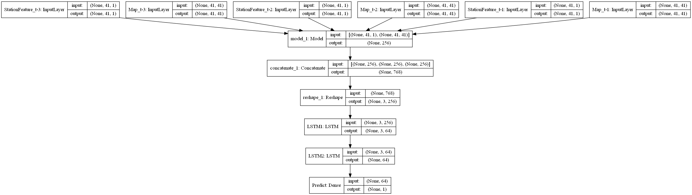

GCN部分模型如下

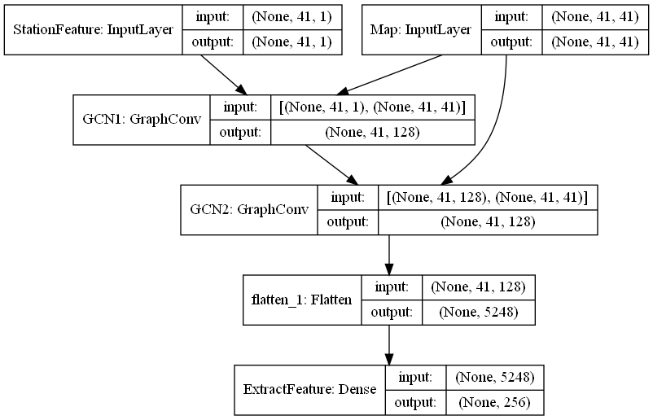

参数：

GCN部分各层参数如下

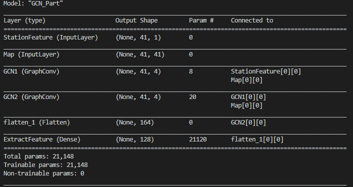

整体模型各层参数如下：

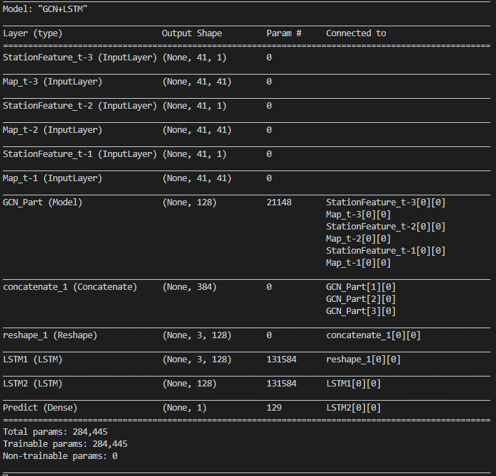

mae在训练上的下降如下：

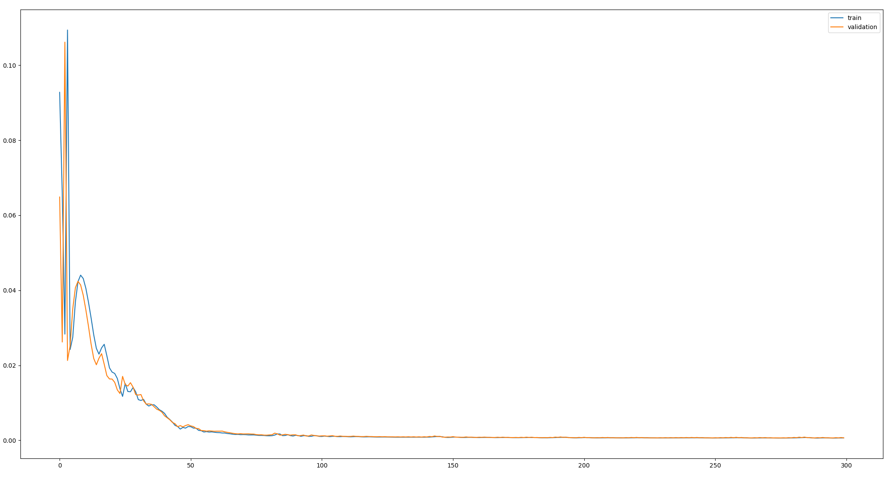

最后10次的迭代结果如下：

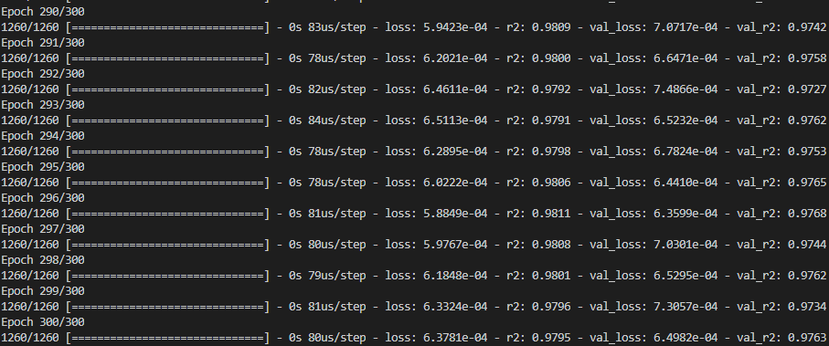

测试集上的结果如下

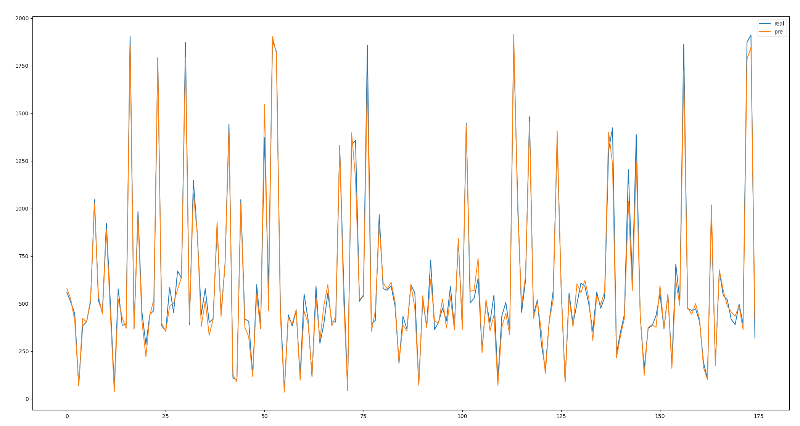

局部如下所示

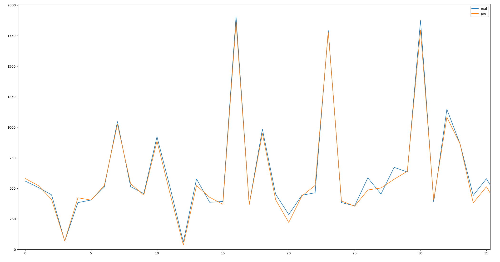

|损失函数|数值|
|-|-|
|Test RMSE| 54.444 |
|Test MAE|38.716|
|Test R2|0.984|
|Test explained_variance_score|0.985|
|Test MAPE|0.075|
# 总结

## GCN微调尝试

| GCN 2隐层(128,128) epochs = 100  |         |        |        |         |        | 平均值  |
| -------------------------------- | ------- | ------ | ------ | ------- | ------ | ------- |
| rmse                             | 108.702 | 95.251 | 98.465 | 100.437 | 92.891 | 99.1492 |
| mae                              | 72.103  | 62.795 | 69.902 | 66.594  | 66.216 | 67.522  |
| r2                               | 0.931   | 0.947  | 0.942  | 0.941   | 0.949  | 0.942   |
| explained varience score         | 0.931   | 0.947  | 0.942  | 0.941   | 0.949  | 0.942   |
| mape                             | 0.143   | 0.118  | 0.148  | 0.129   | 0.133  | 0.1342  |
|                                  |         |        |        |         |        |         |
| **GCN 2隐层(8,8) epochs = 300**  |         |        |        |         |        |         |
| rmse                             | 74.026  | 69.198 | 73.448 | 77.266  | 73.015 | 73.3906 |
| mae                              | 52.63   | 49.499 | 50.457 | 54.375  | 53.131 | 52.0184 |
| r2                               | 0.968   | 0.973  | 0.968  | 0.964   | 0.968  | 0.9682  |
| explained varience score         | 0.968   | 0.973  | 0.968  | 0.964   | 0.969  | 0.9684  |
| mape                             | 0.106   | 0.103  | 0.097  | 0.112   | 0.104  | 0.1044  |
|                                  |         |        |        |         |        |         |
| **GCN 2隐层(4,4) epochs = 300**  |         |        |        |         |        |         |
| rmse                             | 68.787  | 74.33  | 66.161 | 78.308  | 71.606 | 71.8384 |
| mae                              | 50.159  | 52.459 | 48.748 | 54.665  | 51.971 | 51.6004 |
| r2                               | 0.973   | 0.967  | 0.976  | 0.963   | 0.97   | 0.9698  |
| explained varience score         | 0.973   | 0.967  | 0.976  | 0.963   | 0.97   | 0.9698  |
| mape                             | 0.113   | 0.106  | 0.102  | 0.111   | 0.103  | 0.107   |
|                                  |         |        |        |         |        |         |
|                                  |         |        |        |         |        |         |
| **GCN 2隐层(4,4) epochs = 500**  |         |        |        |         |        |         |
| rmse                             | 67.648  | 81.256 | 72.726 | 72.916  | 66.815 | 72.2722 |
| mae                              | 47.202  | 56.157 | 52.799 | 51.808  | 47.083 | 51.0098 |
| r2                               | 0.974   | 0.961  | 0.969  | 0.968   | 0.974  | 0.9692  |
| explained varience score         | 0.974   | 0.961  | 0.969  | 0.969   | 0.974  | 0.9694  |
| mape                             | 0.090   | 0.111  | 0.11   | 0.113   | 0.097  | 0.1042  |
|                                  |         |        |        |         |        |         |
| **GCN 2隐层(4,4) epochs = 1000** |         |        |        |         |        |         |
| rmse                             | 62.8    | 67.522 | 67.522 | 67.172  | 71.27  | 67.2572 |
| mae                              | 45.162  | 46.877 | 46.877 | 47.003  | 51.822 | 47.5482 |
| r2                               | 0.978   | 0.974  | 0.974  | 0.974   | 0.971  | 0.9742  |
| explained varience score         | 0.978   | 0.974  | 0.974  | 0.974   | 0.971  | 0.9742  |
| mape                             | 0.095   | 0.091  | 0.091  | 0.093   | 0.113  | 0.0966  |
|                                  |         |        |        |         |        |         |

## LSTM微调尝试

| LSTM LSTM(256,256) epochs = 200 |         |         |        |        |        | 平均值  |
| ------------------------------- | ------- | ------- | ------ | ------ | ------ | ------- |
| rmse                            | 98.995  | 95.026  | 97.343 | 96.472 | 98.059 | 97.179  |
| mae                             | 68.644  | 66.069  | 67.545 | 68.073 | 67.888 | 67.6438 |
| r2                              | 0.937   | 0.945   | 0.938  | 0.941  | 0.935  | 0.9392  |
| explained varience score        | 0.941   | 0.946   | 0.942  | 0.943  | 0.94   | 0.9424  |
| mape                            | 0.144   | 0.139   | 0.139  | 0.140  | 0.139  | 0.1402  |
|                                 |         |         |        |        |        |         |
| LSTM LSTM(64,64) epochs = 200   |         |         |        |        |        |         |
| rmse                            | 121.005 | 130.572 |        |        |        |         |
| mae                             | 81.958  | 84.53   |        |        |        |         |
| r2                              | 0.894   | 0.881   |        |        |        |         |
| explained varience score        | 0.904   | 0.882   |        |        |        |         |
| mape                            | 0.160   | 0.165   |        |        |        |         |

## GCN+LSTM微调尝试

| GCN+LSTM gcn(128,128) Dense(256) LSTM(64,64) epochs = 150    |        |        |        |        |        | 平均值  |        |             |
| ------------------------------------------------------------ | ------ | ------ | ------ | ------ | ------ | ------- | ------ | ----------- |
| rmse                                                         | 75.977 | 65.452 | 64.977 | 69.111 | 77.806 | 70.6646 |        |             |
| mae                                                          | 56.497 | 48.425 | 45.92  | 49.122 | 55.062 | 51.0052 |        |             |
| r2                                                           | 0.965  | 0.974  | 0.975  | 0.975  | 0.965  | 0.9708  |        |             |
| explained varience score                                     | 0.965  | 0.974  | 0.975  | 0.975  | 0.965  | 0.9708  |        |             |
| mape                                                         | 0.120  | 0.105  | 0.091  | 0.093  | 0.113  | 0.1044  |        |             |
|                                                              |        |        |        |        |        |         |        |             |
|                                                              |        |        |        |        |        |         |        |             |
| **GCN+LSTM gcn(4,4) Dense(32) LSTM(64,64) epochs = 150**     |        |        |        |        |        |         |        |             |
| rmse                                                         | 52.364 | 54.789 | 58.017 | 66.735 | 54.302 | 57.2414 |        |             |
| mae                                                          | 37.881 | 40.008 | 42.801 | 50.751 | 41.082 | 42.5046 |        |             |
| r2                                                           | 0.985  | 0.983  | 0.982  | 0.972  | 0.983  | 0.981   |        |             |
| explained varience score                                     | 0.985  | 0.984  | 0.984  | 0.972  | 0.983  | 0.9816  |        |             |
| mape                                                         | 0.085  | 0.091  | 0.089  | 0.113  | 0.102  | 0.096   |        |             |
|                                                              |        |        |        |        |        |         |        |             |
|                                                              |        |        |        |        |        |         |        |             |
| **GCN+LSTM gcn(4,4) Dense(32) LSTM(64,64) epochs = 300**     |        |        |        |        |        |         |        |             |
| rmse                                                         | 55.113 | 51.818 | 52.533 | 50.761 | 50.362 | 52.1174 |        |             |
| mae                                                          | 42.389 | 37.189 | 39.335 | 37.063 | 36.558 | 38.5068 |        |             |
| r2                                                           | 0.983  | 0.985  | 0.985  | 0.986  | 0.986  | 0.985   |        |             |
| explained varience score                                     | 0.984  | 0.985  | 0.985  | 0.986  | 0.986  | 0.9852  |        |             |
| mape                                                         | 0.1    | 0.08   | 0.091  | 0.081  | 0.084  | 0.0872  |        |             |
|                                                              |        |        |        |        |        |         |        |             |
| **GCN+LSTM gcn(4,4) Dense(64) LSTM(64,64) epochs = 300**     |        |        |        |        |        |         |        |             |
| rmse                                                         | 51.805 | 50.134 | 52.239 | 48.515 | 52.674 | 51.0734 |        |             |
| mae                                                          | 38.649 | 36.171 | 37.583 | 38.156 | 40.333 | 38.1784 |        |             |
| r2                                                           | 0.985  | 0.986  | 0.985  | 0.986  | 0.983  | 0.985   |        |             |
| explained varience score                                     | 0.985  | 0.986  | 0.985  | 0.987  | 0.985  | 0.9856  |        |             |
| mape                                                         | 0.082  | 0.074  | 0.077  | 0.091  | 0.094  | 0.0836  |        |             |
|                                                              |        |        |        |        |        |         |        |             |
| **GCN+LSTM gcn(4,4) GCN_AVG Dense(64) LSTM(64,64) epochs = 300** |        |        |        |        |        |         |        |             |
| rmse                                                         | 58.573 | 52.116 | 56.715 | 49.867 | 50.83  | 53.6202 |        |             |
| mae                                                          | 45.927 | 37.968 | 43.004 | 38.351 | 38.539 | 40.7578 |        |             |
| r2                                                           | 0.981  | 0.985  | 0.983  | 0.985  | 0.985  | 0.9838  |        |             |
| explained varience score                                     | 0.981  | 0.985  | 0.984  | 0.987  | 0.986  | 0.9846  |        |             |
| mape                                                         | 0.108  | 0.084  | 0.093  | 0.085  | 0.086  | 0.0912  |        |             |
|                                                              |        |        |        |        |        |         |        |             |
|                                                              |        |        |        |        |        |         |        |             |
| **GCN+LSTM gcn(4,4) GCN_MAX Dense(64) LSTM(64,64) epochs = 300** |        |        |        |        |        |         |        |             |
| rmse                                                         | 62.605 | 54.343 | 58.355 | 52.068 | 54.976 | 56.4694 |        |             |
| mae                                                          | 44.723 | 39.1   | 41.958 | 38.806 | 40.277 | 40.9728 |        |             |
| r2                                                           | 0.979  | 0.983  | 0.983  | 0.985  | 0.983  | 0.9826  |        |             |
| explained varience score                                     | 0.983  | 0.984  | 0.984  | 0.985  | 0.984  | 0.984   |        |             |
| mape                                                         | 0.083  | 0.08   | 0.088  | 0.089  | 0.087  | 0.0854  |        |             |
|                                                              |        |        |        |        |        |         |        |             |
| **GCN+LSTM gcn(4,4) Dense(128) LSTM(64,64) epochs = 300**    |        |        |        |        |        |         |        | **平均值**  |
| rmse                                                         | 46.669 | 52.17  | 54.724 | 49.866 | 50.523 | 52.196  | 54.063 | 51.45871429 |
| mae                                                          | 35.019 | 37.377 | 40.76  | 36.414 | 37.687 | 40.708  | 41.49  | 38.49357143 |
| r2                                                           | 0.988  | 0.985  | 0.984  | 0.986  | 0.985  | 0.984   | 0.984  | 0.985142857 |
| explained varience score                                     | 0.988  | 0.985  | 0.984  | 0.986  | 0.986  | 0.985   | 0.984  | 0.985428571 |
| mape                                                         | 0.077  | 0.078  | 0.086  | 0.075  | 0.085  | 0.103   | 0.101  | 0.086428571 |
|                                                              |        |        |        |        |        |         |        |             |
|                                                              |        |        |        |        |        |         |        |             |
| **GCN+LSTM gcn(4,4) Dense(164) LSTM(64,64) epochs = 300**    |        |        |        |        |        |         |        | **平均值**  |
| rmse                                                         | 47.841 | 50.178 | 48.076 | 51.129 | 49.773 | 55.135  | 49.158 | 50.18428571 |
| mae                                                          | 36.067 | 37.759 | 34.954 | 39.753 | 38.073 | 41.547  | 37.651 | 37.972      |
| r2                                                           | 0.987  | 0.985  | 0.987  | 0.985  | 0.986  | 0.983   | 0.986  | 0.985571429 |
| explained varience score                                     | 0.987  | 0.986  | 0.987  | 0.985  | 0.986  | 0.984   | 0.986  | 0.985857143 |
| mape                                                         | 0.081  | 0.078  | 0.071  | 0.099  | 0.092  | 0.099   | 0.092  | 0.087428571 |
|                                                              |        |        |        |        |        |         |        |             |
|                                                              |        |        |        |        |        |         |        |             |
| **GCN+LSTM gcn(4,4) Dense(128) LSTM(128,128) epochs = 300**  |        |        |        |        |        |         |        |             |
| rmse                                                         | 53.198 |        |        |        |        |         |        |             |
| mae                                                          | 39.043 |        |        |        |        |         |        |             |
| r2                                                           | 0.985  |        |        |        |        |         |        |             |
| explained varience score                                     | 0.985  |        |        |        |        |         |        |             |
| mape                                                         | 0.088  |        |        |        |        |         |        |             |

## 三种模型比较

|                          | GCN+LSTM | LSTM    | GCN     |
| ------------------------ | -------- | ------- | ------- |
| rmse                     | 51.0734  | 97.179  | 73.3906 |
| mae                      | 38.1784  | 67.6438 | 52.0184 |
| r2                       | 0.985    | 0.9392  | 0.9682  |
| explained varience score | 0.9856   | 0.9424  | 0.9684  |
| mape                     | 0.0836   | 0.1402  | 0.1044  |