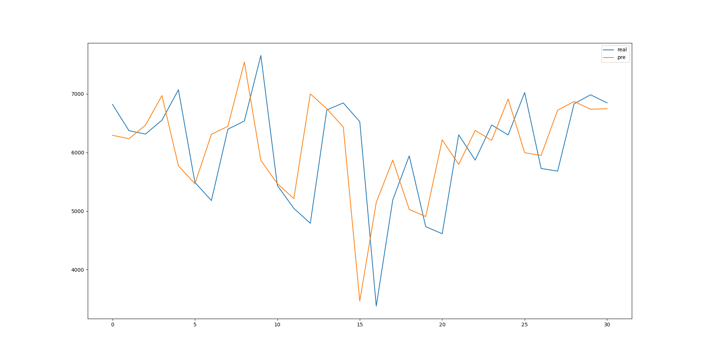
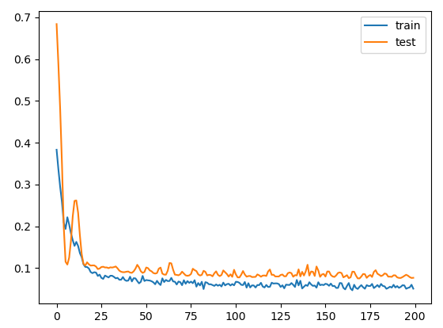

# 1天预测1天

by hzw

数据每一行包含：Num,CurrentConfirmedCount,ConfirmedCount,CuredCount,DeadCount,DateType,DiffConfirmedCount

2021.2.18，第一次预测。结果如下，出现预测比实际“提前”的情况

最前面15天因为数据存在错误删去。剩余183天中，取前面152天作为训练集，剩下31天为测试集。

模型如下：

最后的拟合优度和mae如下：

在训练集上的预测结果如下图所示。rmse为995.614，R2为-0.196

评估：模型过于简单，需要增加隐藏层，增加每层神经元个数

#n天预测1天

by hzw

此处n=5，数据每一行只包含Num（人数），ConfirmedCount（确诊人数），DateType（日期类型）三个参数

模型如下

损失函数如下：

拟合优度与mae如下

训练集上的预测结果如下。rmse为886，R2为0.054。

评估：在训练集上拟合度 高达0.93，在测试机上只有0.1以下。模型存在过拟合的情况。

# n天预测1天（预测训练集）

by hzw