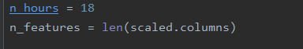
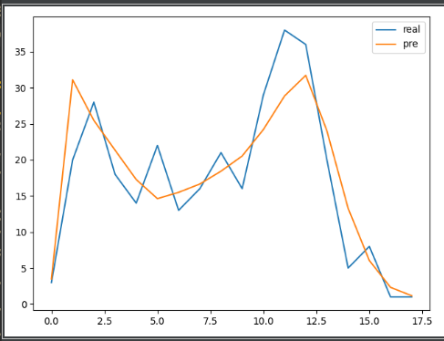

# 1天预测1天

by hzw

数据每一行包含：Num,CurrentConfirmedCount,ConfirmedCount,CuredCount,DeadCount,DateType,DiffConfirmedCount

2021.2.18，第一次预测。结果如下，出现预测比实际“提前”的情况

最前面15天因为数据存在错误删去。剩余183天中，取前面152天作为训练集，剩下31天为测试集。

模型如下：

最后的拟合优度和mae如下：

损失函数如图：

在测试集上的预测结果如下图所示。

|损失函数|数值|
|-|-|
|RMSE|1019.686|
|R2|-0.255|
|MAE|714.259|
|MAPE|0.127|

评估：模型过于简单，需要增加隐藏层，增加每层神经元个数

#n天预测1天

by hzw

此处n=5，数据每一行包含Num（人数），ConfirmedCount（确诊人数），DateType（日期类型）三个参数

模型如下

损失函数如下：

拟合优度与mae如下

测试集上的预测结果如下。

|损失函数|数值|
|-|-|
|RMSE|909.932|
|R2|0.003|
|MAE|628.348|
|MAPE|0.118|

评估：在训练集上拟合度 高达0.93，在测试机上只有0.1以下。模型存在过拟合的情况。

# n天预测1天（预测训练集）

by hzw

此处n=5，数据每一行包含Num（人数），ConfirmedCount（确诊人数），DateType（日期类型）三个参数

模型如下：

损失函数如下：

拟合优度和MAE如下

在测试集上的预测结果

|损失函数|数值|
|-|-|
|RMSE|373.251|
|R2|0.973|
|MAE|257.523|
|MAPE|0.120|

评估：可以看出R2虽然高，但是MAPE也有12%。预测值和真实值比较来看，许多地方预测不够精确

# 1小时预测1小时（5-1~7-16）

by cn

数据每一行包括 Num，Hour，Date，DateType

删除了0点的噪声数据，同时，将每天的小时数定为6时至23小时（保存了客流量为0的情况存在，时段为23时）

模型如下：

最后的拟合优度和mae如下：

损失函数如图：

拟合图像：

评估：拟合得较好，仍然存在上升的空间

# 前N个小时预测一个小时（前n个数据）（5-1~7-16）

by cn

数据每一行包括Num，Hour，Date，DateType

数据集与一小时预测一小时的数据集相同

不同的在于这次用了前N个数据进行预测，这里选用的N为18，即前一天6-23小时的数据

使用的模型与上面相同：

## 1.预测最后两天

最后的拟合优度和mae如下：

损失函数：

| 损失函数 | 数值   |
| -------- | ------ |
| RMSE     | 25.995 |
| R2       | 0.982  |
| MAE      | 19.937 |
| MAPE     | 0.287  |

预测图像：

评估：误差比上面的更小

## 2.预测最后一天

最后的拟合优度和mae如下：

损失函数：

| 损失函数 | 数值   |
| -------- | ------ |
| RMSE     | 26.335 |
| R2       | 0.981  |
| MAE      | 22.235 |
| MAPE     | 0.465  |

预测图像：

评估：预测的也十分好，十分拟合

# 前N天的相同时段预测一个小时（5-1~7-16）

by cn

数据每一行包括Num，Hour，Date，DateType

数据集与一小时预测一小时的数据集相同

不同的在于这次用了前N天相同时段的数据进行预测，这里选用的N为5，即前五天相同时段的数据

使用的模型与上面相同：

最后的拟合优度和mae如下：

损失函数：

拟合图像：

评估：误差略微增大，但是拟合图线趋势较为正确。

# 前N个小时预测一个小时（前n个数据）（1-12~1-23）

by cn

数据每一行包括Num，Hour，Date，DateType

数据集只取了1-12~1-23中的数据

不同的在于这次用了前N个数据进行预测，这里选用的N为18，即前一天6-23小时的数据

使用的模型与上面相同：

最后的拟合优度和mae如下：

损失函数：

| 损失函数 | 数值   |
| -------- | ------ |
| RMSE     | 14.733 |
| R2       | 0.855  |
| MAE      | 11.791 |
| MAPE     | inf    |

预测图像：

评估：不知怎么说…真实值的数据也感觉有点问题，1-23日也比较特殊，可能效果不是很好，还需要想别的办法。

# 前N个小时预测一个小时（前n个数据）（1-23~3-1）

by cn

数据每一行包括Num，Hour，Date，DateType

数据集为1-23~3-1的数据，但数据量较小

不同的在于这次用了前N个数据进行预测，这里选用的N为18，即前一天6-23小时的数据

使用的模型与上面相同：

最后的拟合优度和mae如下：

损失函数：

| 损失函数 | 数值  |
| -------- | ----- |
| RMSE     | 5.029 |
| R2       | 0.782 |
| MAE      | 4.018 |
| MAPE     | 0.351 |

预测图像：

评估：由于数据量较小，拟合得图线较差

# 前N个小时预测一个小时（前n个数据）（3-1~5-1）

by cn

据每一行包括Num，Hour，Date，DateType

数据集取得是3-1~5-1的数据

不同的在于这次用了前N个数据进行预测，这里选用的N为18，即前一天6-23小时的数据

使用的模型与上面相同：

最后的拟合优度和mae如下：

损失函数：

| 损失函数 | 数值   |
| -------- | ------ |
| RMSE     | 65.289 |
| R2       | 0.870  |
| MAE      | 53.344 |
| MAPE     | 0.178  |

预测图像：

评估：3-1~5-1的数据呈现一种上升的趋势。该模型对峰值的预测较好，能较准确的预测出高峰值，但仍有上升空间。